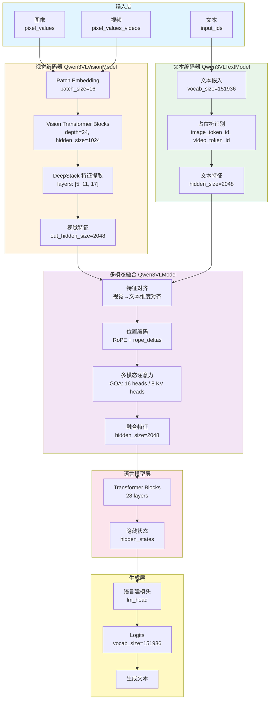
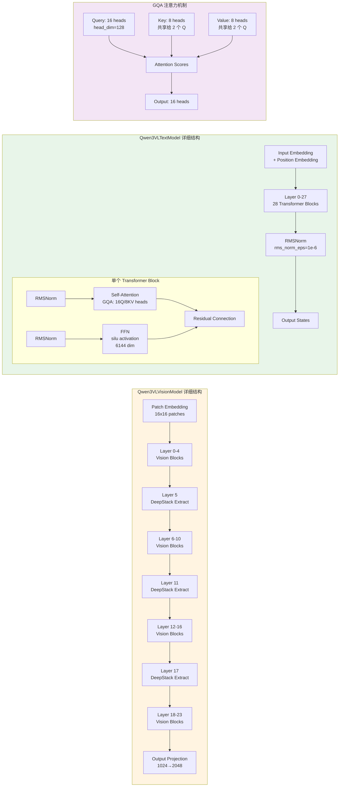
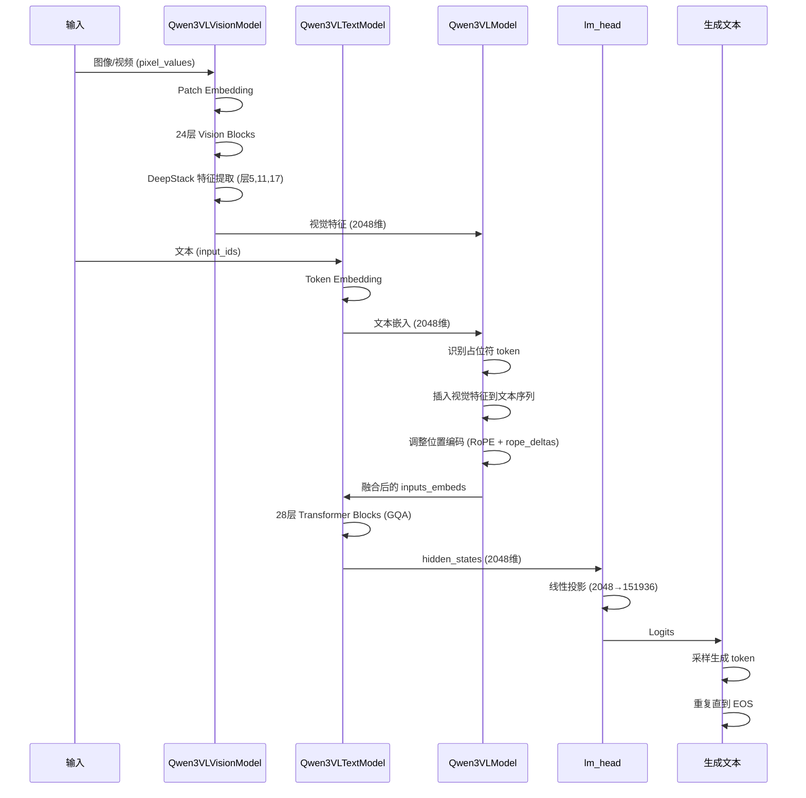

## Qwen3VLForConditionalGeneration 架构分析

### 整体架构概述

`Qwen3VLForConditionalGeneration` 是多模态条件生成模型，可处理文本、图像和视频，并生成文本输出。结构包含：

1. **视觉编码器** (`Qwen3VLVisionModel`) - 处理图像和视频
2. **文本编码器** (`Qwen3VLTextModel`) - 处理文本
3. **多模态融合层** - 整合视觉和文本特征
4. **语言建模头** (`lm_head`) - 生成文本

### 架构流程图



### 详细组件架构图



### 核心组件详细解析

#### 1. 视觉编码器 (Qwen3VLVisionModel)

`Qwen3VLVisionModel` 是专门处理图像和视频输入的视觉编码器，采用 Vision Transformer (ViT) 架构。

**核心功能：**
- **图像处理**：将输入图像分割成 16×16 的 patches，通过卷积层转换为 patch embeddings
- **视频处理**：支持时间维度的 patch 处理（`temporal_patch_size=2`），可处理视频帧序列
- **多尺度特征提取**：通过 DeepStack 机制在多个层级（层 5、11、17）提取不同尺度的视觉特征

**架构组成：**

1. **Patch Embedding (`Qwen3VLVisionPatchEmbed`)**
   - 将图像/视频转换为 patch tokens
   - 对于图像：`patch_size=16`，将图像分割为 16×16 的 patches
   - 对于视频：同时处理空间和时间维度，`temporal_patch_size=2` 处理时间维度

2. **Vision Transformer Blocks (24层)**
   - 每层包含：
     - **Self-Attention**：16 个注意力头，处理空间和时间关系
     - **Feed-Forward Network**：`intermediate_size=4096`，使用 `gelu_pytorch_tanh` 激活函数
     - **Layer Normalization**：稳定训练
   - **Rotary Position Embedding (`Qwen3VLVisionRotaryEmbedding`)**：处理视觉 token 的位置信息，考虑空间合并后的网格维度

3. **DeepStack 特征提取**
   - 在指定的层（5、11、17）提取多尺度视觉特征
   - 这些特征在不同抽象层级捕获视觉信息：
     - **层 5**：捕获局部细节和边缘特征
     - **层 11**：捕获中等尺度的对象和结构
     - **层 17**：捕获全局语义和高级抽象
   - 多尺度特征有助于模型理解不同粒度的视觉信息

4. **空间合并 (`spatial_merge_size=2`)**
   - 通过 `Qwen3VLVisionPatchMerger` 降低空间分辨率
   - 减少计算量，同时保持重要视觉信息

5. **输出投影**
   - 将视觉特征从 `hidden_size=1024` 投影到 `out_hidden_size=2048`
   - 与文本编码器的维度对齐，便于后续融合

**关键特性：**
- **多模态支持**：同时处理静态图像和动态视频
- **高效处理**：通过空间合并和 DeepStack 机制平衡性能和效果
- **位置感知**：使用旋转位置编码处理视觉 token 的空间关系

#### 2. 文本编码器 (Qwen3VLTextModel)

`Qwen3VLTextModel` 是基于 Transformer 架构的语言模型，负责处理文本输入并生成文本表示。

**核心功能：**
- **文本理解**：将输入文本 token 转换为语义表示
- **长上下文支持**：支持最长 256K tokens 的序列
- **高效注意力**：使用 GQA (Grouped Query Attention) 降低 KV 缓存

**架构组成：**

1. **输入嵌入层**
   - **Token Embedding**：将 token IDs 映射到 `hidden_size=2048` 的向量空间
   - **词表大小**：`vocab_size=151936`，包含文本和特殊 token
   - **权重共享**：`tie_word_embeddings=true`，输入和输出嵌入共享权重

2. **位置编码 (RoPE - Rotary Position Embedding)**
   - **基础频率**：`rope_theta=5000000`，用于长序列的位置编码
   - **混合 RoPE (`mrope_interleaved=true`)**：
     - 使用分段配置 `mrope_section=[24, 20, 20]`
     - 不同段使用不同的旋转频率，更好地处理长序列
   - **位置增量 (`rope_deltas`)**：在多模态输入中，为视觉 token 调整位置编码

3. **Transformer Blocks (28层)**
   每层包含：
   - **RMSNorm**：使用 RMSNorm 归一化（`rms_norm_eps=1e-6`）
   - **Grouped Query Attention (GQA)**：
     - Query 头数：16 (`num_attention_heads=16`)
     - Key-Value 头数：8 (`num_key_value_heads=8`)
     - 每个 KV 头被 2 个 Q 头共享，减少 KV 缓存约 50%
     - 头维度：`head_dim=128`
   - **Feed-Forward Network (FFN)**：
     - 中间维度：`intermediate_size=6144`（约为隐藏层的 3 倍）
     - 激活函数：`silu` (Swish)
   - **残差连接**：每个子层都有残差连接

4. **输出层**
   - 最后一层输出 `hidden_states`，维度为 `[batch_size, seq_len, hidden_size=2048]`

**关键特性：**
- **长上下文能力**：支持 256K tokens，适合处理长文档和对话
- **高效推理**：GQA 机制显著降低 KV 缓存，提升推理速度
- **多语言支持**：词表包含多语言 token，支持 30+ 种语言

#### 3. 多模态融合层 (Qwen3VLModel)

`Qwen3VLModel` 是核心的多模态融合模块，负责将视觉和文本特征整合到统一的表示空间中。

**核心功能：**
- **占位符识别**：识别文本序列中的图像/视频占位符 token
- **特征对齐**：将视觉特征与文本特征对齐到相同维度
- **多模态融合**：通过注意力机制融合视觉和文本信息

**工作流程：**

1. **占位符检测 (`get_placeholder_mask`)**
   - 识别文本序列中的特殊 token：
     - `image_token_id=151655`：图像占位符
     - `video_token_id=151656`：视频占位符
     - `vision_start_token_id=151652` 和 `vision_end_token_id=151653`：视觉序列边界
   - 确定每个视觉输入在序列中的位置

2. **视觉特征提取**
   - **图像特征**：调用 `get_image_features()`，使用 `Qwen3VLVisionModel` 处理图像
   - **视频特征**：调用 `get_video_features()`，处理视频帧序列
   - 提取 DeepStack 多尺度特征

3. **特征对齐**
   - 视觉特征维度：`out_hidden_size=2048`
   - 文本特征维度：`hidden_size=2048`
   - 两者维度一致，可直接融合

4. **嵌入融合**
   - 在占位符位置将视觉特征插入到文本嵌入序列中
   - 使用 `_get_image_nums_and_video_nums()` 确定视觉 token 数量
   - 构建统一的 `inputs_embeds` 序列

5. **位置编码调整**
   - 计算 `position_ids`，考虑视觉 token 的位置
   - 应用 `rope_deltas` 调整 RoPE，确保位置编码正确

6. **多模态注意力**
   - 将融合后的 `inputs_embeds` 输入到 `language_model`（即 `Qwen3VLTextModel`）
   - 通过 28 层 Transformer 进行深度交互
   - 视觉和文本信息通过注意力机制相互影响

**关键机制：**
- **统一序列表示**：将视觉和文本统一为 token 序列
- **位置感知融合**：通过位置编码确保视觉和文本 token 的正确关系
- **深度交互**：通过多层 Transformer 实现视觉和文本的深度融合

#### 4. 语言建模头 (lm_head)

`lm_head` 是条件生成模型的输出层，将多模态融合后的隐藏状态映射到词表空间，用于生成文本。

**核心功能：**
- **Logits 计算**：将隐藏状态投影到词表维度
- **文本生成**：通过采样或贪婪解码生成文本 token
- **损失计算**：在训练时计算语言建模损失

**架构组成：**

1. **线性投影层**
   - 输入维度：`hidden_size=2048`
   - 输出维度：`vocab_size=151936`
   - 权重矩阵：`[vocab_size, hidden_size]`

2. **前向传播**
   ```python
   # 伪代码示例
   logits = lm_head(hidden_states)  # [batch_size, seq_len, vocab_size]
   ```

3. **生成过程**
   - **训练阶段**：
     - 计算所有位置的 logits
     - 使用交叉熵损失计算语言建模损失
     - 只计算非填充位置的损失
   - **推理阶段**：
     - 使用 `generate()` 方法进行自回归生成
     - 支持多种解码策略：
       - 贪婪解码（greedy）
       - 采样解码（sampling）
       - Beam search
       - Top-k/Top-p 采样

4. **特殊 Token 处理**
   - **EOS Token** (`eos_token_id=151645`)：生成结束标记
   - **PAD Token** (`pad_token_id=151643`)：填充位置不计算损失
   - **视觉 Token**：在生成时被忽略，不参与文本生成

**生成流程：**
1. 多模态融合后的 `hidden_states` 输入 `lm_head`
2. 计算每个位置的 logits（词表概率分布）
3. 应用 logits 处理器（temperature, top-k, top-p 等）
4. 采样下一个 token
5. 重复直到生成 EOS token 或达到最大长度

**关键特性：**
- **条件生成**：基于多模态输入生成相关文本
- **灵活解码**：支持多种生成策略和参数控制
- **高效推理**：与 KV 缓存机制配合，支持快速生成

### 基于您的配置文件的详细分析

#### 1. 文本配置 (`text_config`)

```json
"text_config": {
  "hidden_size": 2048,           // 隐藏层维度
  "num_hidden_layers": 28,        // Transformer 层数（28层）
  "num_attention_heads": 16,      // 注意力头数
  "num_key_value_heads": 8,       // KV 头数（GQA，Grouped Query Attention）
  "head_dim": 128,                // 每个头的维度
  "intermediate_size": 6144,      // FFN 中间层维度
  "max_position_embeddings": 262144, // 最大序列长度（256K tokens）
  "vocab_size": 151936,           // 词表大小
  "rope_theta": 5000000,         // RoPE 基础频率
  "rope_scaling": {               // RoPE 缩放配置
    "rope_type": "default",
    "mrope_interleaved": true,   // 混合 RoPE
    "mrope_section": [24, 20, 20] // 分段配置
  }
}
```

要点：
- GQA：`num_key_value_heads=8` 小于 `num_attention_heads=16`，降低 KV 缓存
- 长上下文：`max_position_embeddings=262144`（256K）
- 混合 RoPE：`mrope_interleaved=true` 与分段配置，用于长序列位置编码

#### 2. 视觉配置 (`vision_config`)

```json
"vision_config": {
  "hidden_size": 1024,           // 视觉编码器隐藏维度
  "out_hidden_size": 2048,       // 输出维度（与文本对齐）
  "depth": 24,                    // 视觉 Transformer 层数
  "num_heads": 16,                // 注意力头数
  "patch_size": 16,               // 图像 patch 大小
  "spatial_merge_size": 2,       // 空间合并大小
  "temporal_patch_size": 2,       // 视频时间维度 patch 大小
  "num_position_embeddings": 2304, // 位置嵌入数量
  "deepstack_visual_indexes": [5, 11, 17] // DeepStack 视觉索引
}
```

要点：
- DeepStack：在层 5、11、17 提取多尺度视觉特征
- 视频支持：`temporal_patch_size=2` 处理视频帧
- 空间合并：`spatial_merge_size=2` 降低空间分辨率

#### 3. 特殊 Token 配置

```json
"image_token_id": 151655,        // 图像占位符 token
"video_token_id": 151656,        // 视频占位符 token
"vision_start_token_id": 151652, // 视觉序列开始 token
"vision_end_token_id": 151653,   // 视觉序列结束 token
"eos_token_id": 151645,          // 结束 token
"pad_token_id": 151643,          // 填充 token
```

这些 token 用于在文本序列中标记视觉输入的位置。

### 工作流程

1. 视觉处理：
   - 图像/视频 → `Qwen3VLVisionModel` → 视觉特征
   - DeepStack 在指定层提取多尺度特征

2. 文本处理：
   - 文本 → Tokenization → 嵌入
   - 在图像/视频占位符位置插入视觉特征

3. 多模态融合：
   - 视觉特征与文本嵌入对齐（`out_hidden_size=2048`）
   - 通过位置编码和注意力机制融合

4. 生成：
   - 融合特征 → `Qwen3VLTextModel`（28层）→ `lm_head` → 生成文本

### 组件协作流程

四个核心组件的协作流程如下：



### 架构特点总结

**多模态能力：**
- 同时处理文本、图像、视频三种模态
- 统一的序列表示，便于融合和生成

**高效设计：**
- **GQA 注意力**：降低 KV 缓存约 50%，提升推理速度
- **DeepStack 机制**：多尺度特征提取，平衡性能和效果
- **空间合并**：降低视觉 token 数量，减少计算量

**长上下文支持：**
- 支持最长 256K tokens 的序列
- 混合 RoPE 位置编码，优化长序列处理

**生成能力：**
- 条件生成：基于多模态输入生成相关文本
- 灵活解码：支持多种生成策略和参数控制

**适用场景：**
该架构特别适合 GUI Agent 任务：
- **视觉理解**：通过视觉编码器理解界面截图
- **指令生成**：基于视觉和文本输入生成操作指令
- **多轮对话**：支持长上下文，可处理复杂的多轮交互
- **视频理解**：支持视频输入，可处理动态界面操作

### 技术亮点

1. **DeepStack 多尺度视觉特征**：在多个层级提取特征，捕获从细节到语义的不同抽象级别
2. **GQA 高效注意力**：在保持性能的同时显著降低内存和计算开销
3. **统一序列表示**：将视觉和文本统一为 token 序列，简化多模态处理
4. **长上下文能力**：256K tokens 的上下文窗口，适合处理复杂任务
5. **位置感知融合**：通过 RoPE 和 rope_deltas 确保多模态 token 的正确位置关系