# XUI-TARS: Pioneering Automated GUI Interaction with Native Agents

Yujia Qin†*, Yining Ye*◇, Junjie Fang*, Haoming Wang*, Shihao Liang*, Shizuo Tian◇, Junda Zhang, Jiahao Li, Yunxin Li, Shijue Huang, Wanjun Zhong, Kuanye Li, Jiale Yang, Yu Miao, Woyu Lin, Longxiang Liu, Xu Jiang, Qianli Ma, Jingyu Li, Xiaojun Xiao, Kai Cai, Chuang Li, Yaowei Zheng, Chaolin Jin, Chen Li, Xiao Zhou, Minchao Wang, Haoli Chen, Zhaojian Li, Haihua Yang, Haifeng Liu, Feng Lin, Tao Peng, Xin Liu, Guang Shi†

ByteDance Seed, Tsinghua University

{yujia.qin, shiguang.sg}@bytedance.com

# Abstract

This paper introduces UI-TARS, a native GUI agent model that solely perceives the screenshots as input and performs human-like interactions (e.g., keyboard and mouse operations). Unlike prevailing agent frameworks that depend on heavily wrapped commercial models (e.g., GPT-4o) with expert-crafted prompts and workflows, UI-TARS is an end-to-end model that outperforms these sophisticated frameworks. Experiments demonstrate its superior performance: UI-TARS achieves SOTA performance in  $10+$  GUI agent benchmarks evaluating perception, grounding, and GUI task execution (see below). Notably, in the OSWorld benchmark, UI-TARS achieves scores of 24.6 with 50 steps and 22.7 with 15 steps, outperforming Claude's 22.0 and 14.9 respectively. In AndroidWorld, UI-TARS achieves 46.6, surpassing GPT-4o's 34.5. UI-TARS incorporates several key innovations: (1) Enhanced Perception: leveraging a large-scale dataset of GUI screenshots for context-aware understanding of UI elements and precise captioning; (2) Unified Action Modeling, which standardizes actions into a unified space across platforms and achieves precise grounding and interaction through large-scale action traces; (3) System-2 Reasoning, which incorporates deliberate reasoning into multi-step decision making, involving multiple reasoning patterns such as task decomposition, reflection thinking, milestone recognition, etc. (4) Iterative Training with Reflective Online Traces, which addresses the data bottleneck by automatically collecting, filtering, and reflectively refining new interaction traces on hundreds of virtual machines. Through iterative training and reflection tuning, UI-TARS continuously learns from its mistakes and adapts to unforeseen situations with minimal human intervention. We also analyze the evolution path of GUI agents to guide the further development of this domain. UI-TARS is open sourced at https://github.com/bytedance/UI-TARS.

<table><tr><td>Benchmark</td><td>Previous SOTA</td><td colspan="3">Relative improvement of UI-TARS</td></tr><tr><td>GUI-Odyssey</td><td>OS-Agvis-7B</td><td colspan="2">+42.90%</td><td>+40.32%</td></tr><tr><td>OSWorld (Screenshot 15 steps)</td><td>Aguvis-72B w/ GPT-4o</td><td colspan="2">+33.53%</td><td>+10.00%</td></tr><tr><td>ScreenSpot-Pro</td><td>UGround-V1-7B</td><td colspan="2">+22.51%</td><td>+14.79%</td></tr><tr><td>MM2Web-Website</td><td>Aguvis-72B</td><td colspan="2">+12.39%</td><td>+9.20%</td></tr><tr><td>AndroidControl-Low</td><td>OS-Agvis-7B</td><td colspan="2">+7.16%</td><td>+6.57%</td></tr><tr><td>MM2Web-Task</td><td>Aguvis-72B</td><td colspan="2">+7.19%</td><td>+4.84%</td></tr><tr><td>MM2Web-Domain</td><td>Aguvis-72B</td><td colspan="2">+6.70%</td><td>+3.95%</td></tr><tr><td>ScreenSpot-v2</td><td>OS-Agvis-7B</td><td colspan="2">+3.67%</td><td>+5.17%</td></tr><tr><td>ScreenQA-Short</td><td>Qwen2-VL-7B</td><td colspan="2">+4.36%</td><td>+3.30%</td></tr><tr><td>VisualWebBench</td><td>GPT-4o</td><td colspan="2">+5.48%</td><td>+1.53%</td></tr><tr><td>AndroidControl-High</td><td>OS-Agvis-7B</td><td colspan="2">+4.92%</td><td>+1.83%</td></tr><tr><td></td><td></td><td>0.00%</td><td>50.00%</td><td>0.00%</td></tr><tr><td colspan="2">UI-TARS-72B</td><td colspan="2">UI-TARS-7B</td><td>50.00%</td></tr></table>

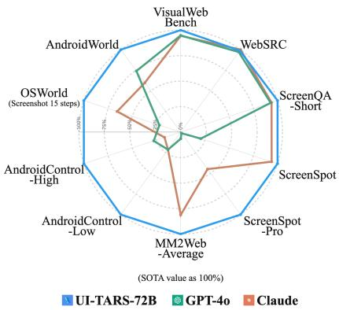

# Contents

1 Introduction 3  
2 Evolution Path of GUI Agents 6

2.1 Rule-based Agents 6  
2.2 From Modular Agent Framework to Native Agent Model 7  
2.3 Active and Lifelong Agent (Prospect) 9

3 Core Capabilities of Native Agent Model 9

3.1 Core Capabilities 10  
3.2 Capability Evaluation 12

4 UI-TARS 13

4.1 Architecture Overview 14  
4.2 Enhancing GUI Perception 15  
4.3 Unified Action Modeling and Grounding 16  
4.4 Infusing System-2 Reasoning 17  
4.5 Learning from Prior Experience in Long-term Memory 20  
4.6 Training 22

5Experiment 22

5.1 Perception Capability Evaluation 22  
5.2 Grounding Capability Evaluation 23  
5.3 Offline Agent Capability Evaluation 24  
5.4 Online Agent Capability Evaluation 25  
5.5 Comparing System 1 and System 2 Reasoning 26

6 Conclusion 27

A Case Study 38  
B Data Example 41

# 1 Introduction

Autonomous agents (Wang et al., 2024b; Xi et al., 2023; Qin et al., 2024) are envisioned to operate with minimal human oversight, perceiving their environment, making decisions, and executing actions to achieve specific goals. Among the many challenges in this domain, enabling agents to interact seamlessly with Graphical User Interfaces (GUIs) has emerged as a critical frontier (Hu et al., 2024; Zhang et al., 2024a; Nguyen et al., 2024; Wang et al., 2024e; Gao et al., 2024). GUI agents are designed to perform tasks within digital environments that rely heavily on graphical elements such as buttons, text boxes, and images. By leveraging advanced perception and reasoning capabilities, these agents hold the potential to revolutionize task automation, enhance accessibility, and streamline workflows across a wide range of applications.

The development of GUI agents has historically relied on hybrid approaches that combine textual representations (e.g., HTML structures and accessibility trees) (Liu et al., 2018; Deng et al., 2023; Zhou et al., 2023). While these methods have driven significant progress, they suffer from limitations such as platform-specific inconsistencies, veracity, and limited scalability (Xu et al., 2024). Textual-based methods often require system-level permissions to access underlying system information, such as HTML code, which further limits their applicability and generalizability across diverse environments. Another critical issue is that, many existing GUI systems follow an agent framework paradigm (Zhang et al., 2023; Wang et al., 2024a; Wu et al., 2024a; Zhang et al., 2024b; Wang & Liu, 2024; Xie et al., 2024), where key functions are modularized across multiple components. These components often rely on specialized vision-language models (VLMs), e.g., GPT-4o (Hurst et al., 2024), for understanding and reasoning (Zhang et al., 2024b), while grounding (Lu et al., 2024b) or memory (Zhang et al., 2023) modules are implemented through additional tools or scripts. Although this modular architecture facilitates rapid development in specific domain tasks, it relies on handcrafted approaches that depend on expert knowledge, modular components, and task-specific optimizations, which are less scalable and adaptive than end-to-end models. This makes the framework prone to failure when faced with unfamiliar tasks or dynamically changing environments (Xia et al., 2024).

These challenges have prompted two key shifts towards native GUI agent model: (1) the transition from textual-dependent to pure-vision-based GUI agents (Bavishi et al., 2023; Hong et al., 2024). "Pure-vision" means the model relies exclusively on screenshots of the interface as input, rather than textual descriptions (e.g., HTML). This bypasses the complexities and platform-specific limitations of textual representations, aligning more closely with human cognitive processes; and (2) the evolution from modular agent frameworks to end-to-end agent models (Wu et al., 2024b; Xu et al., 2024; Lin et al., 2024b; Yang et al., 2024a; Anthropic, 2024b). The end-to-end design unifies traditionally modularized components into a single architecture, enabling a smooth flow of information among modules. In philosophy, agent frameworks are design-driven, requiring extensive manual engineering and predefined workflows to maintain stability and prevent unexpected situations; while agent models are inherently data-driven, enabling them to learn and adapt through large-scale data and iterative feedback (Putta et al., 2024).

Despite their conceptual advantages, today's native GUI agent model often falls short in practical applications, causing their real-world impact to lag behind its hype. These limitations stem from two primary sources: (1) the GUI domain itself presents unique challenges that compound the difficulty of developing robust agents. (1.a) On the perception side, agents must not only recognize but also effectively interpret the high information-density of evolving user interfaces. (1.b) Reasoning and planning mechanisms are equally important in order to navigate, manipulate, and respond to these interfaces effectively. (1.c) These mechanisms must also leverage memory, considering past interactions and experiences to make informed decisions. (1.d) Beyond high-level decision-making, agents must also execute precise, low-level actions, such as outputting exact screen coordinates for clicks or drags and inputting text into the appropriate fields. (2) The transition from agent frameworks to agent models introduces a fundamental data bottleneck. Modular frameworks traditionally rely on separate datasets tailored to individual components. These datasets are relatively easy to curate since they address isolated functionalities. However, training an end-to-end agent model demands data that integrates all components in a unified workflow, capturing the seamless interplay between perception, reasoning, memory, and action. Such data, which comprise rich workflow knowledge from human experts, have been scarcely recorded historically. This lack of comprehensive, high-quality data limits the ability of native agents to generalize across diverse real-world scenarios, hindering their scalability and robustness.

To address these challenges, this paper focuses on advancing native GUI agent model. We begin by reviewing the evolution path for GUI agents (§ 2). By segmenting the development of GUI agents into key stages based on the degree of human intervention and generalization capabilities, we conduct a comprehensive literature review. Starting with traditional rule-based agents, we highlight the evolution from rigid, framework-based systems to adaptive native models that seamlessly integrate perception, reasoning, memory, and action. We

# Find round trip flights from SEA to NYC on 5th next month and filtered by price in ascending order.

# X UI-TARS

X Thought: To proceed with finding flights from SEA to NYC on the 5th of next month, I need to first select the departure city. Click on the "From" field to open the dropdown menu for selecting the departure city.

X Thought: To proceed, I need to type "SEA" into the "Origin" field. This will set the departure city to Seattle, which is the first step in specifying the flight search criteria. Type "SEA" into the "Origin" field to set the departure city to Seattle.

X Thought: To confirm the departure city as "SEA" (Seattle, WA), I need to select it from the dropdown menu. This ensures that the correct city is set for the flight search, allowing me to move forward with entering the destination and other search criteria. Click on the "SEA - Seattle, WA" option in the dropdown menu to confirm the departure city.

X Thought: I have completed departure and destination city selection. To proceed with the task, I need to specify the travel dates. Since the "Depart" field is highlighted, I will click on it to open the date selection interface, where I can choose the 5th of next month. Click on the "Depart" field to open the date selection interface for specifying the departure date.

Action: click (start_box: [0.247, 0.236, 0.247, 0.236])

Action: type (content='SEA')

Action: click (start_box: [0.297, 0.456, 0.297, 0.456])

Action: click (start_box: [0.5, 0.246, 0.5, 0.246])

# Skip several steps

X Thought: I need to select the 5th of next month as the departure date. Since the calendar is already open and displaying February 2025, I will click on the 5th of February to set it as the departure date. Click on the "5" in the February 2025 calendar to select it as the departure date.

X Thought: I need to confirm the selected departure date of February 5, 2025. Clicking the "DONE" button will finalize the date selection and allow me to move forward with specifying the return date or other search criteria. Click on the "DONE" button to confirm the selected departure date of February 5, 2025.

X Thought: I need to initiate the search using the specified criteria. Clicking the "SEARCH" button will execute the search and display the available flight options for the selected route and date. Click on the "SEARCH" button to initiate the flight search based on the specified criteria.

X Thought: I need to address the error message by specifying a return date. Clicking on the "Return" field will allow me to open the date selection interface and choose an appropriate return date, which is necessary to complete the search criteria. Click on the "Return" field to open the date selection interface for specifying a return date.

Action: click (start_box: [0.603, 0.436, 0.603, 0.436])

Action: click (start_box: [0.665, 0.581, 0.665, 0.581])

Action: click (start_box: [0.75, 0.246, 0.75, 0.246])

Action: click (start_box: [0.538, 0.258, 0.538, 0.258])

  
Figure 1: A demo case of UI-TARS that helps user to find flights.

# #

# Trial and error

X Thought: I need to specify a return date for a round trip. Since the calendar is already open and displaying February 2025, I will click on the 5th of February to set it as the return date, ensuring the search criteria are complete. Click on the "S" in the February 2025 calendar to select it as the return date.

X Thought: I need to initiate the search using the specified criteria. Clicking the "SEARCH" button will execute the search and display the available flight options for the selected route and date. Click on the "SEARCH" button to initiate the flight search based on the specified criteria.

X Thought: I need to apply filters to sort the results by price in ascending order. Clicking on the "Sort & Filter" button will open the filtering options, allowing me to set the desired sorting criteria and refine the search results accordingly. Click on the "Sort & Filter" button to access the filtering options for sorting the flight results by price in ascending order.

X Thought: Due to network problems, my last action did not show the filter dropdown menu. Now the page is working now, and to proceed with the task, I need to apply filters again. Click on the "Sort & Filter" button.

Action: click (start_box: [0.465, 0.451, 0.465, 0.451])

Action: click (start_box: [0.75, 0.246, 0.75, 0.246])

Action: click (start_box: [0.761, 0.263, 0.761, 0.263])

Action: click(start_box: [0.761, 0.263], 0.761, 0.263))

X Thought: I need to sort the results by price in ascending order. The "Sort by" dropdown menu is the appropriate control for this, and interacting with it will allow me to select the desired sorting criterion. Clicking on the dropdown will reveal the available sorting options, including the one for price. Click on the "Sort by" dropdown menu to reveal the sorting options and prepare to select the "Price" option.

X Thought: I need to sort the results by price in ascending order. The "Price" option in the "Sort by" dropdown menu is the appropriate choice for this, and selecting it will ensure the results are displayed in the desired order, making it easier to identify the most affordable options. Click on the "Price" option in the "Sort by" dropdown menu to sort the flight results by price in ascending order.

X Thought: I need to scroll down to see more details about the filtered flights. The page is at the top position, and scrolling down will show the details about the 10 flight results. Scroll down to see detailed results.

X Thought: The task of finding round trip flights from SEA to NYC on the 5th of next month, filtered by price in ascending order, has been successfully completed. The results are now sorted by price, and all relevant filters have been applied. No further actions are required to fulfill the task, and I can now submit the task as completed. Submit the task, confirming that it has been successfully completed.

Action: click (start_box: [0.342, 0.418, 0.342, 0.418])

Action: click (start_box: [0.243, 0.521, 0.243, 0.521])

$\Leftrightarrow$  Action: scroll (direction='down')

Action: finished

also prospect the future potential of GUI agents capable of active and lifelong learning, which minimizes human intervention while maximizing generalization abilities. To deepen understanding, we provide a detailed analysis of the core capabilities of the native agent model, which include: (1) perception, enabling real-time environmental understanding for improved situational awareness; (2) action, requiring the native agent model to accurately predict and ground actions within a predefined space; (3) reasoning, which emulates human thought processes and encompasses both System 1 and System 2 thinking; and (4) memory, which stores task-specific information, prior experiences, and background knowledge. We also summarize the main evaluation metrics and benchmarks for GUI agents.

Based on these analyses, we propose a native GUI agent model UI-TARS2, with a demo case illustrated in Figure 1. UI-TARS incorporates the following core contributions:

- Enhanced Perception for GUI Screenshot ( $\S 4.2$ ): GUI environments, with their high information density, intricate layouts, and diverse styles, demand robust perception capabilities. We curate a large-scale dataset by collecting screenshots using specialized parsing tools to extract metadata such as element types, bounding boxes, and text content from websites, applications, and operating systems. The dataset targets the following tasks: (1) element description, which provides fine-grained, structured descriptions of GUI components; (2) dense captioning, aimed at holistic interface understanding by describing the entire GUI layout, including spatial relationships, hierarchical structures, and interactions among elements; (3) state transition captioning, which captures subtle visual changes in the screen; (4) question answering, designed to enhance the agent's capacity for visual reasoning; and (5) set-of-mark prompting, which uses visual markers to associate GUI elements with specific spatial and functional contexts. These carefully designed tasks collectively enable UI-TARS to recognize and understand GUI elements with exceptional precision, providing a robust foundation for further reasoning and action.

- Unified Action Modeling for Multi-step Execution (§ 4.3): we design a unified action space to standardize semantically equivalent actions across platforms. To improve multi-step execution, we create a large-scale dataset of action traces, combining our annotated trajectories and standardized open-source data. The grounding ability, which involves accurately locating and interacting with specific GUI elements, is improved by curating a vast dataset that pairs element descriptions with their spatial coordinates. This data enables UI-TARS to achieve precise and reliable interactions.

- System-2 Reasoning for Deliberate Decision-making (§ 4.4): robust performance in dynamic environments demands advanced reasoning capabilities. To enrich reasoning ability, we crawl 6M GUI tutorials, meticulously filtered and refined to provide GUI knowledge for logical decision-making. Building on this foundation, we augment reasoning for all the collected action traces by injecting diverse reasoning patterns—such as task decomposition, long-term consistency, milestone recognition, trial&error, and reflection—into the model. UI-TARS integrates these capabilities by generating explicit "thoughts" before each action, bridging perception and action with deliberate decision-making.

- Iterative Refinement by Learning from Prior Experience (§ 4.5): a significant challenge in GUI agent development lies in the scarcity of large-scale, high-quality action traces for training. To overcome this data bottleneck, UI-TARS employs an iterative improvement framework that dynamically collects and refines new interaction traces. Leveraging hundreds of virtual machines, UI-TARS explores diverse real-world tasks based on constructed instructions and generates numerous traces. Rigorous multi-stage filtering—incorporating rule-based heuristics, VLM scoring, and human review—ensures trace quality. These refined traces are then fed back into the model, enabling continuous, iterative enhancement of the agent's performance across successive cycles of training. Another central component of this online bootstrapping process is reflection tuning, where the agent learns to identify and recover from errors by analyzing its own suboptimal actions. We annotate two types of data for this process: (1) error correction, where annotators pinpoint mistakes in agent-generated traces and label the corrective actions, and (2) post-reflection, where annotators simulate recovery steps, demonstrating how the agent should realign task progress after an error. These two types of data create paired samples, which are used to train the model using Direct Preference Optimization (DPO) (Rafailov et al., 2023). This strategy ensures that the agent not only learns to avoid errors but also adapts dynamically when they occur. Together, these strategies enable UI-TARS to achieve robust, scalable learning with minimal human oversight.

We continually train Qwen-2-VL 7B and 72B (Wang et al., 2024c) on approximately 50 billion tokens to develop UI-TARS-7B and UI-TARS-72B. Through extensive experiments, we draw the following conclusions:

- Overall Performance: UI-TARS demonstrates SOTA performance across  $10+$  GUI Agent benchmarks, covering evaluation for perception, grounding, and agent task execution. These results validate the effectiveness of our method, significantly outperforming competitive baselines such as GPT-4o and Claude Computer Use (Anthropic, 2024b) in reasoning-intensive and dynamic scenarios.

- Perception: UI-TARS excels in GUI perception, effectively handling high information density and intricate layouts. Experiments confirm its ability to extract precise metadata, describe GUI elements, and generate detailed, context-aware captions. For example, UI-TARS-72B scored 82.8 in Visual-WebBench (Liu et al., 2024c), higher than GPT-4o (78.5).

- Grounding: UI-TARS achieves high-precision grounding across mobile, desktop, and web environments by accurately associating GUI elements with their spatial coordinates. For example, it scores 38.1 (SOTA) on a recently released challenging benchmark ScreenSpot Pro (Li et al., 2025).

- Agent Capabilities: extensive evaluations highlight UI-TARS's superior agent capabilities. Experiments demonstrate exceptional performance in reasoning-intensive benchmarks, with the 72B variant particularly excelling in multistep and dynamic tasks. Notably, UI-TARS achieves excellent results on challenging benchmarks such as OSWorld (Xie et al., 2024) and AndroidWorld (Rawles et al., 2024a). In OSWorld, UI-TARS-72B achieves scores of 24.6 with 50 steps and 22.7 with 15 steps, outperforming Claude's 22.0 and 14.9 respectively. In AndroidWorld, it achieves a score of 46.6, outshining GPT-4o's 34.5, further emphasizing its ability to tackle high-complexity real-world scenarios.

# 2 Evolution Path of GUI Agents

GUI agents are particularly significant in the context of automating workflows, where they help streamline repetitive tasks, reduce human effort, and enhance productivity. At their core, GUI agents are designed to facilitate the interaction between humans and machines, simplifying the execution of tasks. Their evolution reflects a progression from rigid, human-defined heuristics to increasingly autonomous systems that can adapt, learn, and even independently identify tasks. In this context, the role of GUI agents has shifted from simple automation to full-fledged, self-improving agents that increasingly integrate with the human workflow, acting not just as tools, but as collaborators in the task execution process.

Over the years, agents have progressed from basic rule-based automation to an advanced, highly automated, and flexible system that increasingly mirrors human-like behavior and requires minimal human intervention to perform its tasks. As illustrated in Figure 2, the development of GUI agents can be broken down into several key stages, each representing a leap in autonomy, flexibility, and generalization ability. Each stage is characterized by how much human intervention is required in the workflow design and learning process.

# 2.1 Rule-based Agents

Stage 1: Rule-based Agents In the initial stage, agents such as Robotic Process Automation (RPA) systems (Dobrica, 2022; Hofmann et al., 2020) were designed to replicate human actions in highly structured environments, often interacting with GUIs and enterprise software systems. These agents typically processed user instructions by matching them to predefined rules and invoking APIs accordingly. Although effective for well-defined and repetitive tasks, these systems were constrained by their reliance on human-defined heuristics and explicit instructions, hindering their ability to handle novel and complex scenarios. At this stage, the agent cannot learn from its environment or previous experiences, and any changes to the workflow require human intervention. Moreover, these agents require direct access to APIs or underlying system permissions, as demonstrated by systems like DART (Memon et al., 2003), WoB (Shi et al., 2017), Roscript (Qian et al., 2020) and FLIN (Mazumder & Riva, 2021). This makes it unsuitable for cases where such access is restricted or unavailable. This inherent rigidity constrained their applicability to scale across diverse environments.

The limitations of rule-based agents underscore the importance of transitioning to GUI-based agents that rely on visual information and explicit operation on GUIs instead of requiring low-level access to systems. Through visual interaction with interfaces, GUI agents unlock greater flexibility and adaptability, significantly expanding the range of tasks they can accomplish without being limited by predefined rules or the need for explicit system access. This paradigm shift opens pathways for agents to interact with unfamiliar or newly developed interfaces autonomously.

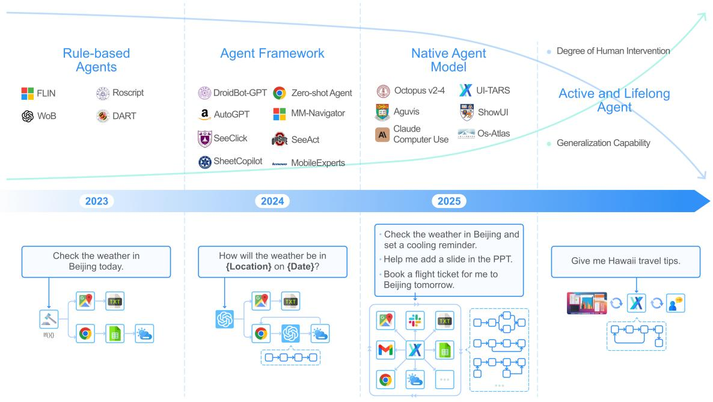  
Figure 2: The evolution path for GUI agents.

# 2.2 From Modular Agent Framework to Native Agent Model

Agent frameworks leveraging the power of large models (M)LLMs have surged in popularity recently. This surge is driven by the foundation models' ability to deeply comprehend diverse data types and generate relevant outputs via multi-step reasoning. Unlike rule-based agents, which necessitate handcrafted rules for each specific task, foundation models can generalize across different environments and effectively handle tasks by interacting multiple times with environments. This eliminates the need for humans to painstakingly define rules for every new scenario, significantly simplifying agent development and deployment.

Stage 2: Agent Framework Specifically, these agent systems mainly leverage the understanding and reasoning capabilities of advanced foundation models (e.g., GPT-4 (OpenAI, 2023b) and GPT-4o (Hurst et al., 2024)) to enhance task execution flexibility, which become more flexible, framework-based agents. Early efforts primarily focused on tasks such as calling specific APIs or executing code snippets within text-based interfaces (Wang et al., 2023; Li et al., 2023a,b; Wen et al., 2023; Nakano et al., 2021). These agents marked a significant advancement from purely rule-based systems by enabling more automatic and flexible interactions. Autonomous frameworks like AutoGPT (Yang et al., 2023a) and LangChain allow agents to integrate multiple external tools, APIs, and services, enabling a more dynamic and adaptable workflow.

Enhancing the performance of foundation model-based agent frameworks often involves designing task-specific workflows and optimizing prompts for each component. For instance, some approaches augment these frameworks with specialized modules, such as short- or long-term memory, to provide task-specific knowledge or store operational experience for self-improvement. Cradle (Tan et al., 2024) enhances foundational agents' multitasking capabilities by storing and leveraging task execution experiences. Similarly, Song et al. (2024) propose a framework for API-driven web agents that utilizes task-specific background knowledge to execute complex web operations. The Agent Workflow Memory (AWM) module (Wang et al., 2024g) further optimizes memory management by selectively providing relevant workflows to guide the agent's subsequent actions. Another common strategy to improve task success is the incorporation of reflection-based, multi-step reasoning to refine action planning and execution. The widely recognized ReAct framework (Yao et al., 2023) integrates reasoning with the outcomes of actions, enabling more dynamic and adaptable planning. For multimodal tasks, MMNavigator (Yan et al., 2023) leverages summarized contextual actions and mark tags to generate accurate, executable actions. SeeAct (Zheng et al., 2024b) takes a different approach by explicitly instructing GPT-4V to mimic human browsing behavior, taking into account the task, webpage content, and previous actions. Furthermore, multi-agent collaboration has emerged as a powerful technique for boosting task completion rates. MobileExperts (Zhang et al., 2024c), for example, addresses the unique challenges of mobile environments

by incorporating tool formulation and fostering collaboration among multiple agents. In summary, current advancements in agent frameworks heavily rely on optimizing plan and action generation through prompt engineering, centered around the capabilities of the underlying foundation models, ultimately leading to improved task completion.

Key Limitations of Agent Frameworks Despite greater adaptability compared to rule-based systems, agent frameworks still rely on human-defined workflows to structure their actions. The "agentic workflow knowledge" (Wang et al., 2024g) is manually encoded through custom prompts, external scripts, or tool-usage heuristics. This externalization of knowledge yields several drawbacks:

- Fragility and Maintenance Overhead: whenever tasks, interfaces, or usage scenarios evolve, the workflow's manual rules or prompts must be re-crafted or extended by developers—an error-prone and labor-intensive process.  
- Disjoint Learning Paradigms: framework-based methods rarely integrate new experience data to update the underlying LLM/VLM parameters. Instead, they rely on offline prompt-engineering or workflow design. As tasks deviate from the original domain, these frameworks often fail, limiting adaptability.  
- Module Incompatibility: complex tasks demand multiple modules (e.g., visual parsing, memory stores, long-horizon planning) that must coordinate via prompts or bridging code. Inconsistencies or errors in any module can derail the entire pipeline, and diagnosing these issues typically requires domain experts to debug the flow.

Thus, while agent frameworks offer quick demonstrations and are flexible within a narrow scope, they ultimately remain brittle when deployed in real-world scenarios, where tasks and interfaces continuously evolve. This reliance on pre-programmed workflows, driven by human expertise, makes frameworks inherently non-scalable. They depend on the foresight of developers to anticipate all future variations, which limits their capacity to handle unforeseen changes or learn autonomously. Frameworks are design-driven, meaning they lack the ability to learn and generalize across tasks without continuous human involvement.

Stage 3: Native Agent Model In contrast, the future of autonomous agent development lies in the creation of native agent models, where workflow knowledge is embedded directly within the agent's model through orientational learning. In this paradigm, tasks are learned and executed in an end-to-end manner, unifying perception, reasoning, memory, and action within a single, continuously evolving model. This approach is fundamentally data-driven, allowing for the seamless adaptation of agents to new tasks, interfaces, or user needs without relying on manually crafted prompts or predefined rules. Native agents offer several distinct advantages that contribute to their scalability and adaptability:

- Holistic Learning and Adaptation: because the agent's policy is learned end-to-end, it can unify knowledge from perception, reasoning, memory, and action in its internal parameters. As new data or user demonstrations become available, the entire system (rather than just a single module or prompt) updates its knowledge. This empowers the model to adapt more seamlessly to changing tasks, interfaces, or user demands.  
- Reduced Human Engineering: instead of carefully scripting how the LLM/VLM should be invoked at each node, native models learn task-relevant workflows from large-scale demonstrations or online experiences. The burden of "hardwiring a workflow" is replaced by data-driven learning. This significantly reduces the need for domain experts to handcraft heuristics whenever the environment evolves.  
- **Strong Generalization via Unified Parameters:** Although manual prompt engineering can make the model adaptable to user-defined new tools, the model itself cannot evolve. Under one parameterized policy and a unified data construction and training pipeline, knowledge among environments like certain app features, navigation strategies, or UI patterns can be transferred across tasks, equipping it with strong generalization.  
- Continuous Self-Improvement: native agent models lend themselves naturally to online or lifelong learning paradigms. By deploying the agent in real-world GUI environments and collecting new interaction data, the model can be fine-tuned or further trained to handle novel challenges.

This data-driven, learning-oriented approach stands in contrast to the design-driven, static nature of agent frameworks. As for now, the development of GUI agent gradually reached this stage, which representative works like Claude Computer-Use (Anthropic, 2024b), Aguvis (Xu et al., 2024), ShowUI (Lin et al., 2024b), OS-Atlas (Wu et al., 2024b), Octopus v2-4 (Chen & Li, 2024), etc. These models mainly utilize existing world data to tailor large VLMs specifically for the domain of GUI interaction.

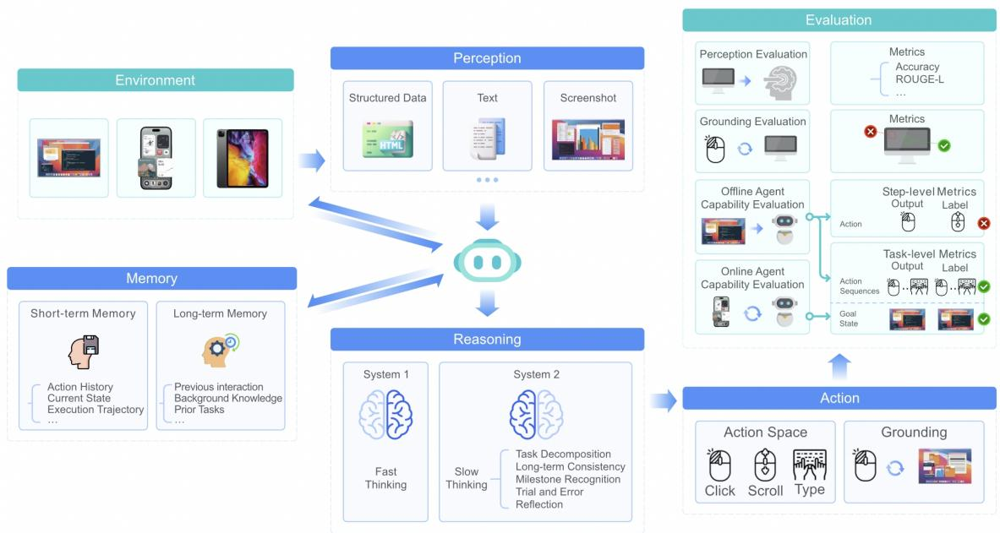  
Figure 3: An overview of core capabilities and evaluation for GUI agents.

# 2.3 Active and Lifelong Agent (Prospect)

Stage 4: Action and Lifelong Agent Despite improvements in adaptability, native agents still rely heavily on human experts for data labeling and training guidance. This dependence inherently restricts their capabilities, making them contingent upon the quality and breadth of human-provided data and knowledge.

The transition towards active and lifelong learning (Sur et al., 2022; Ramamoorthy et al., 2024) represents a crucial next step in the evolution of GUI agents. In this paradigm, agents actively engage with their environment to propose tasks, execute them, and evaluate the outcomes. These agents can autonomously assign self-rewards based on the success of their actions, reinforcing positive behaviors and progressively refining their capabilities through continuous feedback loops. This process of self-directed exploration and learning allows the agent to discover new knowledge, improve task execution, and enhance problem-solving strategies without heavy reliance on manual annotations or explicit external guidance.

These agents develop and modify their skills iteratively, much like continual learning in robotics (Ayub et al., 2024; Soltoggio et al., 2024), where they can learn from both successes and failures, progressively enhancing their generalization across an increasingly broad range of tasks and scenarios. The key distinction between native agent models and active lifelong learners lies in the autonomy of the learning process: native agents still depend on humans, whereas active agents drive their own learning by identifying gaps in their knowledge and filling them through self-initiated exploration.

In this work, we focus on building a scalable and data-driven native agent model, which paves the way for this active and lifelong agent stage. We begin by exploring the core capabilities necessary for such a framework (§ 3) and then introduce UI-TARS, our instantiation of this approach (§ 4).

# 3 Core Capabilities of Native Agent Model

The native agent model internalizes modularized components from the previous agent framework into several core capabilities, thereby transitioning towards an end-to-end structure. To get a more profound understanding of the native agent model, this section delves into an in-depth analysis of its core capabilities and reviews the current evaluation metrics and benchmarks.

# 3.1 Core Capabilities

As illustrated in Figure 3, our analysis is structured around four main aspects: perception, action, reasoning (system-1&2 thinking), and memory.

Perception A fundamental aspect of effective GUI agents lies in their capacity to precisely perceive and interpret graphical user interfaces in real-time. This involves not only understanding static screenshots, but also dynamically adapting to changes as the interface evolves. We review existing works based on their usage of input features:

- Structured Text: early iterations (Li et al., 2023a; Wang et al., 2023; Wu et al., 2024a) of GUI agents powered by LLMs are constrained by the LLMs' limitation of processing only textual input. Consequently, these agents rely on converting GUI pages into structured textual representations, such as HTML, accessibility trees, or Document Object Model (DOM). For web pages, some agents use HTML data as input or leverage the DOM to analyze pages' layout. The DOM provides a tree-like structure that organizes elements hierarchically. To reduce input noise, Agent-E (Abuelsaad et al., 2024) utilizes a DOM distillation technique to achieve more effective screenshot representations. Tao et al. (2023) introduce WebWISE, which iteratively generates small programs based on observations from filtered DOM elements and performs tasks in a sequential manner.  
- Visual Screenshot: with advancements in computer vision and VLMs, agents are now capable of leveraging visual data from screens to interpret their on-screen environments. A significant portion of research relies on Set-of-Mark (SoM) (Yang et al., 2023b) prompting to improve the visual grounding capabilities. To enhance visual understanding, these methods frequently employ Optical Character Recognition (OCR) in conjunction with GUI element detection models, including ICONNet (Sunkara et al., 2022) and DINO (Liu et al., 2025). These algorithms are used to identify and delineate interactive elements through bounding boxes, which are subsequently mapped to specific image regions, enriching the agents' contextual comprehension. Some studies also improve the semantic grounding ability and understanding of elements by adding descriptions of these interactive elements in the screenshots. For example, SeeAct (Zheng et al., 2024a) enhances fine-grained screenshot content understanding by associating visual elements with the content they represent in HTML web.  
- Comprehensive Interface Modeling: recently, certain works have employed structured text, visual snapshots, and semantic outlines of elements to attain a holistic understanding of external perception. For instance, Gou et al. (2024a) synthesize large-scale GUI element data and train a visual grounding model UGround to gain the associated references of elements in GUI pages on various platforms. Similarly, OSCAR (Wang & Liu, 2024) utilizes an A11y tree generated by the Windows API for representing GUI components, incorporating descriptive labels to facilitate semantic grounding. Meanwhile, DUALVCR (Kil et al., 2024) captures both the visual features of the screenshot and the descriptions of associated HTML elements to obtain a robust representation of the visual screenshot.

Another important point is the ability to interact in real-time. GUIs are inherently dynamic, with elements frequently changing in response to user actions or system processes. GUI agents must continuously monitor these changes to maintain an up-to-date understanding of the interface's state. This real-time perception is critical for ensuring that agents can respond promptly and accurately to evolving conditions. For instance, if a loading spinner appears, the agent should recognize it as an indication of a pending process and adjust its actions accordingly. Similarly, agents must detect and handle scenarios where the interface becomes unresponsive or behaves unexpectedly.

By effectively combining these above aspects, a robust perception system ensures that the GUI agent can maintain situational awareness and respond appropriately to the evolving state of the user interface, aligning its actions with the user's goals and the application's requirements. However, privacy concerns and the additional perceptual noise introduced by the DOM make it challenging to extend pure text descriptions and hybrid text-visual perceptions to any GUI environment. Hence, similar to human interaction with their surroundings, a native agent model should directly comprehend the external environment through visual perception and ground their actions to the original screenshot accurately. By doing so, the native agent model can generalize various tasks and improve the accuracy of actions at each step.

Action Effective action mechanisms must be versatile, precise, and adaptable to various GUI contexts. Key aspects include:

- Unified and Diverse Action Space: GUI agents (Gur et al., 2023; Bonatti et al., 2024) operate across multiple platforms, including mobile devices, desktop applications, and web interfaces, each with distinct interaction paradigms. Establishing a unified action space abstracts platform-specific actions into a common set of operations such as click, type, scroll, and drag. Additionally, integrating actions from language agents—such as API calls (Chen et al., 2024b; Li et al., 2023a,b), code interpretation (Wu et al., 2024a), and Command-Line Interface (CLI) (Mei et al., 2024) operations—enhances agent versatility. Actions can be categorized into atomic actions, which execute single operations, and compositional actions, which sequence multiple atomic actions to streamline task execution. Balancing atomic and compositional actions optimizes efficiency and reduces cognitive load, enabling agents to handle both simple interactions and the coordinated execution of multiple steps seamlessly.  
- Challenges in Grounding Coordinates: accurately determining coordinates for actions like clicks, drags, and swipes is challenging due to variability in GUI layouts (He et al., 2024; Burger et al., 2020), differing aspect ratios across devices, and dynamic content changes. Different devices' aspect ratios can alter the spatial arrangement of interface elements, complicating precise localization. Grounding coordinates requires advanced techniques to interpret visual cues from screenshots or live interface streams accurately.

Due to the similarity of actions across different operational spaces, agent models can standardize actions from various GUI contexts into a unified action space. Decomposing actions into atomic operations reduces learning complexity, facilitating faster adaptation and transfer of atomic actions across different platforms.

Reasoning with System 1&2 Thinking Reasoning is a complex capability that integrates a variety of cognitive functions. Human interaction with GUIs relies on two distinct types of cognitive processes (Groves & Thompson, 1970): system 1 and system 2 thinking.

- System 1 refers to fast, automatic, and intuitive thinking, typically employed for simple and routine tasks, such as clicking a familiar button or dragging a file to a folder without conscious deliberation.  
- System 2 encompasses slow, deliberate, and analytical thinking, which is crucial for solving complex tasks, such as planning an overall workflow or reflecting to troubleshoot errors.

Similarly, autonomous GUI agents must develop the ability to emulate both system 1 and system 2 thinking to perform effectively across a diverse range of tasks. By learning to identify when to apply rapid, heuristic-based responses and when to engage in detailed, step-by-step reasoning, these agents can achieve greater efficiency, adaptability, and reliability in dynamic environments.

System 1 Reasoning represents the agent's ability to execute fast, intuitive responses by identifying patterns in the interface and applying pre-learned knowledge to observed situations. This form of reasoning mirrors human interaction with familiar elements of a GUI, such as recognizing that pressing "Enter" in a text field submits a form or understanding that clicking a certain button progresses to the next step in a workflow. These heuristic-based actions enable agents to respond swiftly and maintain operational efficiency in routine scenarios. However, the reliance on pre-defined mappings limits the scope of their decision-making to immediate, reactive behaviors. For instance, models such as large action models (Wu et al., 2024b; Wang et al., 2024a) excel at generating quick responses by leveraging environmental observations, but they often lack the capacity for more sophisticated reasoning. This constraint becomes particularly evident in tasks requiring the planning and execution of multi-step operations, which go beyond the reactive, one-step reasoning of system 1. Thus, while system 1 provides a foundation for fast and efficient operation, it underscores the need for agents to evolve toward more deliberate and reflective capabilities seen in system 2 reasoning.

System 2 Reasoning represents deliberate, structured, and analytical thinking, enabling agents to handle complex, multi-step tasks that go beyond the reactive behaviors of system 1. Unlike heuristic-based reasoning, system 2 involves explicitly generating intermediate thinking processes, often using techniques like Chain-of-Thought (CoT) (Wei et al., 2022) or ReAct (Yao et al., 2023), which bridge the gap between simple actions and intricate workflows. This paradigm of reasoning is composed of several essential components.

- First, task decomposition focuses on formulating planings to achieve overarching objectives by decomposing tasks into smaller, manageable sub-tasks (Dagan et al., 2023; Song et al., 2023; Huang et al., 2024). For example, completing a multi-field form involves a sequence of steps like entering a name, address, and other details, all guided by a well-structured plan.  
- Second, long-term consistency is critical during the entire task completion process. By consistently referring back to the initial objective, agent models can effectively avoid any potential deviations that may occur during complex, multi-stage tasks, thus ensuring coherence and continuity from start to finish.

- Third, milestone recognition allows the agent model to estimate the current state of progress, analyze observations, and determine the subsequent goals. This ensures that multi-step workflows are executed effectively without losing direction.  
- Fourth, trial and error endows agent models with additional opportunities to hypothesize, test, and assess potential actions, thereby enhancing the precision of decision-making, particularly in ambiguous and complex scenarios.  
- Finally, reflection equips agent models with the capability to evaluate past actions, identify mistakes, and make adjustments to improve future performance (Shinn et al., 2023; Renze & Guven, 2024). This iterative process enhances reliability and helps prevent repetitive errors.

The development of UI-TARS places a strong emphasis on equipping the model with robust system 2 reasoning capabilities, allowing it to address complex tasks with greater precision and adaptability. By integrating high-level planning mechanisms, UI-TARS excels at decomposing overarching goals into smaller, manageable sub-tasks. This structured approach enables the model to systematically handle intricate workflows that require coordination across multiple steps. Additionally, UI-TARS incorporates a long-form CoT reasoning process, which facilitates detailed intermediate thinking before executing specific actions. Furthermore, UI-TARS adopts reflection-driven training process. By incorporating reflective thinking, the model continuously evaluates its past actions, identifies potential mistakes, and adjusts its behavior to improve performance over time. The model's iterative learning method yields significant benefits, enhancing its reliability and equipping it to navigate dynamic environments and unexpected obstacles.

Memory The memory is mainly used to store the supported explicit knowledge and historical experience that the agent refers to when making decisions. For agent frameworks, an additional memory module is often introduced to store previous interactions and task-level knowledge. Agents then retrieve and update these memory modules during decision-making progress. The memory module can be divided into two categories:

- Short-term Memory: this serves as a temporary repository for task-specific information, capturing the agent's immediate context. This includes the agent's action history, current state details, and the ongoing execution trajectory of the task, enabling real-time situational awareness and adaptability. By semantically processing contextual screenshots, CoAT (Zhang et al., 2024d) extracts key interface details, thereby enhancing comprehension of the task environment. CoCo-Agent (Ma et al., 2024) records layouts and dynamic states through Comprehensive Environment Perception (CEP).  
- Long-term Memory: it operates as a long-term data reserve, capturing and safeguarding records of previous interaction, tasks, and background knowledge. It retains details such as execution paths from prior tasks, offering a comprehensive knowledge base that supports reasoning and decision-making for future tasks. By integrating accumulated knowledge that contains user preferences and task operation experiences, OS-copilot (Wu et al., 2024a) refines its task execution over time to better align with user needs and improve overall efficiency. Cradle (Tan et al., 2024) focuses on enhancing the multitasking abilities of foundational agents by equipping them with the capability to store and utilize task execution experiences. Song et al. (2024) introduce a framework for API-driven web agents that leverage task-specific background knowledge to perform complex web operations.

Memory reflects the capability to leverage background knowledge and input context. The synergy between short-term and long-term memory storage significantly enhances the efficiency of an agent's decision-making process. Native agent models, unlike agent frameworks, encode long-term operational experience of tasks within their internal parameters, converting the observable interaction process into implicit, parameterized storage. Techniques such as In-Context Learning (ICL) or CoT reasoning can be employed to activate this internal memory.

# 3.2 Capability Evaluation

To evaluate the effectiveness of GUI agents, numerous benchmarks have been meticulously designed, focusing on various aspects of capabilities such as perception, grounding, and agent capabilities. Specifically, Perception Evaluation reflects the degree of understanding of GUI knowledge. Grounding Evaluation verifies whether agents can accurately locate coordinates in diverse GUI layouts. Agent capabilities can be primarily divided into two categories: Offline Agent Capability Evaluation, which is conducted in a predefined and static environment and mainly focuses on assessing the individual steps performed by GUI agents, and Online Agent Capability Evaluation, which is performed in an interactive and dynamic environment and evaluates the agent's overall capability to successfully complete the task.

Perception Evaluation Perception evaluation assesses agents' understanding of user interface (UI) knowledge and their awareness of the environment. For instance, VisualWebBench (Liu et al., 2024c) focuses on agents' web understanding capabilities, while WebSRC (Chen et al., 2021) and ScreenQA (Hsiao et al., 2022) evaluate web structure comprehension and mobile screen content understanding through question-answering (QA) tasks. Additionally, GUI-World (Chen et al., 2024a) offers a wide range of queries in multiple-choice, free-form, and conversational formats to assess GUI understanding. Depending on the varying question formats, a range of metrics are employed. For instance, accuracy is utilized for multiple-choice question (MCQ) tasks as the key metric, and in the case of captioning or Optical Character Recognition (OCR) tasks, the ROUGE-L metric is adopted to evaluate performance.

Grounding Evaluation Given an instructions, grounding evaluation focuses on the ability to precisely locate GUI elements. ScreenSpot (Cheng et al., 2024) evaluates single-step GUI grounding performance across multiple platforms. ScreenSpot v2 (Wu et al., 2024b), a re-annotated version, addresses annotation errors present in the original ScreenSpot. ScreenSpot Pro (Li et al., 2025) facilitates grounding evaluation by incorporating real-world tasks gathered from diverse high-resolution professional desktop environments. Metrics for grounding evaluation are usually determined based on whether the model's predicted location accurately lies within the bounding box of the target element.

Offline Agent Capability Evaluation Offline evaluation measures the performance of GUI agents in static, pre-defined environments. Each environment typically includes an input instruction and the current state of the environment (e.g., a screenshot or a history of previous actions), requiring agents to produce the correct outputs or actions. These environments remain consistent throughout the evaluation process. Numerous offline evaluation benchmarks, including AITW (Rawles et al., 2023), Mind2Web (Deng et al., 2023), MT-Mind2Web (Deng et al., 2024), AITZ (Zhang et al., 2024e), AndroidControl (Li et al., 2024c), and GUI-Odyssey (Lu et al., 2024a), provide agents with a task description, a current screenshot, and previous actions history, aimed at enabling accurate prediction of the next action. These benchmarks commonly employ step-level metrics, providing fine-grained supervision of their specific behaviors. For instance, the Action-Matching Score (Rawles et al., 2023; Zhang et al., 2024e; Li et al., 2024c; Lu et al., 2024a) considers an action correct solely when both the type of action and its specific details (e.g. arguments like typed content or scroll direction) are consistent with the ground truth. Some benchmarks (Li et al., 2020a; Burns et al., 2022) demand that agents produce a series of automatically executable actions from provided instructions and screenshots. These benchmarks predominantly assess performance using task-level metrics, which determine task success by whether the output results precisely match the pre-defined labels, like the complete and partial action sequence matching accuracy (Li et al., 2020a; Burns et al., 2022; Rawles et al., 2023).

Online Agent Capability Evaluation Online evaluation facilitates dynamic environments, each designed as an interactive simulation that replicates real-world scenarios. In these environments, GUI agents can modify environmental states by executing actions in real time. These dynamic environments span various platforms: (1) Web: WebArena (Zhou et al., 2023) and MMInA (Zhang et al., 2024g) provide realistic web environments. (2) Desktop: OSWorld (Xie et al., 2024), OfficeBench (Wang et al., 2024f), ASSISTGUI (Gao et al., 2023), and WindowsAgentArena (Bonatti et al., 2024) operate within real computer desktop environments. (3) Mobile: AndroidWorld (Rawles et al., 2024a), LlamaTouch (Zhang et al., 2024f), and B-MOCA (Lee et al., 2024) are built on mobile operating systems such as Android. To assess performance in online evaluation, task-level metrics are employed, providing a comprehensive measure of the agents' effectiveness. Specifically, in the realm of online agent capability evaluation, these task-level metrics primarily determine task success based on whether an agent successfully reaches a goal state. This verification process checks whether the intended outcome achieved or if the resulting outputs precisely align with the labels (Zhou et al., 2023; Xie et al., 2024; Wang et al., 2024f; Gao et al., 2023).

# 4 UI-TARS

In this section, we introduce UI-TARS, a native GUI agent model designed to operate without reliance on cumbersome manual rules or the cascaded modules typical of conventional agent frameworks. UI-TARS directly perceives the screenshot, applies reasoning processes, and generates valid actions autonomously. Moreover, UI-TARS can learn from prior experience, iteratively refining its performance by leveraging environment feedback.

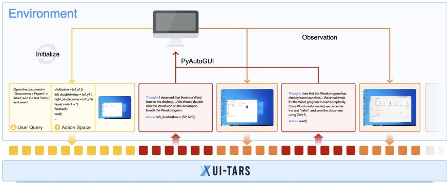

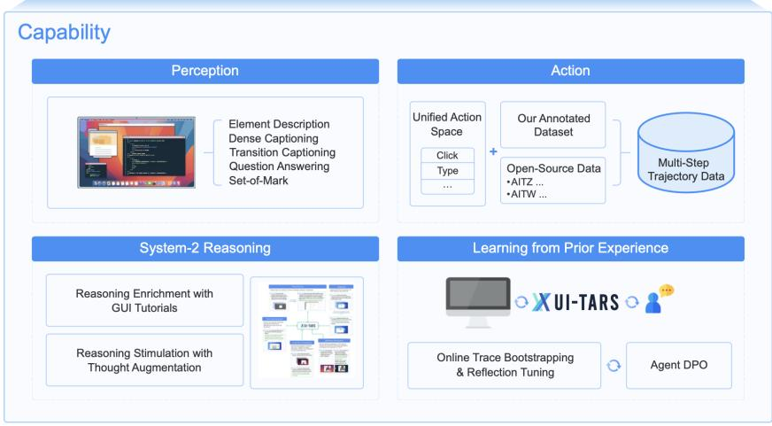  
Figure 4: Overview of UI-TARS. We illustrate the architecture of the model and its core capabilities.

In the following, we begin by describing the overall architecture of UI-TARS (§ 4.1), followed by how we enhance its perception (§ 4.2) and action (§ 4.3) capabilities. Then we concentrate on how to infuse system-2 reasoning capabilities into UI-TARS (§ 4.4) and iterative improvement through experience learning (§ 4.5).

# 4.1 Architecture Overview

As illustrated in Figure 4, given an initial task instruction, UI-TARS iteratively receives observations from the device and performs corresponding actions to accomplish the task. This sequential process can be formally expressed as:

$$
\left(\text {i n s t r u c t i o n}, \left(o _ {1}, a _ {1}\right), \left(o _ {2}, a _ {2}\right), \dots , \left(o _ {n}, a _ {n}\right)\right), \tag {1}
$$

where  $o_i$  denotes the observation (device screenshot) at time step  $i$ , and  $a_i$  represents the action executed by the agent. At each time step, UI-TARS takes as input the task instruction, the history of prior interactions  $(o_1, a_1, \dots, o_{i-1}, a_{i-1})$ , and the current observation  $o_i$ . Based on this input, the model outputs an action  $a_i$  from the predefined action space. After executing the action, the device provides the subsequent observation, and these processes iteratively continue.

To further enhance the agent's reasoning capabilities and foster more deliberate decision-making, we integrate a reasoning component in the form of "thoughts"  $t_i$ , generated before each action  $a_i$ . These thoughts reflect the reflective nature of "System 2" thinking. They act as a crucial intermediary step, guiding the agent to reconsider previous actions and observations before moving forward, thus ensuring that each decision is made with intentionality and careful consideration.

This approach is inspired by the ReAct framework (Yao et al., 2023), which introduces a similar reflective mechanism but in a more straightforward manner. In contrast, our integration of "thoughts" involves a more structured, goal-oriented deliberation. These thoughts are a more explicit reasoning process that guides the agent toward better decision-making, especially in complex or ambiguous situations. The process can now be formalized as:

$$
\left(\text {i n s t r u c t i o n}, \left(o _ {1}, t _ {1}, a _ {1}\right), \left(o _ {2}, t _ {2}, a _ {2}\right), \dots , \left(o _ {n}, t _ {n}, a _ {n}\right)\right), \tag {2}
$$

  
Figure 5: Data example of perception and grounding data.

these intermediate thoughts guide the model's decision-making and enable more nuanced and reflective interactions with the environment.

In order to optimize memory usage and maintain efficiency within the typically constrained token budget (e.g., 32k sequence length), we limit the input to the last  $N$  observations. This constraint ensures the model remains capable of handling the necessary context without overwhelming its memory capacity. The full history of previous actions and thoughts is retained as short-term memory. UI-TARS predicts the thought  $t_n$  and action  $a_{n}$  outputs iteratively, conditioned on both the task instruction and the previous interactions:

$$
P \left(t _ {n}, a _ {n} \mid \text {i n s t r u c t i o n}, t _ {1}, a _ {1}, \dots , \left(o _ {n - i}, t _ {n - i}, a _ {n - i}\right) _ {i = 1} ^ {N}, o _ {n}\right). \tag {3}
$$

# 4.2 Enhancing GUI Perception

Improving GUI perception presents several unique challenges: (1) Screenshot Scarcity: while large-scale general scene images are widely available, GUI-specific screenshots are relatively sparse. (2) Information Density and Precision Requirement: GUI images are inherently more information-dense and structured than general scene images, often containing hundreds of elements arranged in complex layouts. Models must not only recognize individual elements but also understand their spatial relationships and functional interactions. Moreover, many elements in GUI images are small (e.g.,  $10 \times 10$  pixel icons in a  $1920 \times 1080$  image), making it difficult to perceive and localize these elements accurately. Unlike traditional frameworks that rely on separate, modular perception models, native agents overcome these challenges by directly processing raw input from GUI screenshots. This approach enables them to scale better by leveraging large-scale, unified datasets, thereby addressing the unique challenges of GUI perception with greater efficiency.

Screenshot Collection To address data scarcity and ensure diverse coverage, we built a large-scale dataset comprising screenshots and metadata from websites, apps, and operating systems. Using specialized parsing tools, we automatically extracted rich metadata—such as element type, depth, bounding box, and text content for each element—while rendering the screenshots. Our approach combined automated crawling and human-assisted exploration to capture a wide range of content. We included primary interfaces as well as deeper, nested pages accessed through repeated interactions. All data was logged in a structured format—(screenshots, element box, element metadata)—to provide comprehensive coverage of diverse interface designs.

We adopt a bottom-up data construction approach, starting from individual elements and progressing to holistic interface understanding. By focusing on small, localized parts of the GUI before integrating them into the broader context, this approach minimizes errors while balancing precision in recognizing components with the ability to interpret complex layouts. Based on the collected screenshot data, we curated five core task data (Figure 5):

Element Description To enhance recognizing and understanding specific elements within a GUI, particularly tiny elements, we focus on creating detailed and structured descriptions for each element. Such descriptions are based on metadata extracted using parsing tools and further synthesized by a VLM, covering four aspects: (1) Element Type (e.g., windows control types): we classify elements (e.g., buttons, text fields, scrollbars) based on visual cues and system information; (2) Visual Description, which describes the element's appearance, including its shape, color, text content, and style, derived directly from the image; (3) Position Information: we describe the spatial position of each element relative to others; (4) Element Function, which describes the element's intended functionality and possible ways of interactions. We train UI-TARS to enumerate all visible elements within a screenshot and generate their element descriptions, conditioned on the screenshot.

Dense Captioning We train UI-TARS to understand the entire interface while maintaining accuracy and minimizing hallucinations. The goal of dense captioning is to provide a comprehensive, detailed description of the GUI screenshot, capturing not only the elements themselves but also their spatial relationships and the overall layout of the interface. For each recorded element in the screenshot, we first obtain their element descriptions. For embedded images, which often lack detailed metadata, we also generate their descriptive captions. After that, we integrate all the image and element descriptions into a cohesive, highly detailed caption that preserves the structure of the GUI layout using a VLM. During training, UI-TARS is given only the image and tasked with outputting the corresponding dense caption.

State Transition Captioning While dense captioning provides a comprehensive description of a GUI interface, it does not capture state transitions, particularly the subtle effects of actions (e.g., a tiny button being pressed) on the interface. To address this limitation, we train the model to identify and describe the differences between two consecutive screenshots and determine whether an action, such as a mouse click or keyboard input, has occurred. We also incorporate screenshot pairs that correspond to non-interactive UI changes (e.g., animations, screen refreshes, or background updates). During training, UI-TARS is presented with a pair of images and tasked with predicting the specific visual changes (and possible reasons) of the two images. In this way, UI-TARS learns the subtle UI changes, including both user-initiated actions and non-interactive transitions. This capability is crucial for tasks requiring fine-grained interaction understanding and dynamic state perception.

Question Answering (QA) While dense captioning and element descriptions primarily focus on understanding the layout and elements of a GUI, QA offers a more dynamic and flexible approach to integrating these tasks with reasoning capabilities. We synthesize a diverse set of QA data that spans a broad range of tasks, including interface comprehension, image interpretation, element identification, and relational reasoning. This enhances UI-TARS's capacity to process queries that involve a higher degree of abstraction or reasoning.

Set-of-Mark (SoM) We also enhance the Set-of-Mark (SoM) prompting ability (Yang et al., 2023b) of UI-TARS. We draw visually distinct markers for parsed elements on the GUI screenshot based on their spatial coordinates. These markers vary in attributes such as form, color, and size, providing clear, intuitive visual cues for the model to locate and identify specific elements. In this way, UI-TARS better associates visual markers with their corresponding elements. We integrate SoM annotations with tasks like dense captioning and QA. For example, the model might be trained to describe an element highlighted by a marker.

# 4.3 Unified Action Modeling and Grounding

The de-facto approach for improving action capabilities involves training the model to mimic human behaviors in task execution, i.e., behavior cloning (Bain & Sammut, 1995). While individual actions are discrete and isolated, real-world agent tasks inherently involve executing a sequence of actions, making it essential to train the model on multi-step trajectories. This approach allows the model to learn not only how to perform individual actions but also how to sequence them effectively (system-1 thinking).

Unified Action Space Similar to previous works, we design a common action space that standardizes semantically equivalent actions across devices (Table 1), such as "click" on Windows versus "tap" on mobile, enabling knowledge transfer across platforms. Due to device-specific differences, we also introduce optional actions tailored to each platform. This ensures the model can handle the unique requirements of each device while maintaining consistency across scenarios. We also define two terminal actions: Finished(), indicating task completion, and CallUser(), invoked in cases requiring user intervention, such as login or authentication.

<table><tr><td>Environment</td><td>Action</td><td>Definition</td></tr><tr><td rowspan="7">Shared</td><td>Click(x, y)</td><td>Clicks at coordinates (x, y).</td></tr><tr><td>Drag(x1, y1, x2, y2)</td><td>Drags from (x1, y1) to (x2, y2).</td></tr><tr><td>Scroll(x, y, direction)</td><td>Scrolls at (x, y) in the given direction.</td></tr><tr><td>Type(content)</td><td>Types the specified content.</td></tr><tr><td>Wait()</td><td>Pauses for a brief moment.</td></tr><tr><td>Finished()</td><td>Marks the task as complete.</td></tr><tr><td>CallUser()</td><td>Requests user intervention.</td></tr><tr><td rowspan="3">Desktop</td><td>Hotkey(key)</td><td>Presses the specified hotkey.</td></tr><tr><td>LeftDouble(x, y)</td><td>Double-clicks at (x, y).</td></tr><tr><td>RightSingle(x, y)</td><td>Right-clicks at (x, y).</td></tr><tr><td rowspan="4">Mobile</td><td>LongPress(x, y)</td><td>Long presses at (x, y).</td></tr><tr><td>PressBack()</td><td>Presses the “back” button.</td></tr><tr><td>PressHome()</td><td>Presses the “home” button.</td></tr><tr><td>PressEnter()</td><td>Presses the “enter” key.</td></tr></table>

<table><tr><td rowspan="2" colspan="2">Data Type</td><td colspan="2">Grounding</td><td colspan="2">MultiStep</td></tr><tr><td>Ele.</td><td>Ele./Image</td><td>Trace</td><td>avg steps</td></tr><tr><td rowspan="3">Open Source</td><td>Web</td><td>14.8M</td><td>6.7</td><td>6.4k</td><td>7.1</td></tr><tr><td>Mobile</td><td>2.5M</td><td>4.6</td><td>145k</td><td>9.6</td></tr><tr><td>Desktop</td><td>1.1M</td><td>6.2</td><td>0</td><td>0</td></tr><tr><td colspan="2">Ours</td><td>*</td><td>7.5</td><td>*</td><td>14.9</td></tr></table>

Table 2: Basic statistics for grounding and multi-step action trace data, comparing both our annotated dataset and open-source data across different platforms (web, mobile, and desktop). We report the number of elements (Ele.) and the number of action traces (Trace).

Table 1: Unified action space for different platforms.

Action Trace Collection A significant challenge in training models for task execution lies in the limited availability of multi-step trajectory data, which has historically been under-recorded and sparse. To address this issue, we rely on two primary data sources: (1) our annotated dataset: we develop a specialized annotation tool to capture user actions across various software and websites within PC environments. The annotation process begins with the creation of initial task instructions, which are reviewed and refined by annotators to ensure clarity and alignment with the intended goals. Annotators then execute the tasks, ensuring that their actions fulfill the specified requirements. Each task undergoes rigorous quality filtering; and (2) open-source data: we also integrate multiple existing datasets (MM-Mind2Web (Zheng et al., 2024b), GUIAct (Chen et al., 2024c), AITW (Rawles et al., 2023), AITZ (Zhang et al., 2024d), AndroidControl (Li et al., 2024c), GUI-Odyssey (Lu et al., 2024a), AMEX (Chai et al., 2024)) and standardize them into a unified action space format. This involves reconciling varying action representations into a consistent template, allowing for seamless integration with the annotated data. In Table 2, we list the basic statistics of our action trace data.

Improving Grounding Ability Grounding, the ability to accurately locate and interact with specific GUI elements, is critical for actions like clicking or dragging. Unlike multi-step action data, grounding data is easier to scale because it primarily relies on the visual and position properties of elements, which can be efficiently synthesized or extracted (Hong et al., 2024; Gou et al., 2024a; Wu et al., 2024b). We train UI-TARS to directly predict the coordinates of the elements it needs to interact with. This involves associating each element in a GUI with its spatial coordinates and metadata.

As described in § 4.2, we collected screenshots and extracted metadata, including element type, depth, bounding boxes, and text content, using specialized parsing tools. For elements recorded with bounding boxes, we calculated the average of the corners to derive a single point coordinate, representing the center of the bounding box. To construct training samples, each screenshot is paired with individual element descriptions derived from metadata. The model is tasked with outputting relative coordinates normalized to the dimensions of the screen, ensuring consistency across devices with varying resolutions. For example, given the description "red button in the top-right corner labeled Submit", the model predicts the normalized coordinates of that button. This direct mapping between descriptions and coordinates enhances the model's ability to understand and ground visual elements accurately.

To further augment our dataset, we integrated open-source data (Seeclick (Cheng et al., 2024), GUIAct (Chen et al., 2024c), MultiUI (Liu et al., 2024b), Rico-SCA (Li et al., 2020a), WidgetCaption (Li et al., 2020b), MUG (Li et al., 2024b), Rico Icon (Sunkara et al., 2022), CLAY (Li et al., 2022), UIBERT (Bai et al., 2021), OmniACT (Kapoor et al., 2024), AutoGUI (Anonymous, 2024), OS-ATLAS (Wu et al., 2024b)) and standardized them into our unified action space format. We provide the basic statistics of the grounding data for training in Table 2. This combined dataset enables UI-TARS to achieve high-precision grounding, significantly improving its effectiveness in actions such as clicking and dragging.

# 4.4 Infusing System-2 Reasoning

Relying solely on system-1 intuitive decision-making is insufficient to handle complex scenarios and ever-changing environments. Therefore, we aim for UI-TARS to combine system-2 level reasoning, flexibly planning action steps by understanding the global structure of tasks.

Reasoning Enrichment with GUI Tutorials The first step focuses on reasoning enrichment, where we leverage publicly available tutorials that interweave text and images to demonstrate detailed user interactions across diverse software and web environments. These tutorials provide an ideal source for establishing foundational GUI knowledge while introducing logical reasoning patterns inherent to task execution.

We selected MINT (Awadalla et al., 2024) and OmniCorpus (Li et al., 2024a), two widely recognized image-text interleaved pre-training datasets, as our initial data sources. However, these datasets contain substantial noise, with only a small fraction aligning with GUI tutorial criteria. To extract high-quality tutorial data, we implemented a multi-stage data collection and filtering pipeline: (1) Coarse-Grained Filtering: to isolate tutorial-like content, we trained a fastText classifier (Joulin et al., 2016) using a manually curated positive set of high-quality tutorials and random samples from MINT and OmniCorpus as the negative set. The trained classifier was then applied to perform an initial screening, filtering out irrelevant samples and generating a candidate dataset. (2) Fine-Grained Filtering: to further refine the candidate dataset, we employed an LLM to identify and remove false positives. This step ensured the remaining samples conformed to the characteristics of GUI tutorials. The coarse and fine filtering processes were iterated over multiple rounds to maximize the recall rate of high-quality GUI tutorials. (3) Dedduplication and Data Refinement: the filtered dataset was further refined to address duplicates, advertisements, and residual noise. Deduplication was performed using URL-based and Locality-Sensitive Hashing (LSH) methods. Finally, we prompt an LLM to rephrase all the textual content in the tutorial, refining the content while eliminating irrelevant or low-quality ones.

Through this multi-stage process, we curated approximately 6M high-quality GUI tutorials. On average, each tutorial contains 510 text tokens and 3.3 images. This data not only enhances the model's understanding of GUI operations but also lays a robust foundation for infusing reasoning capabilities.

Reasoning Stimulation with Thought Augmentation The action trace data we collect in § 4.3 is inherently action-focused, containing sequences of observations and actions  $(o_{i-1}, a_{i-1}, o_i, a_i, \ldots)$  but lacking explicit reasoning thoughts. To stimulate reasoning capabilities of UI-TARS, we augment the dataset by annotating "thoughts" to bridge the gap between perception and action. This transforms the data format to  $(o_{i-1}, t_{i-1}, a_{i-1}, o_i, t_i, a_i, \ldots)$ , where  $t$  represents the reasoning thought. These thoughts enable the model to express its decision-making process explicitly, fostering better alignment with task objectives. To construct these thoughts, we employ two annotation stages:

(1) ActRe (Yang et al., 2024b): as shown in (4), for each trace collected in § 4.3, we split them into multiple steps. For each step  $n$ , its thought  $t_n$  is generated iteratively by prompting a VLM with the previous context and the current target action  $a_n$ . This method tries to make the generated thought logically grounded in the preceding context and aligned with the current action.

$$
\left\{ \begin{array}{l} t _ {n} = \operatorname {V L M} (\text {i n s t r u c t i o n}, \left(o _ {1}, t _ {1}, a _ {1}\right), \left(o _ {2}, t _ {2}, a _ {2}\right), \dots , o _ {n}, a _ {n}) \\ t _ {n + 1} = \operatorname {V L M} (\text {i n s t r u c t i o n}, \left(o _ {1}, t _ {1}, a _ {1}\right), \left(o _ {2}, t _ {2}, a _ {2}\right), \dots , \left(o _ {n}, t _ {n}, a _ {n}\right), o _ {n + 1}, a _ {n + 1}) \\ \vdots \end{array} \right. \tag {4}
$$

During ActRe annotation, we prompt the VLM toward exhibiting higher-order, system-2 reasoning, which involves deliberate, step-by-step decision-making and reflection. By promoting these reasoning patterns, we encourage the model to engage in thoughtful, long-term planning and reflection to solve complex tasks. As shown in Figure 6, the reasoning patterns we prompt the VLM to follow include:

- Task Decomposition: guide the model to break complex tasks into smaller, manageable subtasks, enabling it to address intricate workflows step-by-step.  
- Long-term Consistency: ensure the model maintains a consistent goal throughout a task, referencing the overall objective and operation history to avoid deviations during complex, multi-step tasks.  
- Milestone Recognition: enable the model to recognize the completion of intermediate objectives, facilitating smooth transitions to subsequent goals.  
- Trial and Error: equip the model to hypothesize, test, and evaluate potential actions, especially in ambiguous situations like verifying search results without directly interacting.  
- Reflection: enable the model to identify and correct errors when operations fail, encouraging adaptability and error recovery through reflective reasoning.

(2) Thought Bootstrapping: reverse annotation of thoughts conditioned on ground-truth actions (i.e., ActRe) can lead to false positives because the generated thoughts may appear to match the corresponding actions at a

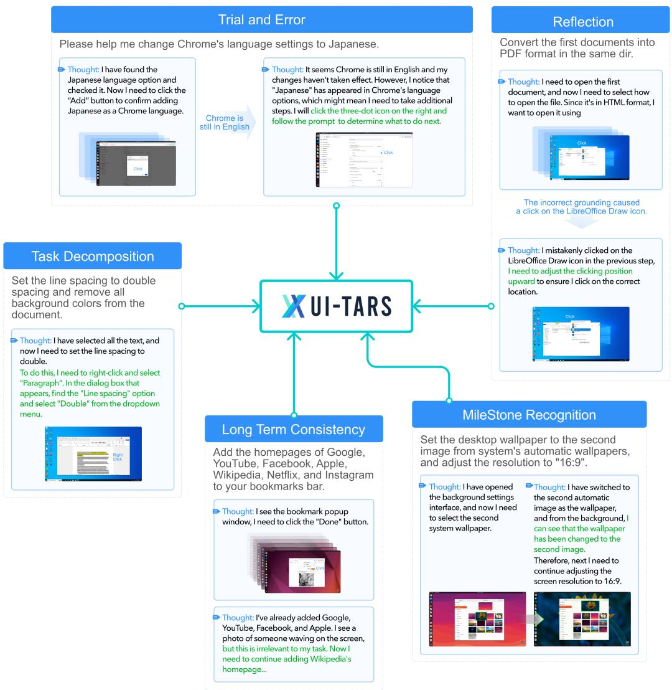  
Figure 6: Various reasoning patterns in our augmented thought.

superficial level, without establishing a true causal relationship. Specifically, the reasoning process underlying the action may be overlooked, causing the thought to align with the action only by coincidence rather than through logical reasoning. This issue arises because the annotation process relies on knowing the action in advance, which may bias the thought to conform to the action rather than reflect the actual decision-making process leading to it.

To address this, we adopt a bootstrapping approach that generates thoughts without prior knowledge of the ground-truth action. By sampling multiple thought-action pairs, as shown in (5), we identify the thought that leads to the correct action, ensuring that the reasoning aligns causally with the chosen action. This approach produces higher-quality annotations because it forces the model to simulate a genuine decision-making process rather than merely justifying a pre-determined action (UI-TARSearly means an early-stage model checkpoint).

$$
\left\{ \begin{array}{l} \left(\hat {t} _ {n _ {i}}, \hat {a} _ {n _ {i}}\right) _ {i = 1} ^ {\max  - \text {t r y}} = \mathrm {U I - T A R S} _ {\text {e a r l y}} (\text {i n s t r u c t i o n}, \left(o _ {1}, t _ {1}, a _ {1}\right), \left(o _ {2}, t _ {2}, a _ {2}\right), \dots , o _ {n}) \\ \text {S . 1 . 4 . (} \hat {\hat {s}} _ {-} \text {)} _ {i = 1} ^ {\hat {\hat {s}}} = \hat {\hat {s}} _ {-} \end{array} \right. \tag {5}
$$

$$
\left. \left\{ \begin{array}{l} \text {S e l e c t} \left(\hat {t} _ {n _ {i}}, \hat {a} _ {n _ {i}}\right), \text {w h e r e} \hat {a} _ {n _ {i}} = a _ {n} \end{array} \right. \right.
$$

We annotate thoughts in both Chinese and English, expanding linguistic diversity. Although we augment thoughts for all traces, we also involve the vanilla action traces (without thought) during training.

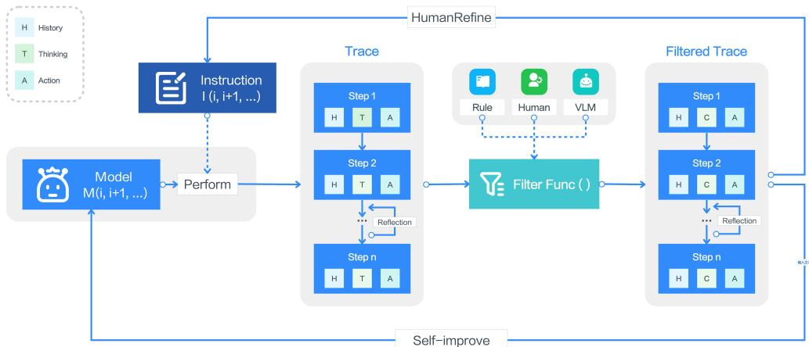  
Figure 7: Overview of the online bootstrapping process.

# 4.5 Learning from Prior Experience in Long-term Memory

GUI agents face significant challenges in scaling to the level of LLMs, primarily due to the scarcity of large-scale, standardized, real-world process data for GUI operations. While LLMs can leverage abundant textual data that captures diverse knowledge and reasoning patterns, process data detailing user interactions and decision-making sequences within GUI environments is rarely recorded or systematically organized. This lack of data impedes the ability of GUI agents to scale effectively and generalize across a wide range of tasks. One promising solution lies in learning from prior experiences stored in long-term memory. By capturing and retaining knowledge from previous tasks, agents can leverage these past experiences to inform their future decisions, making their actions more adaptive and efficient.

To facilitate this process, we enable UI-TARS to dynamically learn from interactions with real-world devices. Through semi-automated data collection, filtering, and refinement, the model continuously improves while minimizing the need for manual intervention. By leveraging long-term memory, UI-TARS builds on its accumulated knowledge, refining its performance over time and adapting to new tasks more efficiently. Each iteration of this process results in a more capable model.

Online Trace Bootstrapping As shown in Figure 7, we begin by obtaining a diverse set of task goals, combining both human-annotated and model-generated instructions. At iteration  $n$ , the agent  $M_{n}$  executes these instructions  $\mathcal{I}_n$  within the target GUI environments (e.g., a virtual PC), producing a raw set of traces:

$$
\mathcal {T} _ {\text {r a w}, n} = \left\{\left(o _ {1}, t _ {1}, a _ {1}, o _ {2}, t _ {2}, a _ {2}, \dots , o _ {n}, t _ {n}, a _ {n}\right), \dots \right\}.
$$

To ensure high-quality data, we apply a multi-level filtering function:

$$
\operatorname {F i l t e r} \left(\mathcal {T} _ {\text {r a w}, n}, \mathcal {I} _ {n}\right) = \mathcal {T} _ {\text {f i l t e r e d}, n},
$$

which discards noisy or invalid traces through the following steps: (1) Rule-Based Reward: heuristic rules remove traces with obvious anomalies (e.g., redundant actions that do not alter the environment); (2) VLM Scoring: VLMs assign quality scores to the remaining traces, with traces scoring below a predefined threshold being removed; (3) Human Review: part of the traces are further inspected by annotators, who identify the step where an error occurs, discard any subsequent actions, and retain only the valid prefix. UI-TARS leverages the resulting filtered trace set  $\mathcal{T}_{\mathrm{filtered},n}$  for self-improvement:

$$
M _ {n + 1} = \operatorname {F i n e T u n e} \left(M _ {n}, \mathcal {T} _ {\text {f i l t e r e d}, n}\right).
$$

For each round, we employ annotators to refine or expand the instruction set:

$$
\mathcal {I} _ {n + 1} = \operatorname {H u m a n R e f i n e} \left(\mathcal {I} _ {n}, \mathcal {T} _ {\text {f i l t e r e d}, n}\right).
$$

We iterate the above process on hundreds of virtual PCs for multiple rounds, continuously leveraging the latest model  $M_{n + 1}$  to generate new traces, thus expanding and refining the data.

Reflection Tuning In realistic online deployments, agents often encounter situations where they get stuck due to a lack of self-reflection and error correction capabilities. For example, an agent might repeatedly click on an unresponsive button or attempt invalid operations due to misinterpretation of the interface. Without the ability to recognize these errors or adjust its strategy, the agent remains in a loop of ineffective actions, unable to progress toward the task objective. However, most offline datasets contain idealized, error-free trajectories because annotators ensure that each action meets expectations during the data labeling process. While such data helps reduce noise during model training, it also prevents the agent from learning how to recover from errors. To address this limitation, we propose a reflection tuning protocol that exposes the model to real-world errors made by itself with their corrections, enabling UI-TARS to learn how to recover from suboptimal decisions.

For an online trace generated by UI-TARS:  $\mathcal{T} =$  (instruction,  $(o_1,t_1,a_1),(o_2,t_2,a_2),\ldots ,(o_t,t_t,a_t))$  , suppose that an error occurs at step  $\tau$  , where the action  $a_{\tau}$  is deemed invalid or suboptimal. We asked annotators to identify this error and label the corrected thought and action  $t_\tau^*,a_\tau^*$  . This results in an error correction trace pair:

$$
\left\{ \begin{array}{l} \mathcal {T} _ {-} = \left(\text {i n s t r u c t i o n}, \left(o _ {1}, t _ {1}, a _ {1}\right), \left(o _ {2}, t _ {2}, a _ {2}\right), \dots , \left(o _ {\tau}, t _ {\tau}, a _ {\tau}\right)\right) \\ \mathcal {T} _ {+} = \left(\text {i n s t r u c t i o n}, \left(o _ {1}, t _ {1}, a _ {1}\right), \left(o _ {2}, t _ {2}, a _ {2}\right), \dots , \left(o _ {\tau}, t _ {\tau} ^ {*}, a _ {\tau} ^ {*}\right)\right) \end{array} \right. \tag {6}
$$

Innovatively, we further require annotators to continue labeling the subsequent step based on the incorrect action  $a_{\tau}$ , simulating a scenario where the error has already occurred. When determining the thought for the next step  $t_{\tau + 1}^{*}$ , annotators must acknowledge the impact of the previous mistake, compensate for its effects, and provide a correct action  $a_{\tau + 1}^{*}$  to realign the task progress. For example, if the previous step intended to add a webpage to bookmarks but mistakenly clicked the close button, the next step should involve reopening the recently closed webpage to re-attempt clicking the bookmark button. Formally, we have a post-reflection trace pair:

$$
\left\{ \begin{array}{l} \mathcal {T} _ {-} = \left(\text {i n s t r u c t i o n}, \left(o _ {1}, t _ {1}, a _ {1}\right), \left(o _ {2}, t _ {2}, a _ {2}\right), \dots , \left(o _ {\tau}, t _ {\tau}, a _ {\tau}\right), \left(o _ {\tau + 1}, t _ {\tau + 1}, a _ {\tau + 1}\right)\right) \\ \mathcal {T} _ {+} = \left(\text {i n s t r u c t i o n}, \left(o _ {1}, t _ {1}, a _ {1}\right), \left(o _ {2}, t _ {2}, a _ {2}\right), \dots , \left(o _ {\tau}, t _ {\tau}, a _ {\tau}\right), \left(o _ {\tau + 1}, t _ {\tau + 1} ^ {*}, a _ {\tau + 1} ^ {*}\right)\right) \end{array} \right. \tag {7}
$$

We utilize the positive samples  $\mathcal{T}_{+}$  for SFT training and calculate the loss only for the corrected steps (i.e.,  $(t_{\tau}^{*},a_{\tau}^{*})$  and  $(t_{\tau +1}^{*},a_{\tau +1}^{*}))$ , while the error steps (i.e.,  $(t_{\tau},a_{\tau})$ ) are not considered for training. Through this process, UI-TARS gradually improves its ability to recognize and recover from errors, enabling it to make effective adjustments when faced with imperfect or uncertain conditions. Cultivating this reflective ability enhances the agent's adaptability to dynamic environments and tasks.

Agent DPO During online bootstrapping, a large number of erroneous steps (negative examples) are naturally generated. However, SFT only utilizes the corrected steps (i.e., "positive" examples), while ignoring the negative samples, which limits its ability to explicitly guide the agent away from suboptimal actions. To address this limitation, we turn to Direct Preference Optimization (DPO) (Rafailov et al., 2023), which leverages both the corrected and erroneous actions by introducing a reference-based objective. This approach optimizes UI-TARS by directly encoding a preference for corrected actions over erroneous ones, thereby making better use of the available data.

Consider a state  $s_{\tau}$  where the agent initially performed an incorrect action  $a_{\tau}$ , which was later corrected to a preferred action  $a_{\tau}'$ . Here, the state  $s_{\tau}$  consists of the instruction and its interaction history up to the current step  $(o_1, t_1, a_1, \ldots, o_{\tau-1}, t_{\tau-1}, a_{\tau-1})$ . This comprehensive representation provides the necessary context for the agent to make informed decisions. The key idea is to define a preference likelihood that quantifies how much the model favors the corrected action  $a_{\tau}'$  over the original action  $a_{\tau}$ . Formally, we define a learned reward function  $r_{\theta}(s, a)$  that estimates the desirability of taking action  $a$  in state  $s$ . Based on Bradley-Terry model (Bradley & Terry, 1952), we can express the pairwise preference likelihood as:

$$
P _ {\theta} \left(a _ {\tau} ^ {\prime} \succ a _ {\tau} \mid s _ {\tau}\right) = \frac {\exp \left(r _ {\theta} \left(s _ {\tau} , a _ {\tau} ^ {\prime}\right)\right)}{\exp \left(r _ {\theta} \left(s _ {\tau} , a _ {\tau}\right)\right) + \exp \left(r _ {\theta} \left(s _ {\tau} , a _ {\tau} ^ {\prime}\right)\right)},
$$

where  $a_{\tau}^{\prime} \succ a_{\tau}$  indicates that  $a_{\tau}^{\prime}$  is preferred over  $a_{\tau}$ . The numerator represents the exponential of the reward assigned to the corrected action, while the denominator sums the exponentials of the rewards for both actions, ensuring that the likelihood is properly normalized.

DPO derives the analytical optimal policy given the reward function from the reinforcement learning (RL) objective with a KL-divergence constraint. We follow DPO to replace the reward function  $r_{\theta}$  with the optimal

policy and directly optimize the DPO objective on the preference dataset:

$$
\mathcal {L} _ {\mathrm {D P O}} (\theta) = - \underset {\tau} {\mathbb {E}} \left[ \log \sigma \left(\beta \log \frac {\pi_ {\theta} (a _ {\tau} ^ {\prime} | s _ {\tau})}{\pi_ {\mathrm {S F T}} (a _ {\tau} ^ {\prime} | s _ {\tau})} - \beta \log \frac {\pi_ {\theta} (a _ {\tau} | s _ {\tau})}{\pi_ {\mathrm {S F T}} (a _ {\tau} | s _ {\tau})}\right) \right]
$$

where  $\tau$  goes over all timesteps for which error-correction pairs are available.  $\pi_{\theta}$  denotes the optimal agent,  $\pi_{\mathrm{SFT}}$  denotes the SFT agent and  $\beta$  as a hyper-parameter controls the divergence between the optimal agent and the SFT agent. By minimizing the DPO loss, we fit the agent to increase the likelihood of the corrected actions and decrease the likelihood of the erroneous actions with an implicit reward function.

# 4.6 Training

To ensure a fair comparison with existing works such as Aguvis (Xu et al., 2024) and OS-Atlas (Wu et al., 2024b), we use the same VLM backbone, Qwen-2-VL (Wang et al., 2024c), and adopt a three-phase training process. This process refines the model's capabilities across diverse GUI tasks, utilizing a total data size of approximately 50B tokens. Each phase progressively incorporates higher-quality data to enhance the model's performance on complex reasoning tasks.

- Continual Pre-training Phase: we utilize the full set of data described in § 4, excluding the reflection tuning data, for continual pre-training with a constant learning rate. This foundational phase allows the model to learn all the necessary knowledge for automated GUI interaction, including perception, grounding, and action traces, ensuring robust coverage across diverse GUI elements and interactions.  
- Annealing Phase: we then select high-quality subsets of perception, grounding, action trace, reflection tuning data for annealing. The annealing process gradually adjusts the model's learning dynamics, promoting more focused learning and better optimization of its decision-making strategies in real-world GUI interaction scenarios. We denote the model trained after this phase as UI-TARS-SFT.  
- DPO Phase: finally, we employ annotated reflective pairs from online bootstrapping data for DPO training. During this process, the model refines its decision-making, reinforcing optimal actions while penalizing suboptimal ones. This process improves the model's ability to make precise, context-aware decisions in real-world GUI interactions. The final model is denoted as UI-TARS-DPO.

# 5 Experiment

In this section, we evaluate the performance of UI-TARS, trained on the dataset described in § 4, consisting of approximately 50B tokens. We choose Qwen-2-VL (Wang et al., 2024c) as the base model for training and developed three model variants: UI-TARS-2B, UI-TARS-7B and UI-TARS-72B. Extensive experiments are conducted to validate the advantages of the proposed models. These experiments are designed to assess the models' capabilities in three critical dimensions: perception, grounding, and agent capabilities. Finally, we perform an ablation study to further investigate the impact of system 1 and system 2 reasoning on downstream tasks. We set the  $N$  in Eq. 3 to 5 throughout this section. We evaluate both UI-TARS-SFT and UI-TARS-DPO for OSWorld in § 5.4, as this benchmark benefits most from the iterative improvement from the DPO phase. For other benchmarks, however, we report the model trained after the annealing phase (i.e., UI-TARS-SFT).

Baseline We compare UI-TARS with various baselines, including commercial models such as GPT-4o (Hurst et al., 2024), Claude-3.5-Sonnet (Anthropic, 2024a), Gemini-1.5-Pro (Team et al., 2024), and Gemini-2.0 (Project Mariner) (GoogleDeepmind, 2024), as well as academic models from CogAgent (Hong et al., 2024), OminiParser (Lu et al., 2024b), InternVL (Chen et al., 2024d), Aria-UI (Yang et al., 2024a), Aguvis (Xu et al., 2024), OS-Atlas (Wu et al., 2024b), UGround (Gou et al., 2024b), ShowUI (Lin et al., 2024a), SeeClick (Cheng et al., 2024), the Qwen series models QwenVL-7B (Bai et al., 2023b), Qwen2-VL (7B and 72B) (Wang et al., 2024c), UIX-Qwen2-7B (Liu et al., 2024a) and Qwen-VL-Max (Bai et al., 2023a).

# 5.1 Perception Capability Evaluation

We evaluate the perception capabilities of the UI-TARS models using three key benchmarks: VisualWebBench (Liu et al., 2024c), WebSRC (Chen et al., 2021), and ScreenQA-short (Hsiao et al., 2022). VisualWebBench measures the model's ability to understand and ground web elements, covering tasks like webpage QA, webpage OCR, and action prediction. UI-TARS models achieve outstanding results, with the 72B variant scoring 82.8, significantly outperforming closed-source models like GPT-4o (78.5) and Cluade 3.5

<table><tr><td>Model</td><td>VisualWebBench</td><td>WebSRC</td><td>ScreenQA-short</td></tr><tr><td>Qwen2-VL-7B (Wang et al., 2024c)</td><td>73.3</td><td>81.8</td><td>84.9</td></tr><tr><td>Qwen-VL-Max (Bai et al., 2023b)</td><td>74.1</td><td>91.1</td><td>78.6</td></tr><tr><td>Gemini-1.5-Pro (Team et al., 2024)</td><td>75.4</td><td>88.9</td><td>82.2</td></tr><tr><td>UIX-Qwen2-7B (Wang et al., 2024d)</td><td>75.9</td><td>82.9</td><td>78.8</td></tr><tr><td>Claude-3.5-Sonnet (Anthropic, 2024a)</td><td>78.2</td><td>90.4</td><td>83.1</td></tr><tr><td>GPT-4o (Hurst et al., 2024)</td><td>78.5</td><td>87.7</td><td>82.3</td></tr><tr><td>UI-TARS-2B</td><td>72.9</td><td>89.2</td><td>86.4</td></tr><tr><td>UI-TARS-7B</td><td>79.7</td><td>93.6</td><td>87.7</td></tr><tr><td>UI-TARS-72B</td><td>82.8</td><td>89.3</td><td>88.6</td></tr></table>

Table 3: Results on GUI Perception benchmarks.  

<table><tr><td rowspan="2">Agent Model</td><td colspan="3">Development</td><td colspan="3">Creative</td><td colspan="3">CAD</td><td colspan="3">Scientific</td><td colspan="3">Office</td><td colspan="3">OS</td><td colspan="3">Avg</td></tr><tr><td>Text</td><td>Icon</td><td>Avg</td><td>Text</td><td>Icon</td><td>Avg</td><td>Text</td><td>Icon</td><td>Avg</td><td>Text</td><td>Icon</td><td>Avg</td><td>Text</td><td>Icon</td><td>Avg</td><td>Text</td><td>Icon</td><td>Avg</td><td>Text</td><td>Icon</td><td>Avg</td></tr><tr><td>QwenVL-7B (Bai et al., 2023b)</td><td>0.0</td><td>0.0</td><td>0.0</td><td>0.0</td><td>0.0</td><td>0.0</td><td>0.0</td><td>0.0</td><td>0.0</td><td>0.7</td><td>0.0</td><td>0.4</td><td>0.0</td><td>0.0</td><td>0.0</td><td>0.0</td><td>0.0</td><td>0.0</td><td>0.1</td><td>0.0</td><td>0.1</td></tr><tr><td>GPT-4o (Hurst et al., 2024)</td><td>1.3</td><td>0.0</td><td>0.7</td><td>1.0</td><td>0.0</td><td>0.6</td><td>2.0</td><td>0.0</td><td>1.5</td><td>2.1</td><td>0.0</td><td>1.2</td><td>1.1</td><td>0.0</td><td>0.9</td><td>0.0</td><td>0.0</td><td>0.0</td><td>1.3</td><td>0.0</td><td>0.8</td></tr><tr><td>SeeClick (Cheng et al., 2024)</td><td>0.6</td><td>0.0</td><td>0.3</td><td>1.0</td><td>0.0</td><td>0.6</td><td>2.5</td><td>0.0</td><td>1.9</td><td>3.5</td><td>0.0</td><td>2.0</td><td>1.1</td><td>0.0</td><td>0.9</td><td>2.8</td><td>0.0</td><td>1.5</td><td>1.8</td><td>0.0</td><td>1.1</td></tr><tr><td>Qwen2-VL-7B (Wang et al., 2024c)</td><td>2.6</td><td>0.0</td><td>1.3</td><td>1.5</td><td>0.0</td><td>0.9</td><td>0.5</td><td>0.0</td><td>0.4</td><td>6.3</td><td>0.0</td><td>3.5</td><td>3.4</td><td>1.9</td><td>3.0</td><td>0.9</td><td>0.0</td><td>0.5</td><td>2.5</td><td>0.2</td><td>1.6</td></tr><tr><td>OS-Atlas-4B (Wu et al., 2024b)</td><td>7.1</td><td>0.0</td><td>3.7</td><td>3.0</td><td>1.4</td><td>2.3</td><td>2.0</td><td>0.0</td><td>1.5</td><td>9.0</td><td>5.5</td><td>7.5</td><td>5.1</td><td>3.8</td><td>4.8</td><td>5.6</td><td>0.0</td><td>3.1</td><td>5.0</td><td>1.7</td><td>3.7</td></tr><tr><td>ShowUI-2B (Lin et al., 2024b)</td><td>16.9</td><td>1.4</td><td>9.4</td><td>9.1</td><td>0.0</td><td>5.3</td><td>2.5</td><td>0.0</td><td>1.9</td><td>13.2</td><td>7.3</td><td>10.6</td><td>15.3</td><td>7.5</td><td>13.5</td><td>10.3</td><td>2.2</td><td>6.6</td><td>10.8</td><td>2.6</td><td>7.7</td></tr><tr><td>CogAgent-18B (Hong et al., 2024)</td><td>14.9</td><td>0.7</td><td>8.0</td><td>9.6</td><td>0.0</td><td>5.6</td><td>7.1</td><td>3.1</td><td>6.1</td><td>22.2</td><td>1.8</td><td>13.4</td><td>13.0</td><td>0.0</td><td>10.0</td><td>5.6</td><td>0.0</td><td>3.1</td><td>12.0</td><td>0.8</td><td>7.7</td></tr><tr><td>Aria-UI (Yang et al., 2024a)</td><td>16.2</td><td>0.0</td><td>8.4</td><td>23.7</td><td>2.1</td><td>14.7</td><td>7.6</td><td>1.6</td><td>6.1</td><td>27.1</td><td>6.4</td><td>18.1</td><td>20.3</td><td>1.9</td><td>16.1</td><td>4.7</td><td>0.0</td><td>2.6</td><td>17.1</td><td>2.0</td><td>11.3</td></tr><tr><td>UGround-7B (Gou et al., 2024a)</td><td>26.6</td><td>2.1</td><td>14.7</td><td>27.3</td><td>2.8</td><td>17.0</td><td>14.2</td><td>1.6</td><td>11.1</td><td>31.9</td><td>2.7</td><td>19.3</td><td>31.6</td><td>11.3</td><td>27.0</td><td>17.8</td><td>0.0</td><td>9.7</td><td>25.0</td><td>2.8</td><td>16.5</td></tr><tr><td>Claude Computer Use (Anthropic, 2024b)</td><td>22.0</td><td>3.9</td><td>12.6</td><td>25.9</td><td>3.4</td><td>16.8</td><td>14.5</td><td>3.7</td><td>11.9</td><td>33.9</td><td>15.8</td><td>25.8</td><td>30.1</td><td>16.3</td><td>26.9</td><td>11.0</td><td>4.5</td><td>8.1</td><td>23.4</td><td>7.1</td><td>17.1</td></tr><tr><td>OS-Atlas-7B (Wu et al., 2024b)</td><td>33.1</td><td>1.4</td><td>17.7</td><td>28.8</td><td>2.8</td><td>17.9</td><td>12.2</td><td>4.7</td><td>10.3</td><td>37.5</td><td>7.3</td><td>24.4</td><td>33.9</td><td>5.7</td><td>27.4</td><td>27.1</td><td>4.5</td><td>16.8</td><td>28.1</td><td>4.0</td><td>18.9</td></tr><tr><td>UGround-V1-7B (Gou et al., 2024a)</td><td>-</td><td>-</td><td>35.5</td><td>-</td><td>-</td><td>27.8</td><td>-</td><td>-</td><td>13.5</td><td>-</td><td>-</td><td>38.8</td><td>-</td><td>-</td><td>48.8</td><td>-</td><td>-</td><td>26.1</td><td>-</td><td>-</td><td>31.1</td></tr><tr><td>UI-TARS-2B</td><td>47.4</td><td>4.1</td><td>26.4</td><td>42.9</td><td>6.3</td><td>27.6</td><td>17.8</td><td>4.7</td><td>14.6</td><td>56.9</td><td>17.3</td><td>39.8</td><td>50.3</td><td>17.0</td><td>42.6</td><td>21.5</td><td>5.6</td><td>14.3</td><td>39.6</td><td>8.4</td><td>27.7</td></tr><tr><td>UI-TARS-7B</td><td>58.4</td><td>12.4</td><td>36.1</td><td>50.0</td><td>9.1</td><td>32.8</td><td>20.8</td><td>9.4</td><td>18.0</td><td>63.9</td><td>31.8</td><td>50.0</td><td>63.3</td><td>20.8</td><td>53.5</td><td>30.8</td><td>16.9</td><td>24.5</td><td>47.8</td><td>16.2</td><td>35.7</td></tr><tr><td>UI-TARS-72B</td><td>63.0</td><td>17.3</td><td>40.8</td><td>57.1</td><td>15.4</td><td>39.6</td><td>18.8</td><td>12.5</td><td>17.2</td><td>64.6</td><td>20.9</td><td>45.7</td><td>63.3</td><td>26.4</td><td>54.8</td><td>42.1</td><td>15.7</td><td>30.1</td><td>50.9</td><td>17.5</td><td>38.1</td></tr></table>

Table 4: Comparison of various models on ScreenSpot-Pro.

(78.2), as shown in Table 3. For WebSRC and ScreenQA-short, which assess web structural comprehension and mobile screen content understanding through QA tasks, UI-TARS models show a clear advantage. WebSRC focuses on understanding the semantic content and layout of webpages in web contexts, while ScreenQA-short evaluates the interpretation of complex mobile screen layouts and interface-related questions. UI-TARS-7B achieves a leading score of 93.6 on WebSRC, while UI-TARS-72B excells in ScreenQA-short with a score of 88.6. These results demonstrate the superior perception and comprehension capabilities of UI-TARS in web and mobile environments. Such perceptual ability lays the foundation for agent tasks, where accurate environmental understanding is crucial for task execution and decision-making.

# 5.2 Grounding Capability Evaluation

To evaluate the grounding capabilities of the UI-TARS, we focus on three benchmarks: ScreenSpot Pro (Li et al., 2025), ScreenSpot (Cheng et al., 2024), and ScreenSpot v2 (Wu et al., 2024b). These benchmarks assess the ability to understand and localize elements in GUIs. ScreenSpot Pro is designed for high-resolution professional environments, this benchmark includes expert-annotated tasks across 23 applications in five industries and three operating systems. It provides a rigorous assessment of model grounding performance in specialized, high-complexity scenarios. ScreenSpot and ScreenSpot v2 test GUI grounding across mobile, desktop, and web platforms. ScreenSpot evaluates models using both direct instructions and self-generated plans, while ScreenSpot v2 enhances the evaluation accuracy by correcting annotation errors.

UI-TARS consistently outperforms baselines across multiple benchmarks. Specifically, in Table 4, UI-TARS-72B achieves a score of 38.1 on ScreenSpot Pro, significantly exceeding the performance of UGround-V1-7B (31.1) and OS-Atlas-7B (18.9). Notably, we observe that increasing the input image resolution on ScreenSpot Pro led to a significant performance improvement. Additionally, UI-TARS-7B attains a leading score of 89.5 on ScreenSpot in Table 5. On ScreenSpot v2, as shown in Table 6, both UI-TARS-7B (91.6) and UI-TARS-72B (90.3) outperform existing baselines, such as OS-Atlas-7B (87.1), further highlighting the robustness of our approach. In addition, the results show a significant improvement in grounding performance as we scale from UI-TARS-2B to UI-TARS-7B across all three grounding datasets. Comparing UI-TARS-7B and UI-TARS-72B, while ScreenSpot v1 and v2 exhibit no significant performance change, ScreenSpot Pro shows notable improvement in model scaling. This indicates that ScreenSpot v1 and v2 may not be sufficiently robust to fully capture the model's grounding capabilities at higher scales.

<table><tr><td rowspan="2" colspan="2">Method</td><td colspan="2">Mobile</td><td colspan="2">Desktop</td><td colspan="2">Web</td><td rowspan="2">Avg</td></tr><tr><td>Text</td><td>Icon/Widget</td><td>Text</td><td>Icon/Widget</td><td>Text</td><td>Icon/Widget</td></tr><tr><td colspan="9">Agent Framework</td></tr><tr><td rowspan="3">GPT-4 (OpenAI, 2023b)</td><td>SeeClick (Cheng et al., 2024)</td><td>76.6</td><td>55.5</td><td>68.0</td><td>28.6</td><td>40.9</td><td>23.3</td><td>48.8</td></tr><tr><td>OmniParser (Lu et al., 2024b)</td><td>93.9</td><td>57.0</td><td>91.3</td><td>63.6</td><td>81.3</td><td>51.0</td><td>73.0</td></tr><tr><td>UGround-7B (Gou et al., 2024a)</td><td>90.1</td><td>70.3</td><td>87.1</td><td>55.7</td><td>85.7</td><td>64.6</td><td>75.6</td></tr><tr><td rowspan="2">GPT-4o (Hurst et al., 2024)</td><td>SeeClick (Cheng et al., 2024)</td><td>81.0</td><td>59.8</td><td>69.6</td><td>33.6</td><td>43.9</td><td>26.2</td><td>52.3</td></tr><tr><td>UGround-7B (Gou et al., 2024a)</td><td>93.4</td><td>76.9</td><td>92.8</td><td>67.9</td><td>88.7</td><td>68.9</td><td>81.4</td></tr><tr><td colspan="9">Agent Model</td></tr><tr><td>GPT-4 (OpenAI, 2023b)</td><td></td><td>22.6</td><td>24.5</td><td>20.2</td><td>11.8</td><td>9.2</td><td>8.8</td><td>16.2</td></tr><tr><td>GPT-4o (Hurst et al., 2024)</td><td></td><td>20.2</td><td>24.9</td><td>21.1</td><td>23.6</td><td>12.2</td><td>7.8</td><td>18.3</td></tr><tr><td>CogAgent (Hong et al., 2024)</td><td></td><td>67.0</td><td>24.0</td><td>74.2</td><td>20.0</td><td>70.4</td><td>28.6</td><td>47.4</td></tr><tr><td>CogAgent-9B-20241220 (Hong et al., 2024)</td><td></td><td>-</td><td>-</td><td>-</td><td>-</td><td>-</td><td>-</td><td>85.4</td></tr><tr><td>SeeClick (Cheng et al., 2024)</td><td></td><td>78.0</td><td>52.0</td><td>72.2</td><td>30.0</td><td>55.7</td><td>32.5</td><td>53.4</td></tr><tr><td>Qwen2-VL (Wang et al., 2024c)</td><td></td><td>75.5</td><td>60.7</td><td>76.3</td><td>54.3</td><td>35.2</td><td>25.7</td><td>55.3</td></tr><tr><td>UGround-7B (Gou et al., 2024a)</td><td></td><td>82.8</td><td>60.3</td><td>82.5</td><td>63.6</td><td>80.4</td><td>70.4</td><td>73.3</td></tr><tr><td>Aguvis-G-7B (Xu et al., 2024)</td><td></td><td>88.3</td><td>78.2</td><td>88.1</td><td>70.7</td><td>85.7</td><td>74.8</td><td>81.8</td></tr><tr><td>OS-AAtlas-7B (Wu et al., 2024b)</td><td></td><td>93.0</td><td>72.9</td><td>91.8</td><td>62.9</td><td>90.9</td><td>74.3</td><td>82.5</td></tr><tr><td>Claude Computer Use (Anthropic, 2024b)</td><td></td><td>-</td><td>-</td><td>-</td><td>-</td><td>-</td><td>-</td><td>83.0</td></tr><tr><td>Gemini 2.0 (Project Mariner) (GoogleDeepmind, 2024)</td><td></td><td>-</td><td>-</td><td>-</td><td>-</td><td>-</td><td>-</td><td>84.0</td></tr><tr><td>Aguvis-7B (Xu et al., 2024)</td><td></td><td>95.6</td><td>77.7</td><td>93.8</td><td>67.1</td><td>88.3</td><td>75.2</td><td>84.4</td></tr><tr><td>Aguvis-72B (Xu et al., 2024)</td><td></td><td>94.5</td><td>85.2</td><td>95.4</td><td>77.9</td><td>91.3</td><td>85.9</td><td>89.2</td></tr><tr><td>UI-TARS-2B</td><td></td><td>93.0</td><td>75.5</td><td>90.7</td><td>68.6</td><td>84.3</td><td>74.8</td><td>82.3</td></tr><tr><td>UI-TARS-7B</td><td></td><td>94.5</td><td>85.2</td><td>95.9</td><td>85.7</td><td>90.0</td><td>83.5</td><td>89.5</td></tr><tr><td>UI-TARS-72B</td><td></td><td>94.9</td><td>82.5</td><td>89.7</td><td>88.6</td><td>88.7</td><td>85.0</td><td>88.4</td></tr></table>

Table 5: Comparison of various planners and grounding methods on ScreenSpot.  

<table><tr><td rowspan="2" colspan="2">Method</td><td colspan="2">Mobile</td><td colspan="2">Desktop</td><td colspan="2">Web</td><td rowspan="2">Avg</td></tr><tr><td>Text</td><td>Icon/Widget</td><td>Text</td><td>Icon/Widget</td><td>Text</td><td>Icon/Widget</td></tr><tr><td colspan="9">Agent Framework</td></tr><tr><td rowspan="3">GPT-4o (Hurst et al., 2024)</td><td>SeeClick (Cheng et al., 2024)</td><td>85.2</td><td>58.8</td><td>79.9</td><td>37.1</td><td>72.7</td><td>30.1</td><td>63.6</td></tr><tr><td>OS-Atlas-4B (Wu et al., 2024b)</td><td>95.5</td><td>75.8</td><td>79.4</td><td>49.3</td><td>90.2</td><td>66.5</td><td>79.1</td></tr><tr><td>OS-Atlas-7B (Wu et al., 2024b)</td><td>96.2</td><td>83.4</td><td>89.7</td><td>69.3</td><td>94.0</td><td>79.8</td><td>87.1</td></tr><tr><td colspan="9">Agent Model</td></tr><tr><td colspan="2">SeeClick (Cheng et al., 2024)</td><td>78.4</td><td>50.7</td><td>70.1</td><td>29.3</td><td>55.2</td><td>32.5</td><td>55.1</td></tr><tr><td colspan="2">OS-Atlas-4B (Wu et al., 2024b)</td><td>87.2</td><td>59.7</td><td>72.7</td><td>46.4</td><td>85.9</td><td>63.1</td><td>71.9</td></tr><tr><td colspan="2">OS-Atlas-7B (Wu et al., 2024b)</td><td>95.2</td><td>75.8</td><td>90.7</td><td>63.6</td><td>90.6</td><td>77.3</td><td>84.1</td></tr><tr><td colspan="2">UI-TARS-2B</td><td>95.2</td><td>79.1</td><td>90.7</td><td>68.6</td><td>87.2</td><td>78.3</td><td>84.7</td></tr><tr><td colspan="2">UI-TARS-7B</td><td>96.9</td><td>89.1</td><td>95.4</td><td>85.0</td><td>93.6</td><td>85.2</td><td>91.6</td></tr><tr><td colspan="2">UI-TARS-72B</td><td>94.8</td><td>86.3</td><td>91.2</td><td>87.9</td><td>91.5</td><td>87.7</td><td>90.3</td></tr></table>

Table 6: Comparison of various planners and grounding methods on ScreenSpot-V2.

In summary, these results highlight the robust grounding capabilities of UI-TARS across various scenarios, including mobile, desktop, web, and professional environments. The models' consistent performance across datasets and their ability to handle both general and high-complexity tasks underscore their versatility and effectiveness in real-world GUI grounding applications.

# 5.3 Offline Agent Capability Evaluation

To evaluate the GUI agent capabilities of UI-TARS in static, pre-defined environments, we conduct evaluations on three benchmarks: Multimodal Mind2Web (Zheng et al., 2024a) is designed to create and evaluate generalist web agents executing language instructions. It primarily assesses a model's performance in web-based environments. Metrics include element accuracy (Ele.Acc), operation F1 score (Op.F1), and step success rate (Step SR), as shown in Table 7. Android Control (Li et al., 2024c) evaluates planning and action-execution abilities in mobile environments. This dataset includes two types of tasks: (1) high-level tasks require the model to autonomously plan and execute multistep actions; (2) low-level tasks instruct the model to execute predefined, human-labeled actions for each step (Table 8). GUI Odyssey (Lu et al., 2024a) focuses on cross-app navigation tasks in mobile environments, featuring an average of  $15+$  steps per task. Tasks span diverse navigation scenarios with instructions generated from predefined templates. The dataset includes human demonstrations recorded on an Android emulator, providing detailed and validated metadata for each task episode. For Multimodal Mind2Web, we adhere to the settings and metrics specified in the original framework. For Android Control and GUI Odyssey (Table 8), we follow the settings and metrics outlined in OS-Atlas (Wu et al., 2024b).

<table><tr><td rowspan="2"></td><td rowspan="2">Method</td><td colspan="3">Cross-Task</td><td colspan="3">Cross-Website</td><td colspan="3">Cross-Domain</td></tr><tr><td>Ele.Acc</td><td>Op.F1</td><td>Step SR</td><td>Ele.Acc</td><td>Op.F1</td><td>Step SR</td><td>Ele.Acc</td><td>Op.F1</td><td>Step SR</td></tr><tr><td colspan="11">Agent Framework</td></tr><tr><td>GPT-4o (Hurst et al., 2024)</td><td>SeeClick (Cheng et al., 2024)</td><td>32.1</td><td>-</td><td>-</td><td>33.1</td><td>-</td><td>-</td><td>33.5</td><td>-</td><td>-</td></tr><tr><td>GPT-4o (Hurst et al., 2024)</td><td>UGround (Gou et al., 2024a)</td><td>47.7</td><td>-</td><td>-</td><td>46.0</td><td>-</td><td>-</td><td>46.6</td><td>-</td><td>-</td></tr><tr><td>GPT-4o (Hurst et al., 2024)</td><td>Aria-UI (Yang et al., 2024a)</td><td>57.6</td><td>-</td><td>-</td><td>57.7</td><td>-</td><td>-</td><td>61.4</td><td>-</td><td>-</td></tr><tr><td>GPT-4V (OpenAI, 2023a)</td><td>OmniParser (Lu et al., 2024b)</td><td>42.4</td><td>87.6</td><td>39.4</td><td>41.0</td><td>84.8</td><td>36.5</td><td>45.5</td><td>85.7</td><td>42.0</td></tr><tr><td colspan="11">Agent Model</td></tr><tr><td>GPT-4o (Hurst et al., 2024)</td><td></td><td>5.7</td><td>77.2</td><td>4.3</td><td>5.7</td><td>79.0</td><td>3.9</td><td>5.5</td><td>86.4</td><td>4.5</td></tr><tr><td>GPT-4(SOM) (Achiam et al., 2023)</td><td></td><td>29.6</td><td>-</td><td>20.3</td><td>20.1</td><td>-</td><td>13.9</td><td>27.0</td><td>-</td><td>23.7</td></tr><tr><td>GPT-3.5(Text-only) (OpenAI, 2022)</td><td></td><td>19.4</td><td>59.2</td><td>16.8</td><td>14.9</td><td>56.5</td><td>14.1</td><td>25.2</td><td>57.9</td><td>24.1</td></tr><tr><td>GPT-4(Text-only) (Achiam et al., 2023)</td><td></td><td>40.8</td><td>63.1</td><td>32.3</td><td>30.2</td><td>61.0</td><td>27.0</td><td>35.4</td><td>61.9</td><td>29.7</td></tr><tr><td>Claude*(Anthropic, 2024b)</td><td></td><td>62.7</td><td>84.7</td><td>53.5</td><td>59.5</td><td>79.6</td><td>47.7</td><td>64.5</td><td>85.4</td><td>56.4</td></tr><tr><td>Aguvis-7B (Xu et al., 2024)</td><td></td><td>64.2</td><td>89.8</td><td>60.4</td><td>60.7</td><td>88.1</td><td>54.6</td><td>60.4</td><td>89.2</td><td>56.6</td></tr><tr><td>CogAgent (Hong et al., 2024)</td><td></td><td>-</td><td>-</td><td>62.3</td><td>-</td><td>-</td><td>54</td><td>-</td><td>-</td><td>59.4</td></tr><tr><td>Aguvis-72B (Xu et al., 2024)</td><td></td><td>69.5</td><td>90.8</td><td>64.0</td><td>62.6</td><td>88.6</td><td>56.5</td><td>63.5</td><td>88.5</td><td>58.2</td></tr><tr><td>UI-TARS-2B</td><td></td><td>62.3</td><td>90.0</td><td>56.3</td><td>58.5</td><td>87.2</td><td>50.8</td><td>58.8</td><td>89.6</td><td>52.3</td></tr><tr><td>UI-TARS-7B</td><td></td><td>73.1</td><td>92.2</td><td>67.1</td><td>68.2</td><td>90.9</td><td>61.7</td><td>66.6</td><td>90.9</td><td>60.5</td></tr><tr><td>UI-TARS-72B</td><td></td><td>74.7</td><td>92.5</td><td>68.6</td><td>72.4</td><td>91.2</td><td>63.5</td><td>68.9</td><td>91.8</td><td>62.1</td></tr></table>

* Claude refers to Claude-computer-use.

Table 7: Performance comparison on Multimodal Mind2Web across different settings. We report element accuracy (Ele.Acc), operation F1 (Op.F1), and step success rate (Step SR).  

<table><tr><td rowspan="2">Agent Models</td><td colspan="3">AndroidControl-Low</td><td colspan="3">AndroidControl-High</td><td colspan="3">GUI Odyssey</td></tr><tr><td>Type</td><td>Grounding</td><td>SR</td><td>Type</td><td>Grounding</td><td>SR</td><td>Type</td><td>Grounding</td><td>SR</td></tr><tr><td>Claude*(Anthropic, 2024b)</td><td>74.3</td><td>0.0</td><td>19.4</td><td>63.7</td><td>0.0</td><td>12.5</td><td>60.9</td><td>0.0</td><td>3.1</td></tr><tr><td>GPT-4o (Hurst et al., 2024)</td><td>74.3</td><td>0.0</td><td>19.4</td><td>66.3</td><td>0.0</td><td>20.8</td><td>34.3</td><td>0.0</td><td>3.3</td></tr><tr><td>SeeClick (Cheng et al., 2024)</td><td>93.0</td><td>73.4</td><td>75.0</td><td>82.9</td><td>62.9</td><td>59.1</td><td>71.0</td><td>52.4</td><td>53.9</td></tr><tr><td>InternVL-2-4B (Chen et al., 2024d)</td><td>90.9</td><td>84.1</td><td>80.1</td><td>84.1</td><td>72.7</td><td>66.7</td><td>82.1</td><td>55.5</td><td>51.5</td></tr><tr><td>Qwen2-VL-7B (Wang et al., 2024c)</td><td>91.9</td><td>86.5</td><td>82.6</td><td>83.8</td><td>77.7</td><td>69.7</td><td>83.5</td><td>65.9</td><td>60.2</td></tr><tr><td>Aria-U (Yang et al., 2024a)</td><td>-</td><td>87.7</td><td>67.3</td><td>-</td><td>43.2</td><td>10.2</td><td>-</td><td>86.8</td><td>36.5</td></tr><tr><td>OS-Atlas-4B (Wu et al., 2024b)</td><td>91.9</td><td>83.8</td><td>80.6</td><td>84.7</td><td>73.8</td><td>67.5</td><td>83.5</td><td>61.4</td><td>56.4</td></tr><tr><td>OS-Atlas-7B (Wu et al., 2024b)</td><td>93.6</td><td>88.0</td><td>85.2</td><td>85.2</td><td>78.5</td><td>71.2</td><td>84.5</td><td>67.8</td><td>62.0</td></tr><tr><td>Aguvis-7B (Xu et al., 2024)</td><td>-</td><td>-</td><td>80.5</td><td>-</td><td>-</td><td>61.5</td><td>-</td><td>-</td><td>-</td></tr><tr><td>Aguvis-72B (Xu et al., 2024)</td><td>-</td><td>-</td><td>84.4</td><td>-</td><td>-</td><td>66.4</td><td>-</td><td>-</td><td>-</td></tr><tr><td>UI-TARS-2B</td><td>98.1</td><td>87.3</td><td>89.3</td><td>81.2</td><td>78.4</td><td>68.9</td><td>93.9</td><td>86.8</td><td>83.4</td></tr><tr><td>UI-TARS-7B</td><td>98.0</td><td>89.3</td><td>90.8</td><td>83.7</td><td>80.5</td><td>72.5</td><td>94.6</td><td>90.1</td><td>87.0</td></tr><tr><td>UI-TARS-72B</td><td>98.1</td><td>89.9</td><td>91.3</td><td>85.2</td><td>81.5</td><td>74.7</td><td>95.4</td><td>91.4</td><td>88.6</td></tr></table>

* Claude refers to Claude-computer-use.

Table 8: Results on mobile tasks (AndroidControl and GUI Odyssey). For AndroidControl, we report two settings (Low and High).

Across the three evaluated datasets, UI-TARS demonstrates clear advancements in reasoning and execution capabilities. In Multimodal Mind2Web (Table 7), most of the agent models significantly outperform framework-based methods (using GPT-4o or GPT-4V as the core planner). Comparing different agent models, UI-TARS-72B achieving SOTA performance across key metrics. UI-TARS-7B, despite having fewer parameters, surpass strong baselines such as Aguvis-72B model and Claude. On AndroidControl and GUI Odyssey (Table 7), UI-TARS-7B and UI-TARS-72B surpasses previous SOTA method (OS-Atlas-7B) with an absolute performance increase of 25, showing notable superiority in multistep offline tasks. We also find that Claude Computer-Use performs strongly in web-based tasks but significantly struggles with mobile scenarios, indicating that the GUI operation ability of Claude has not been well transferred to the mobile domain. In contrast, UI-TARS exhibits excellent performance in both website and mobile domain, highlighting its adaptability and generalization capabilities.

# 5.4 Online Agent Capability Evaluation

Online evaluations enable dynamic environments, each designed as an interactive simulation that mirrors real-world scenarios. In these environments, GUI agents can alter environmental states by executing actions in real time. We evaluate different models in online environments using two benchmarks: OSWorld (Xie et al., 2024) provides a scalable and diverse environment for evaluating multimodal agents on complex tasks across Ubuntu, Windows, and macOS platforms. It consists of 369 tasks involving real-world web and desktop applications, with detailed setups and evaluation scripts. The evaluation is conducted in screenshot-only mode. To mitigate potential interference from network instability and environmental factors, the final score is

<table><tr><td rowspan="2" colspan="2">Method</td><td colspan="2">Online</td></tr><tr><td>OSWorld</td><td>AndroidWorld</td></tr><tr><td colspan="4">Agent Framework</td></tr><tr><td rowspan="5">GPT-4o (Hurst et al., 2024)</td><td>UGround (Gou et al., 2024a)</td><td>-</td><td>32.8</td></tr><tr><td>Aria-UI (Yang et al., 2024a)</td><td>15.2</td><td>44.8</td></tr><tr><td>Aguvis-7B (Xu et al., 2024)</td><td>14.8</td><td>37.1</td></tr><tr><td>Aguvis-72B (Xu et al., 2024)</td><td>17.0</td><td>-</td></tr><tr><td>OS-Atlas-7B (Wu et al., 2024b)</td><td>14.6</td><td>-</td></tr><tr><td colspan="4">Agent Model</td></tr><tr><td></td><td>GPT-4o (Hurst et al., 2024)</td><td>5.0</td><td>34.5 (SoM)</td></tr><tr><td></td><td>Gemini-Pro-1.5 (Team et al., 2024)</td><td>5.4</td><td>22.8 (SoM)</td></tr><tr><td></td><td>CogAgent-9B-20241220 (Hong et al., 2024)</td><td>8.1</td><td>-</td></tr><tr><td></td><td>Aguvis-72B (Xu et al., 2024)</td><td>10.3</td><td>26.1</td></tr><tr><td></td><td>Claude Computer-Use (Anthropic, 2024b)</td><td>14.9 (15 steps)</td><td>27.9</td></tr><tr><td></td><td>Claude Computer-Use (Anthropic, 2024b)</td><td>22.0 (50 steps)</td><td>-</td></tr><tr><td></td><td>UI-TARS-7B-SFT</td><td>17.7 (15 steps)</td><td>33.0</td></tr><tr><td></td><td>UI-TARS-7B-DPO</td><td>18.7 (15 steps)</td><td>-</td></tr><tr><td></td><td>UI-TARS-72B-SFT</td><td>18.8 (15 steps)</td><td>46.6</td></tr><tr><td></td><td>UI-TARS-72B-DPO</td><td>22.7 (15 steps)</td><td>-</td></tr><tr><td></td><td>UI-TARS-72B-DPO</td><td>24.6 (50 steps)</td><td>-</td></tr></table>

Table 9: Results on online benchmarks. We evaluate performance under the screenshot-only setting on OSWorld, limiting the maximum number of steps to 15.

averaged over 3 runs. We also consider traces where our model decides to "CallUser" or traces our model fails to output "Finish" in the end as infeasible tasks for evaluation. AndroidWorld (Rawles et al., 2024b) is an environment designed for developing and benchmarking autonomous agents on a live Android emulator. It includes 116 tasks across 20 mobile apps, with dynamic task variations generated through randomized parameters. This dataset is ideal for evaluating agents' adaptability and planning abilities in mobile contexts.

The results are listed in Table 9. (1) On OSWorld, when given a budget of 15 steps, UI-TARS-7B-DPO (18.7) and UI-TARS-72B-DPO (22.7) significantly outperforms Claude (14.9), demonstrating its strong reasoning capabilities. Also, UI-TARS-72B-DPO with a 15-step budget (22.7) is comparable to Claude when the latter is given 50-step budget (22.0), showing great execution efficiency. Notably, UI-TARS-72B-DPO achieves a new SOTA result 24.6 on OSWorld with a budget of 50 steps, surpassing all the existing agent frameworks (e.g., GPT-4o with Aria-UI), highlighting the significant potential of agent models in addressing complex desktop-based tasks with higher efficiency and effectiveness. (2) Results on AndroidWorld deliver a similar conclusion, with UI-TARS-72B-SFT achieving a 46.6 performance, outperforming the best previous agent framework (GPT-4o with Aria-UI, 44.8) and agent model (Aguvis-72B, 26.1). (3) Comparing the results of SFT model and DPO model, we find that DPO significantly improves the performance on OSWorld, showing that involving "negative samples" during training enables the model to better distinguish between optimal and suboptimal actions. (4) Furthermore, comparing UI-TARS-72B and UI-TARS-7B, we find that the 72B model performs much better than the 7B model in online tasks, and the gap is larger compared to offline tasks (Table 7 and Table 8). This shows that scaling model size significantly improves system 2 reasoning, enabling more deliberate and logical decision-making. Moreover, the discrepancy suggests that evaluations based solely on offline benchmarks may fail to accurately capture the models' capabilities in real-time, dynamic environments. In general, these results validate the potential of agent models for reasoning-intensive tasks and emphasize the advantages of leveraging larger-scale models to tackle the challenges of online environments.

# 5.5 Comparing System 1 and System 2 Reasoning

We compare the effects of system-1 and system-2 reasoning on model performance. System-1 reasoning refers to the model directly producing actions without chain-of-thought, while system-2 reasoning involves a more deliberate thinking process where the model generates reasoning steps before selecting an action. We train UI-TARS-7B to acquire both capabilities but we modify the model's reasoning behavior during inference through prompt engineering.

In-domain Evaluation We first evaluate performance across three in-domain agent benchmarks: Multimodal Mind2Web, Android Control, and GUI Odyssey, all of which have corresponding training data in UI-TARS. For efficiency in evaluation, we randomly sample 1,000 examples for the Android Control and GUI Odyssey benchmarks. We use the Best-of-N (BoN) sampling method, where UI-TARS samples  $N$  candidate outputs per input, with  $N$  set to 1, 16, and 64. The step success rate is used as the evaluation metric.

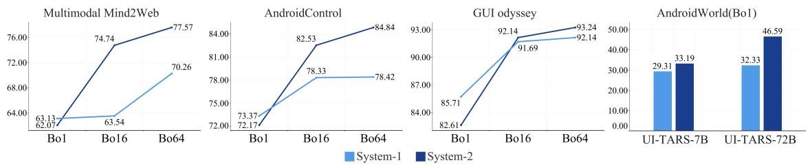  
Figure 8: Performance of system-1 (no-thought) and system-2 (with thought) in in-domain (Mind2Web, AndroidControl, GUI Odyssey) and out-of-domain (AndroidWorld) benchmarks.

As shown in Figure 8, at  $N = 1$ , system-2 reasoning performs slightly worse than system-1 reasoning across all three in-domain benchmarks. While system-2 reasoning is generally expected to improve task execution by introducing a reflective, multi-step process, this result suggests that under a single-sample condition, the complexity of system-2 reasoning can lead to suboptimal reasoning steps. Specifically, the model may introduce irrelevant or incorrect reasoning steps—such as referring to non-existent objects or making erroneous inferences—which increases the risk of hallucinations or failure to generate the correct action. In the absence of diverse candidate outputs, the model may fixate on a flawed reasoning path, resulting in a lower likelihood of choosing the correct action.

However, as  $N$  increases to 16 and 64, the system-2 model begins to demonstrate a clear advantage over system-1 reasoning. The increased number of candidate outputs provides greater diversity in the decision space, allowing the model to overcome suboptimal reasoning paths. In particular, the system-2 model benefits from the opportunity to explore multiple reasoning chains, which compensates for the earlier issues seen with  $N = 1$ . The diversity of candidates increases the likelihood that the correct action is among the sampled outputs, even if some of the intermediate reasoning steps were not ideal. This shift in performance is particularly striking as it shows that the deliberate, multi-step reasoning of system-2 can effectively compensate for its initial disadvantages when sufficient candidate outputs are available.

A key insight is that while system-2 reasoning excels with sufficient diversity, achieving optimal performance with a single, decisive output (as in Bo1) remains a significant challenge. The ideal future direction involves leveraging system-2 reasoning's strengths in diverse, real-world scenarios while minimizing the need for multiple samples. This could be accomplished through techniques like reinforced fine-tuning (Jaech et al., 2024), which would guide the model to produce the correct action with high confidence in a single pass.

Out-of-domain Evaluation Next, we evaluate both reasoning methods on AndroidWorld, an out-of-domain (OOD) benchmark without corresponding training data in UI-TARS. We evaluate UI-TARS-7B and UI-TARS-72B at Bo1. Interestingly, the results from AndroidWorld reveal a significant shift compared to the in-domain benchmarks. While system-1 reasoning performs well in in-domain scenarios (Mind2Web, Android Control, and GUI Odyssey), system-2 reasoning significantly outperforms system-1 in the OOD setting (AndroidWorld). This suggests that although system-2 may face challenges in in-domain scenarios, particularly under single-sample conditions, its deeper reasoning capabilities provide a distinct advantage in OOD situations. In these cases, the increased reasoning depth helps the model generalize to previously unseen tasks, highlighting the broader applicability and potential of system-2 reasoning in real-world, diverse scenarios.

# 6 Conclusion

In this paper, we introduced UI-TARS, a native GUI agent model that integrates perception, action, reasoning, and memory into a scalable and adaptive framework. Achieving state-of-the-art performance on challenging benchmarks such as OSWorld, UI-TARS outperforms existing systems like Claude and GPT-4o. We presented several novel innovations, including enhanced perception, unified action modeling, system-2 reasoning, and iterative refinement using online traces, all of which enable the agent to effectively handle complex GUI tasks with minimal human oversight. We also reviewed the evolution path of GUI agents, from rule-based systems to adaptive native models. We segment the development process into key stages based on the degree of human intervention and generalization capabilities, emphasizing the transition from text-based methods to pure-vision, end-to-end agent models. We also explored the core capabilities of the native agent model, including perception, action, reasoning, and memory, which form the foundation for future advancements in GUI agents. Looking ahead, while native agents represent a significant leap forward, the future lies in

the integration of active and lifelong learning, where agents autonomously drive their own learning through continuous, real-world interactions.

# Acknowledgements

We thank Ziqian Wei, and Tianyu Zhang for figure drawing, Yiheng Xu, Tao Yu, Wenqian Wang, Xiaobo Qin, Zhiyong Wu, and Yi Lin, Junyuan Qi, Zihao Wang, Jiecao Chen, Mu Qiao, Congwu Shen, Ruo Wang, Mingxuan Wang, Lin Yan, Renjie Zheng, Guanlin Liu, Yuwen Xiong for suggestions, and Faming Wu, Sihang Yuan, Ziyuan Zhao, Jie Tang, Zhaoyi An, Yiran Wang, Linlin Ao, Bairen Yi, Yanghua Peng, Lishu Luo, Zhi Zhang, Zehua Wang, Lingjun Liu for supporting this work.

# References

Tamer Abuelsaad, Deepak Akkil, Prasenjit Dey, Ashish Jagmohan, Aditya Vempaty, and Ravi Kokku. Agent-e: From autonomous web navigation to foundational design principles in agentic systems. ArXiv preprint, abs/2407.13032, 2024. URL https://arxiv.org/abs/2407.13032.  
Josh Achiam, Steven Adler, Sandhini Agarwal, Lama Ahmad, Ilge Akkaya, Florencia Leoni Aleman, Diogo Almeida, Janko Altenschmidt, Sam Altman, Shyamal Anadkat, et al. Gpt-4 technical report. ArXiv preprint, abs/2303.08774, 2023. URL https://arxiv.org/abs/2303.08774.  
Anonymous. AutoGUI: Scaling GUI grounding with automatic functionality annotations from LLMs. In Submitted to The Thirteenth International Conference on Learning Representations, 2024. URL https://openreview.net/forum?id=wl4c9jvcyY. under review.  
Anthropic. Claude-3-5-sonnet. https://www.anthropic.com/news/claude-3-5-sonnet, 2024a.  
Anthropic. Developing a computer use model, 2024b. URL https://www.anthropic.com/news/developing-computer-use.  
Anas Awadalla, Le Xue, Oscar Lo, Manli Shu, Hannah Lee, Etash Kumar Guha, Matt Jordan, Sheng Shen, Mohamed Awadalla, Silvio Savarese, et al. Mint-1t: Scaling open-source multimodal data by 10x: A multimodal dataset with one trillion tokens. ArXiv preprint, abs/2406.11271, 2024. URL https://arxiv.org/abs/2406.11271.  
Ali Ayub, Chystopher L Nehaniv, and Kerstin Dautenhahn. Interactive continual learning architecture for long-term personalization of home service robots. In 2024 IEEE International Conference on Robotics and Automation (ICRA), pp. 11289-11296. IEEE, 2024.  
Chongyang Bai, Xiaoxue Zang, Ying Xu, Srinivas Sunkara, Abhinav Rastogi, Jindong Chen, and Blaise Agüera y Arcas. Uibert: Learning generic multimodal representations for UI understanding. In Zhi-Hua Zhou (ed.), Proceedings of the Thirtieth International Joint Conference on Artificial Intelligence, IJCAI 2021, Virtual Event / Montreal, Canada, 19-27 August 2021, pp. 1705-1712. ijcai.org, 2021. doi: 10.24963/IJCAI.2021/235. URL https://doi.org/10.24963/ijcai.2021/235.  
Jinze Bai, Shuai Bai, Shusheng Yang, Shijie Wang, Sinan Tan, Peng Wang, Junyang Lin, Chang Zhou, and Jingren Zhou. Qwen-vl: A frontier large vision-language model with versatile abilities. arXiv preprint arXiv:2308.12966, 2023a.  
Jinze Bai, Shuai Bai, Shusheng Yang, Shijie Wang, Sinan Tan, Peng Wang, Junyang Lin, Chang Zhou, and Jingren Zhou. Qwen-vl: A versatile vision-language model for understanding, localization, text reading, and beyond, 2023b. URL https://arxiv.org/abs/2308.12966.  
Michael Bain and Claude Sammut. A framework for behavioural cloning. In Machine Intelligence 15, pp. 103-129, 1995. URL http://www.cse.unsw.edu.au/~claude/papers/MI15.pdf.  
Rohan Bavishi, Erich Elsen, Curtis Hawthorne, Maxwell Nye, Augustus Odena, Arushi Somani, and Sağnak Taşırlar. Introducing our multimodal models, 2023. URL https://www.adept.ai/blog/fuyu-8b.  
Rogerio Bonatti, Dan Zhao, Francesco Bonacci, Dillon Dupont, Sara Abdali, Yinheng Li, Yadong Lu, Justin Wagle, Kazuhito Koishida, Arthur Tucker, Lawrence Jang, and Zack Hui. Windows agent arena: Evaluating multi-modal os agents at scale, 2024. URL https://arxiv.org/abs/2409.08264.  
Ralph Allan Bradley and Milton E Terry. Rank analysis of incomplete block designs: I. the method of paired comparisons. Biometrika, 39(3/4):324-345, 1952.  
Benjamin Burger, Phillip M Maffettone, Vladimir V Gusev, Catherine M Aitchison, Yang Bai, Xiaoyan Wang, Xiaobo Li, Ben M Alston, Buyi Li, Rob Clowes, et al. A mobile robotic chemist. Nature, 583(7815): 237-241, 2020.  
Andrea Burns, Deniz Arsan, Sanjna Agrawal, Ranjitha Kumar, Kate Saenko, and Bryan A. Plummer. A dataset for interactive vision-language navigation with unknown command feasibility. In Computer Vision - ECCV 2022: 17th European Conference, Tel Aviv, Israel, October 23-27, 2022, Proceedings, Part VIII, pp. 312-328, Berlin, Heidelberg, 2022. Springer-Verlag. ISBN 978-3-031-20073-1. doi: 10.1007/978-3-031-20074-8_18. URL https://doi.org/10.1007/978-3-031-20074-8_18.

Yuxiang Chai, Siyuan Huang, Yazhe Niu, Han Xiao, Liang Liu, Dingyu Zhang, Peng Gao, Shuai Ren, and Hongsheng Li. Amex: Android multi-annotation expo dataset for mobile gui agents, 2024. URL https://arxiv.org/abs/2407.17490.  
Dongping Chen, Yue Huang, Siyuan Wu, Jingyu Tang, Liuyi Chen, Yilin Bai, Zhigang He, Chenlong Wang, Huichi Zhou, Yiqiang Li, Tianshuo Zhou, Yue Yu, Chujie Gao, Qihui Zhang, Yi Gui, Zhen Li, Yao Wan, Pan Zhou, Jianfeng Gao, and Lichao Sun. Gui-world: A dataset for gui-oriented multimodal llm-based agents, 2024a. URL https://arxiv.org/abs/2406.10819.  
Wei Chen and Zhiyuan Li. Octopus v2: On-device language model for super agent, 2024. URL https://arxiv.org/abs/2404.01744.  
Wei Chen, Zhiyuan Li, and Mingyuan Ma. Octopus: On-device language model for function calling of software apis. ArXiv preprint, abs/2404.01549, 2024b. URL https://arxiv.org/abs/2404.01549.  
Wentong Chen, Junbo Cui, Jinyi Hu, Yujia Qin, Junjie Fang, Yue Zhao, Chongyi Wang, Jun Liu, Guirong Chen, Yupeng Huo, Yuan Yao, Yankai Lin, Zhiyuan Liu, and Maosong Sun. Guicourse: From general vision language models to versatile gui agents, 2024c. URL https://arxiv.org/abs/2406.11317.  
Xingyu Chen, Zihan Zhao, Lu Chen, JiaBao Ji, Danyang Zhang, Ao Luo, Yuxuan Xiong, and Kai Yu. WebSRC: A dataset for web-based structural reading comprehension. In Marie-Francine Moens, Xuanjing Huang, Lucia Specia, and Scott Wen-tau Yih (eds.), Proceedings of the 2021 Conference on Empirical Methods in Natural Language Processing, pp. 4173-4185, Online and Punta Cana, Dominican Republic, 2021. Association for Computational Linguistics. doi: 10.18653/v1/2021.emnlp-main.343. URL https://aclanthology.org/2021.emnlp-main.343.  
Zhe Chen, Jiannan Wu, Wenhai Wang, Weijie Su, Guo Chen, Sen Xing, Muyan Zhong, Qinglong Zhang, Xizhou Zhu, Lewei Lu, et al. Intervl: Scaling up vision foundation models and aligning for generic visual-linguistic tasks. In Proceedings of the IEEE/CVF Conference on Computer Vision and Pattern Recognition, pp. 24185-24198, 2024d.  
Kanzhi Cheng, Qiushi Sun, Yougang Chu, Fangzhi Xu, Yantao Li, Jianbing Zhang, and Zhiyong Wu. Seeclick: Harnessing gui grounding for advanced visual gui agents, 2024. URL https://arxiv.org/abs/2401.10935.  
Gautier Dagan, Frank Keller, and Alex Lascarides. Dynamic planning with a llm, 2023. URL https://arxiv.org/abs/2308.06391.  
Xiang Deng, Yu Gu, Boyuan Zheng, Shijie Chen, Samual Stevens, Boshi Wang, Huan Sun, and Yu Su. Mind2web: Towards a generalist agent for the web. In Alice Oh, Tristan Naumann, Amir Globerson, Kate Saenko, Moritz Hardt, and Sergey Levine (eds.), Advances in Neural Information Processing Systems 36: Annual Conference on Neural Information Processing Systems 2023, NeurIPS 2023, New Orleans, LA, USA, December 10 - 16, 2023, 2023. URL http://papers.nips.cc/paper_files/paper/2023/bit/5950bf290a1570ea401bf98882128160-Abstract-Datasets_and_Benchmarks.html.  
Yang Deng, Xuan Zhang, Wenxuan Zhang, Yifei Yuan, See-Kiong Ng, and Tat-Seng Chua. On the multi-turn instruction following for conversational web agents, 2024. URL https://arxiv.org/abs/2402.15057.  
Liliana Dobrica. Robotic process automation platform uipath. Commun. ACM, 65(4):42-43, 2022. ISSN 0001-0782. doi: 10.1145/3511667. URL https://doi.org/10.1145/3511667.  
Difei Gao, Lei Ji, Zechen Bai, Mingyu Ouyang, Peiran Li, Dongxing Mao, Qinchen Wu, Weichen Zhang, Peiyi Wang, Xiangwu Guo, Hengxu Wang, Luowei Zhou, and Mike Zheng Shou. Assistgui: Task-oriented desktop graphical user interface automation, 2023. URL https://arxiv.org/abs/2312.13108.  
Minghe Gao, Wendong Bu, Bingchen Miao, Yang Wu, Yunfei Li, Juncheng Li, Siliang Tang, Qi Wu, Yueting Zhuang, and Meng Wang. Generalist virtual agents: A survey on autonomous agents across digital platforms. ArXiv preprint, abs/2411.10943, 2024. URL https://arxiv.org/abs/2411.10943.  
GoogleDeepmind. Gemini-2.0 (project mariner), 2024. URL https://deepmind.google/technologies/project-mariner.

Boyu Gou, Ruohan Wang, Boyuan Zheng, Yanan Xie, Cheng Chang, Yiheng Shu, Huan Sun, and Yu Su. Navigating the digital world as humans do: Universal visual grounding for gui agents. ArXiv preprint, abs/2410.05243, 2024a. URL https://arxiv.org/abs/2410.05243.  
Boyu Gou, Ruohan Wang, Boyuan Zheng, Yanan Xie, Cheng Chang, Yiheng Shu, Huan Sun, and Yu Su. Navigating the digital world as humans do: Universal visual grounding for gui agents, 2024b. URL https://arxiv.org/abs/2410.05243.  
Philip M Groves and Richard F Thompson. Habituation: a dual-process theory. Psychological review, 77(5): 419, 1970.  
Izzeddin Gur, Hiroki Furuta, Austin Huang, Mustafa Safdari, Yutaka Matsuo, Douglas Eck, and Aleksandra Faust. A real-world webagent with planning, long context understanding, and program synthesis. ArXiv preprint, abs/2307.12856, 2023. URL https://arxiv.org/abs/2307.12856.  
Hongliang He, Wenlin Yao, Kaixin Ma, Wenhao Yu, Yong Dai, Hongming Zhang, Zhenzhong Lan, and Dong Yu. Webvoyager: Building an end-to-end web agent with large multimodal models. ArXiv preprint, abs/2401.13919, 2024. URL https://arxiv.org/abs/2401.13919.  
Peter Hofmann, Caroline Samp, and Nils Urbach. *Robotic process automation.* *Electronic Markets*, 30 (1):99-106, 2020. doi: 10.1007/s12525-019-00365-. URL https://ideas.repec.org/a/spr/elmark/v30y2020i1d10.1007_s12525-019-00365-8.html.  
Wenyi Hong, Weihan Wang, Qingsong Lv, Jiazheng Xu, Wenmeng Yu, Junhui Ji, Yan Wang, Zihan Wang, Yuxiao Dong, Ming Ding, et al. Cogagent: A visual language model for gui agents. In Proceedings of the IEEE/CVF Conference on Computer Vision and Pattern Recognition, pp. 14281-14290, 2024.  
Yu-Chung Hsiao, Fedir Zubach, Gilles Baechler, Victor Carbune, Jason Lin, Maria Wang, Srinivas Sunkara, Yun Zhu, and Jindong Chen. Screenqa: Large-scale question-answer pairs over mobile app screenshots. ArXiv preprint, abs/2209.08199, 2022. URL https://arxiv.org/abs/2209.08199.  
Xueyu Hu, Tao Xiong, Biao Yi, Zishu Wei, Ruixuan Xiao, Yurun Chen, Jiasheng Ye, Meiling Tao, Xiangxin Zhou, Ziyu Zhao, et al. Os agents: A survey on mllm-based agents for general computing devices use. 2024.  
Xu Huang, Weiwen Liu, Xiaolong Chen, Xingmei Wang, Hao Wang, Defu Lian, Yasheng Wang, Ruiming Tang, and Enhong Chen. Understanding the planning of llm agents: A survey, 2024. URL https://arxiv.org/abs/2402.02716.  
Aaron Hurst, Adam Lerer, Adam P Goucher, Adam Perelman, Aditya Ramesh, Aidan Clark, AJ Ostrow, Akila Welihinda, Alan Hayes, Alec Radford, et al. Gpt-4o system card. ArXiv preprint, abs/2410.21276, 2024. URL https://arxiv.org/abs/2410.21276.  
Aaron Jaech, Adam Kalai, Adam Lerer, Adam Richardson, Ahmed El-Kishky, Aiden Low, Alec Helyar, Aleksander Madry, Alex Beutel, Alex Carney, et al. Openai o1 system card. arXiv preprint arXiv:2412.16720, 2024.  
Armand Joulin, Edouard Grave, Piotr Bojanowski, Matthijs Douze, Herve Jégou, and Tomas Mikolov. Fasttext.zip: Compressing text classification models. ArXiv preprint, abs/1612.03651, 2016. URL https://arxiv.org/abs/1612.03651.  
Raghav Kapoor, Yash Parag Butala, Melisa Russak, Jing Yu Koh, Kiran Kamble, Waseem Alshikh, and Ruslan Salakhutdinov. Omniact: A dataset and benchmark for enabling multimodal generalist autonomous agents for desktop and web, 2024. URL https://arxiv.org/abs/2402.17553.  
Jihyung Kil, Chan Hee Song, Boyuan Zheng, Xiang Deng, Yu Su, and Wei-Lun Chao. Dual-view visual contextualization for web navigation. In Proceedings of the IEEE/CVF Conference on Computer Vision and Pattern Recognition, pp. 14445-14454, 2024.  
Juyong Lee, Taywon Min, Minyong An, Dongyoon Hahm, Haeone Lee, Changyeon Kim, and Kimin Lee. Benchmarking mobile device control agents across diverse configurations, 2024. URL https://arxiv.org/abs/2404.16660.

Gang Li, Gilles Baechler, Manuel Tragut, and Yang Li. Learning to denoise raw mobile UI layouts for improving datasets at scale. In Simone D. J. Barbosa, Cliff Lampe, Caroline Appert, David A. Shamma, Steven Mark Drucker, Julie R. Williamson, and Koji Yatani (eds.), CHI '22: CHI Conference on Human Factors in Computing Systems, New Orleans, LA, USA, 29 April 2022 - 5 May 2022, pp. 67:1-67:13. ACM, 2022. doi: 10.1145/3491102.3502042. URL https://doi.org/10.1145/3491102.3502042.  
Hongxin Li, Jingran Su, Yuntao Chen, Qing Li, and Zhaoxiang Zhang. Sheetcopilot: Bringing software productivity to the next level through large language models. In Alice Oh, Tristan Naumann, Amir Globerson, Kate Saenko, Moritz Hardt, and Sergey Levine (eds.), Advances in Neural Information Processing Systems 36: Annual Conference on Neural Information Processing Systems 2023, NeurIPS 2023, New Orleans, LA, USA, December 10 - 16, 2023, 2023a. URL http://papers.nips.cc/paper_files/paper/2023/bitstream/0ff30c4bf31db0119a6219e0d250e037-Abstract-Conference.html.  
Kaixin Li, Ziyang Meng, Hongzhan Lin, Ziyang Luo, Yuchen Tian, Jing Ma, Zhiyong Huang, and Tat-Seng Chua. Screenshot-pro: Gui grounding for professional high-resolution computer use, 2025.  
Qingyun Li, Zhe Chen, Weiyun Wang, Wenhai Wang, Shenglong Ye, Zhenjiang Jin, Guanzhou Chen, Yinan He, Zhangwei Gao, Erfei Cui, et al. Omnicorpus: An unified multimodal corpus of 10 billion-level images interleaved with text. ArXiv preprint, abs/2406.08418, 2024a. URL https://arxiv.org/abs/2406.08418.  
Tao Li, Gang Li, Zhiwei Deng, Bryan Wang, and Yang Li. A zero-shot language agent for computer control with structured reflection. In Houda Bouamor, Juan Pino, and Kalika Bali (eds.), Findings of the Association for Computational Linguistics: EMNLP 2023, pp. 11261-11274, Singapore, 2023b. Association for Computational Linguistics. doi: 10.18653/v1/2023-findings-emnlp.753. URL https://aclanthology.org/2023-findings-emnlp.753.  
Tao Li, Gang Li, Jingjie Zheng, Purple Wang, and Yang Li. MUG: Interactive multimodal grounding on user interfaces. In Yvette Graham and Matthew Purver (eds.), Findings of the Association for Computational Linguistics: EACL 2024, pp. 231-251, St. Julian's, Malta, 2024b. Association for Computational Linguistics. URL https://aclanthology.org/2024-findings-eacl.17.  
Wei Li, William E Bishop, Alice Li, Christopher Rawles, Folawiyo Campbell-Ajala, Divya Tyamagundlu, and Oriana Riva. On the effects of data scale on UI control agents. In The Thirty-eight Conference on Neural Information Processing Systems Datasets and Benchmarks Track, 2024c. URL https://openreview.net/forum?id=yUEBXN3cvX.  
Yang Li, Jiacong He, Xin Zhou, Yuan Zhang, and Jason Baldridge. Mapping natural language instructions to mobile UI action sequences. In Dan Jurafsky, Joyce Chai, Natalie Schluter, and Joel Tetreault (eds.), Proceedings of the 58th Annual Meeting of the Association for Computational Linguistics, pp. 8198-8210, Online, 2020a. Association for Computational Linguistics. doi: 10.18653/v1/2020.acl-main.729. URL https://aclanthology.org/2020.acl-main.729.  
Yang Li, Gang Li, Luheng He, Jingjie Zheng, Hong Li, and Zhiwei Guan. Widget captioning: Generating natural language description for mobile user interface elements. In Bonnie Webber, Trevor Cohn, Yulan He, and Yang Liu (eds.), Proceedings of the 2020 Conference on Empirical Methods in Natural Language Processing (EMNLP), pp. 5495-5510, Online, 2020b. Association for Computational Linguistics. doi: 10.18653/v1/2020.emnlp-main.443. URL https://aclanthology.org/2020.emnlp-main.443.  
Kevin Qinghong Lin, Linjie Li, Difei Gao, Zhengyuan Yang, Shiwei Wu, Zechen Bai, Weixian Lei, Lijuan Wang, and Mike Zheng Shou. Showui: One vision-language-action model for gui visual agent, 2024a. URL https://arxiv.org/abs/2411.17465.  
Qinghong Lin, Linjie Li, Difei Gao, Zhengyuan Yang, Shiwei Wu, Zechen Bai, Weixian Lei, Lijuan Wang, and Mike Zheng Shou. Showui: One vision-language-action model for gui visual agent. arXiv e-prints, pp. arXiv-2411, 2024b.  
Evan Zheran Liu, Kelvin Guu, Panupong Pasupat, Tianlin Shi, and Percy Liang. Reinforcement learning on web interfaces using workflow-guided exploration. In 6th International Conference on Learning Representations, ICLR 2018, Vancouver, BC, Canada, April 30 - May 3, 2018, Conference Track Proceedings. OpenReview.net, 2018. URL https://openreview.net/forum?id=ryTp3f-0-.

Junpeng Liu, Tianyue Ou, Yifan Song, Yuxiao Qu, Wai Lam, Chenyan Xiong, Wenhu Chen, Graham Neubig, and Xiang Yue. Harnessing webpage uis for text-rich visual understanding. arXiv preprint arXiv:2410.13824, 2024a.  
Junpeng Liu, Tianyue Ou, Yifan Song, Yuxiao Qu, Wai Lam, Chenyan Xiong, Wenhu Chen, Graham Neubig, and Xiang Yue. Harnessing webpage uis for text-rich visual understanding, 2024b. URL https://arxiv.org/abs/2410.13824.  
Junpeng Liu, Yifan Song, Bill Yuchen Lin, Wai Lam, Graham Neubig, Yuanzhi Li, and Xiang Yue. Visualwebbench: How far have multimodal llms evolved in web page understanding and grounding? ArXiv preprint, abs/2404.05955, 2024c. URL https://arxiv.org/abs/2404.05955.  
Shilong Liu, Zhaoyang Zeng, Tianhe Ren, Feng Li, Hao Zhang, Jie Yang, Qing Jiang, Chunyuan Li, Jianwei Yang, Hang Su, et al. Grounding dino: Marrying dino with grounded pre-training for open-set object detection. In European Conference on Computer Vision, pp. 38-55. Springer, 2025.  
Quanfeng Lu, Wenqi Shao, Zitao Liu, Fanqing Meng, Boxuan Li, Botong Chen, Siyuan Huang, Kaipeng Zhang, Yu Qiao, and Ping Luo. Gui odyssey: A comprehensive dataset for cross-app gui navigation on mobile devices. ArXiv preprint, abs/2406.08451, 2024a. URL https://arxiv.org/abs/2406.08451.  
Yadong Lu, Jianwei Yang, Yelong Shen, and Ahmed Awadallah. Omniparser for pure vision based gui agent. ArXiv preprint, abs/2408.00203, 2024b. URL https://arxiv.org/abs/2408.00203.  
Xinbei Ma, Zhuosheng Zhang, and Hai Zhao. Comprehensive cognitive llm agent for smartphone gui automation. ArXiv preprint, abs/2402.11941, 2024. URL https://arxiv.org/abs/2402.11941.  
Sahisnu Mazumder and Oriana Riva. FLIN: A flexible natural language interface for web navigation. In Kristina Toutanova, Anna Rumshisky, Luke Zettlemoyer, Dilek Hakkani-Tur, Iz Beltagy, Steven Bethard, Ryan Cotterell, Tanmoy Chakraborty, and Yichao Zhou (eds.), Proceedings of the 2021 Conference of the North American Chapter of the Association for Computational Linguistics: Human Language Technologies, pp. 2777-2788, Online, 2021. Association for Computational Linguistics. doi: 10.18653/v1/2021.naacl-main.222. URL https://aclanthology.org/2021.naacl-main.222.  
Kai Mei, Zelong Li, Shuyuan Xu, Ruosong Ye, Yingqiang Ge, and Yongfeng Zhang. Aios: Llm agent operating system. arXiv e-prints, pp. arXiv-2403, 2024.  
A. Memon, I. Banerjee, N. Hashmi, and A. Nagarajan. Dart: a framework for regression testing "nightly/daily builds" of gui applications. In International Conference on Software Maintenance, 2003. ICSM 2003. Proceedings., pp. 410-419, 2003. doi: 10.1109/ICSM.2003.1235451.  
Reiichiro Nakano, Jacob Hilton, Suchir Balaji, Jeff Wu, Long Ouyang, Christina Kim, Christopher Hesse, Shantanu Jain, Vineet Kosaraju, William Saunders, et al. Webgpt: Browser-assisted question-answering with human feedback. ArXiv preprint, abs/2112.09332, 2021. URL https://arxiv.org/abs/2112.09332.  
Dang Nguyen, Jian Chen, Yu Wang, Gang Wu, Namyong Park, Zhengmian Hu, Hanjia Lyu, Junda Wu, Ryan Aponte, Yu Xia, et al. Gui agents: A survey. ArXiv preprint, abs/2412.13501, 2024. URL https://arxiv.org/abs/2412.13501.  
OpenAI. Gpt-3.5. https://platform.openai.com/docs/models#gpt-3-5-turbo, 2022.  
OpenAI. Gpt-4v(ision) system card. https://cdn.openai.com/papers/GPTV_System_Card.pdf, 2023a.  
OpenAI. Gpt-4 technical report, 2023b.  
Pranav Putta, Edmund Mills, Naman Garg, Sumeet Motwani, Chelsea Finn, Divyansh Garg, and Rafael Rafailov. Agent q: Advanced reasoning and learning for autonomous ai agents. ArXiv preprint, abs/2408.07199, 2024. URL https://arxiv.org/abs/2408.07199.  
Ju Qian, Zhengyu Shang, Shuoyan Yan, Yan Wang, and Lin Chen. Roscript: A visual script driven truly non-intrusive robotic testing system for touch screen applications. In 2020 IEEE/ACM 42nd International Conference on Software Engineering (ICSE), pp. 297-308, 2020.

Yujia Qin, Shengding Hu, Yankai Lin, Weize Chen, Ning Ding, Ganqu Cui, Zheni Zeng, Xuanhe Zhou, Yufei Huang, Chaojun Xiao, Chi Han, Yi Ren Fung, Yusheng Su, Huadong Wang, Cheng Qian, Runchu Tian, Kunlun Zhu, Shihao Liang, Xingyu Shen, Bokai Xu, Zhen Zhang, Yining Ye, Bowen Li, Ziwei Tang, Jing Yi, Yuzhang Zhu, Zhenning Dai, Lan Yan, Xin Cong, Yaxi Lu, Weilin Zhao, Yuxiang Huang, Junxi Yan, Xu Han, Xian Sun, Dahai Li, Jason Phang, Cheng Yang, Tongshuang Wu, Heng Ji, Guoliang Li, Zhiyuan Liu, and Maosong Sun. Tool learning with foundation models. ACM Comput. Surv., 57(4), 2024. ISSN 0360-0300. doi: 10.1145/3704435. URL https://doi.org/10.1145/3704435.  
Rafael Rafailov, Archit Sharma, Eric Mitchell, Christopher D. Manning, Stefano Ermon, and Chelsea Finn. Direct preference optimization: Your language model is secretly a reward model. In Alice Oh, Tristan Naumann, Amir Globerson, Kate Saenko, Moritz Hardt, and Sergey Levine (eds.), Advances in Neural Information Processing Systems 36: Annual Conference on Neural Information Processing Systems 2023, NeurIPS 2023, New Orleans, LA, USA, December 10 - 16, 2023, 2023. URL http://papers.nips.cc/paper_files/paper/2023/bitstream/a85b405ed65c6477a4fe8302b5e06ce7-Abstract-Conference.html.  
Hariprasauth Ramamoorthy, Shubhankar Gupta, and Suresh Sundaram. Distributed online life-long learning (dol3) for multi-agent trust and reputation assessment in e-commerce. ArXiv preprint, abs/2410.16529, 2024. URL https://arxiv.org/abs/2410.16529.  
Christopher Rawles, Alice Li, Daniel Rodriguez, Oriana Riva, and Timothy P. Lillicrap. Androidinthewild: A large-scale dataset for android device control. In Alice Oh, Tristan Naumann, Amir Globerson, Kate Saenko, Moritz Hardt, and Sergey Levine (eds.), Advances in Neural Information Processing Systems 36: Annual Conference on Neural Information Processing Systems 2023, NeurIPS 2023, New Orleans, LA, USA, December 10 - 16, 2023. URL http://papers.nips.cc/paper_files/paper/2023/bitbb6308b402fe909c39dd29950c32e0-Abstract-Datasets_and_Benchmarks.html.  
Christopher Rawles, Sarah Clinckemaillie, Yifan Chang, Jonathan Waltz, Gabrielle Lau, Marybeth Fair, Alice Li, William Bishop, Wei Li, Folawiyo Campbell-Ajala, Daniel Toyama, Robert Berry, Divya Tyamagundlu, Timothy Lillicrap, and Oriana Riva. Androidworld: A dynamic benchmarking environment for autonomous agents, 2024a. URL https://arxiv.org/abs/2405.14573.  
Christopher Rawles, Sarah Clinckemaillie, Yifan Chang, Jonathan Waltz, Gabrielle Lau, Marybeth Fair, Alice Li, William Bishop, Wei Li, Folawiyo Campbell-Ajala, et al. Androidworld: A dynamic benchmarking environment for autonomous agents. ArXiv preprint, abs/2405.14573, 2024b. URL https://arxiv.org/abs/2405.14573.  
Matthew Renze and Erhan Guven. Self-reflection in llm agents: Effects on problem-solving performance, 2024. URL https://arxiv.org/abs/2405.06682.  
Tianlin Shi, Andrej Karpathy, Linxi Fan, Jonathan Hernandez, and Percy Liang. World of bits: An open-domain platform for web-based agents. In Doina Precup and Yee Whye Teh (eds.), Proceedings of the 34th International Conference on Machine Learning, ICML 2017, Sydney, NSW, Australia, 6-11 August 2017, volume 70 of Proceedings of Machine Learning Research, pp. 3135-3144. PMLR, 2017. URL http://proceedings.mlr.press/v70/shi17a.html.  
Noah Shinn, Beck Labash, and Ashwin Gopinath. Reflection: an autonomous agent with dynamic memory and self-reflection. ArXiv preprint, abs/2303.11366, 2023. URL https://arxiv.org/abs/2303.11366.  
Andrea Soltoggio, Eseoghene Ben-Iwhiwhu, Vladimir Braverman, Eric Eaton, Benjamin Epstein, Yunhao Ge, Lucy Halperin, Jonathan How, Laurent Itti, Michael A Jacobs, et al. A collective ai via lifelong learning and sharing at the edge. Nature Machine Intelligence, 6(3):251-264, 2024.  
Chan Hee Song, Brian M. Sadler, Jiaman Wu, Wei-Lun Chao, Clayton Washington, and Yu Su. Llm-planner: Few-shot grounded planning for embodied agents with large language models. In IEEE/CVF International Conference on Computer Vision, ICCV 2023, Paris, France, October 1-6, 2023, pp. 2986-2997. IEEE, 2023. doi: 10.1109/ICCV51070.2023.00280. URL https://doi.org/10.1109/ICCV51070.2023.00280.  
Yueqi Song, Frank F Xu, Shuyan Zhou, and Graham Neubig. Beyond browsing: Api-based web agents. 2024.

Srinivas Sunkara, Maria Wang, Lijuan Liu, Gilles Baechler, Yu-Chung Hsiao, Jindong Chen, Abhanshu Sharma, and James W. W. Stout. Towards better semantic understanding of mobile interfaces. In Nicoletta Calzolari, Chu-Ren Huang, Hansaem Kim, James Pustejovsky, Leo Wanner, Key-Sun Choi, Pum-Mo Ryu, Hsin-Hsi Chen, Lucia Donatelli, Heng Ji, Sadao Kurohashi, Patrizia Paggio, Nianwen Xue, Seokhwan Kim, Younggyun Hahm, Zhong He, Tony Kyungil Lee, Enrico Santus, Francis Bond, and Seung-Hoon Na (eds.), Proceedings of the 29th International Conference on Computational Linguistics, pp. 5636-5650, Gyeongju, Republic of Korea, 2022. International Committee on Computational Linguistics. URL https://aclanthology.org/2022.coling-1.497.  
Indranil Sur, Zachary Daniels, Abrar Rahman, Kamil Faber, Gianmarco Gallardo, Tyler Hayes, Cameron Taylor, Mustafa Burak Gurbuz, James Smith, Sahana Joshi, et al. System design for an integrated lifelong reinforcement learning agent for real-time strategy games. In Proceedings of the Second International Conference on AI-ML Systems, pp. 1–9, 2022.  
Weihao Tan, Ziluo Ding, Wentao Zhang, Boyu Li, Bohan Zhou, Junpeng Yue, Haochong Xia, Jiechuan Jiang, Longtao Zheng, Xinrun Xu, et al. Towards general computer control: A multimodal agent for red dead redemption ii as a case study. In ICLR 2024 Workshop on Large Language Model (LLM) Agents, 2024.  
Heyi Tao, Sethuraman TV, Michal Shlapentokh-Rothman, and Derek Hoiem. Webwise: Web interface control and sequential exploration with large language models. ArXiv preprint, abs/2310.16042, 2023. URL https://arxiv.org/abs/2310.16042.  
Gemini Team, Petko Georgiev, Ving Ian Lei, Ryan Burnell, Libin Bai, Anmol Gulati, Garrett Tanzer, Damien Vincent, Zhufeng Pan, Shibo Wang, et al. Gemini 1.5: Unlocking multimodal understanding across millions of tokens of context. ArXiv preprint, abs/2403.05530, 2024. URL https://arxiv.org/abs/2403.05530.  
Bryan Wang, Gang Li, and Yang Li. Enabling conversational interaction with mobile UI using large language models. In Albrecht Schmidt, Kaisa Väänänen, Tesh Goyal, Per Ola Kristensson, Anicia Peters, Stefanie Mueller, Julie R. Williamson, and Max L. Wilson (eds.), Proceedings of the 2023 CHI Conference on Human Factors in Computing Systems, CHI 2023, Hamburg, Germany, April 23-28, 2023, pp. 432:1-432:17. ACM, 2023. doi: 10.1145/3544548.3580895. URL https://doi.org/10.1145/3544548.3580895.  
Junyang Wang, Haiyang Xu, Jiabo Ye, Ming Yan, Weizhou Shen, Ji Zhang, Fei Huang, and Jitao Sang. Mobile-agent: Autonomous multi-modal mobile device agent with visual perception. ArXiv preprint, abs/2401.16158, 2024a. URL https://arxiv.org/abs/2401.16158.  
Lei Wang, Chen Ma, Xueyang Feng, Zeyu Zhang, Hao Yang, Jingsen Zhang, Zhiyuan Chen, Jiakai Tang, Xu Chen, Yankai Lin, et al. A survey on large language model based autonomous agents. Frontiers of Computer Science, 18(6):186345, 2024b.  
Peng Wang, Shuai Bai, Sinan Tan, Shijie Wang, Zhihao Fan, Jinze Bai, Keqin Chen, Xuejing Liu, Jialin Wang, Wenbin Ge, Yang Fan, Kai Dang, Mengfei Du, Xuancheng Ren, Rui Men, Dayiheng Liu, Chang Zhou, Jingren Zhou, and Junyang Lin. Qwen2-vl: Enhancing vision-language model's perception of the world at any resolution, 2024c. URL https://arxiv.org/abs/2409.12191.  
Peng Wang, Shuai Bai, Sinan Tan, Shijie Wang, Zhihao Fan, Jinze Bai, Keqin Chen, Xuejing Liu, Jialin Wang, Wenbin Ge, et al. Qwen2-vl: Enhancing vision-language model's perception of the world at any resolution. ArXiv preprint, abs/2409.12191, 2024d. URL https://arxiv.org/abs/2409.12191.  
Shuai Wang, Weiwen Liu, Jingxuan Chen, Weinan Gan, Xingshan Zeng, Shuai Yu, Xinlong Hao, Kun Shao, Yasheng Wang, and Ruiming Tang. Gui agents with foundation models: A comprehensive survey. ArXiv preprint, abs/2411.04890, 2024e. URL https://arxiv.org/abs/2411.04890.  
Xiaoqiang Wang and Bang Liu. Oscar: Operating system control via state-aware reasoning and re-planning. ArXiv preprint, abs/2410.18963, 2024. URL https://arxiv.org/abs/2410.18963.  
Zilong Wang, Yuedong Cui, Li Zhong, Zimin Zhang, Da Yin, Bill Yuchen Lin, and Jingbo Shang. Officebench: Benchmarking language agents across multiple applications for office automation, 2024f. URL https://arxiv.org/abs/2407.19056.

Zora Zhiruo Wang, Jiayuan Mao, Daniel Fried, and Graham Neubig. Agent workflow memory. ArXiv preprint, abs/2409.07429, 2024g. URL https://arxiv.org/abs/2409.07429.  
Jason Wei, Xuezhi Wang, Dale Schuurmans, Maarten Bosma, Brian Ichter, Fei Xia, Ed H. Chi, Quoc V. Le, and Denny Zhou. Chain-of-thought prompting elicits reasoning in large language models. In Sanmi Koyejo, S. Mohamed, A. Agarwal, Danielle Belgrave, K. Cho, and A. Oh (eds.), Advances in Neural Information Processing Systems 35: Annual Conference on Neural Information Processing Systems 2022, NeurIPS 2022, New Orleans, LA, USA, November 28 - December 9, 2022, 2022. URL http://papers.nips.cc/paper_files/paper/2022/bitstream/9d5609613524ecf4f15af0f7b31abca4-Abstract-Conference.html.  
Hao Wen, Hongming Wang, Jiaxuan Liu, and Yuanchun Li. Droidbot-gpt: Gpt-powered ui automation for android. ArXiv preprint, abs/2304.07061, 2023. URL https://arxiv.org/abs/2304.07061.  
Zhiyong Wu, Chengcheng Han, Zichen Ding, Zhenmin Weng, Zhoumianze Liu, Shunyu Yao, Tao Yu, and Lingpeng Kong. Os-copilot: Towards generalist computer agents with self-improvement. ArXiv preprint, abs/2402.07456, 2024a. URL https://arxiv.org/abs/2402.07456.  
Zhiyong Wu, Zhenyu Wu, Fangzhi Xu, Yian Wang, Qiushi Sun, Chengyou Jia, Kanzhi Cheng, Zichen Ding, Liheng Chen, Paul Pu Liang, et al. Os-atlas: A foundation action model for generalist gui agents. ArXiv preprint, abs/2410.23218, 2024b. URL https://arxiv.org/abs/2410.23218.  
Zhiheng Xi, Wenxiang Chen, Xin Guo, Wei He, Yiwen Ding, Boyang Hong, Ming Zhang, Junzhe Wang, Senjie Jin, Enyu Zhou, et al. The rise and potential of large language model based agents: A survey. ArXiv preprint, abs/2309.07864, 2023. URL https://arxiv.org/abs/2309.07864.  
Chunqiu Steven Xia, Yinlin Deng, Soren Dunn, and Lingming Zhang. Agentless: Demystifying llm-based software engineering agents. ArXiv preprint, abs/2407.01489, 2024. URL https://arxiv.org/abs/2407.01489.  
Tianbao Xie, Danyang Zhang, Jixuan Chen, Xiaochuan Li, Siheng Zhao, Ruisheng Cao, Toh Jing Hua, Zhoujun Cheng, Dongchan Shin, Fangyu Lei, Yitao Liu, Yiheng Xu, Shuyan Zhou, Silvio Savarese, Caiming Xiong, Victor Zhong, and Tao Yu. Osworld: Benchmarking multimodal agents for open-ended tasks in real computer environments, 2024. URL https://arxiv.org/abs/2404.07972.  
Yiheng Xu, Zekun Wang, Junli Wang, Dunjie Lu, Tianbao Xie, Amrita Saha, Doyen Sahoo, Tao Yu, and Caiming Xiong. Aguvis: Unified pure vision agents for autonomous gui interaction. ArXiv preprint, abs/2412.04454, 2024. URL https://arxiv.org/abs/2412.04454.  
An Yan, Zhengyuan Yang, Wanrong Zhu, Kevin Lin, Linjie Li, Jianfeng Wang, Jianwei Yang, Yiwu Zhong, Julian McAuley, Jianfeng Gao, Zicheng Liu, and Lijuan Wang. Gpt-4v in wonderland: Large multimodal models for zero-shot smartphone gui navigation, 2023. URL https://arxiv.org/abs/2311.07562.  
Hui Yang, Sifu Yue, and Yunzhong He. Auto-gpt for online decision making: Benchmarks and additional opinions. ArXiv preprint, abs/2306.02224, 2023a. URL https://arxiv.org/abs/2306.02224.  
Jianwei Yang, Hao Zhang, Feng Li, Xueyan Zou, Chunyuan Li, and Jianfeng Gao. Set-of-mark prompting unleashes extraordinary visual grounding in gpt-4v. ArXiv preprint, abs/2310.11441, 2023b. URL https://arxiv.org/abs/2310.11441.  
Yuhao Yang, Yue Wang, Dongxu Li, Ziyang Luo, Bei Chen, Chao Huang, and Junnan Li. Aria-ui: Visual grounding for gui instructions. ArXiv preprint, abs/2412.16256, 2024a. URL https://arxiv.org/abs/2412.16256.  
Zonghan Yang, Peng Li, Ming Yan, Ji Zhang, Fei Huang, and Yang Liu. React meets actre: When language agents enjoy training data autonomy, 2024b. URL https://arxiv.org/abs/2403.14589.  
Shunyu Yao, Jeffrey Zhao, Dian Yu, Nan Du, Izhak Shafran, Karthik R. Narasimhan, and Yuan Cao. React: Synergizing reasoning and acting in language models. In The Eleventh International Conference on Learning Representations, ICLR 2023, Kigali, Rwanda, May 1-5, 2023. OpenReview.net, 2023. URL https://openreview.net/pdf?id=WE_vluYUL-X.

Chaoyun Zhang, Shilin He, Jiaxu Qian, Bowen Li, Liqun Li, Si Qin, Yu Kang, Minghua Ma, Qingwei Lin, Saravan Rajmohan, et al. Large language model-brained gui agents: A survey. ArXiv preprint, abs/2411.18279, 2024a. URL https://arxiv.org/abs/2411.18279.  
Chaoyun Zhang, Liquan Li, Shilin He, Xu Zhang, Bo Qiao, Si Qin, Minghua Ma, Yu Kang, Qingwei Lin, Saravan Rajmohan, et al. Ufo: A ui-focused agent for windows os interaction. ArXiv preprint, abs/2402.07939, 2024b. URL https://arxiv.org/abs/2402.07939.  
Chi Zhang, Zhao Yang, Jiaxuan Liu, Yucheng Han, Xin Chen, Zebiao Huang, Bin Fu, and Gang Yu. Appagent: Multimodal agents as smartphone users. ArXiv preprint, abs/2312.13771, 2023. URL https://arxiv.org/abs/2312.13771.  
Jiayi Zhang, Chuang Zhao, Yihan Zhao, Zhaoyang Yu, Ming He, and Jianping Fan. Mobileexperts: A dynamic tool-enabled agent team in mobile devices. ArXiv preprint, abs/2407.03913, 2024c. URL https://arxiv.org/abs/2407.03913.  
Jiwen Zhang, Jihao Wu, Yihua Teng, Minghui Liao, Nuo Xu, Xiao Xiao, Zhongyu Wei, and Duyu Tang. Android in the zoo: Chain-of-action-thought for gui agents. ArXiv preprint, abs/2403.02713, 2024d. URL https://arxiv.org/abs/2403.02713.  
Jiwen Zhang, Jihao Wu, Yihua Teng, Minghui Liao, Nuo Xu, Xiao Xiao, Zhongyu Wei, and Duyu Tang. Android in the zoo: Chain-of-action-thought for gui agents, 2024e. URL https://arxiv.org/abs/2403.02713.  
Li Zhang, Shihe Wang, Xianqing Jia, Zhihan Zheng, Yunhe Yan, Longxi Gao, Yuanchun Li, and Mengwei Xu. Llamatouch: A faithful and scalable testbed for mobile ui task automation, 2024f. URL https://arxiv.org/abs/2404.16054.  
Ziniu Zhang, Shulin Tian, Liangyu Chen, and Ziwei Liu. Mmina: Benchmarking multihop multimodal internet agents, 2024g. URL https://arxiv.org/abs/2404.09992.  
Boyuan Zheng, Boyu Gou, Jihyung Kil, Huan Sun, and Yu Su. Gpt-4v (ision) is a generalist web agent, if grounded. ArXiv preprint, abs/2401.01614, 2024a. URL https://arxiv.org/abs/2401.01614.  
Boyuan Zheng, Boyu Gou, Jihyung Kil, Huan Sun, and Yu Su. Gpt-4v(ision) is a generalist web agent, if grounded, 2024b. URL https://arxiv.org/abs/2401.01614.  
Shuyan Zhou, Frank F. Xu, Hao Zhu, Xuhui Zhou, Robert Lo, Abishek Sridhar, Xianyi Cheng, Tianyue Ou, Yonatan Bisk, Daniel Fried, Uri Alon, and Graham Neubig. Webarena: A realistic web environment for building autonomous agents, 2023. URL https://arxiv.org/abs/2307.13854.

# A Case Study

We list a few cases executed by UI-TARS in Figure 9, Figure 10, Figure 11, and Figure 12.

Make the background color of slide 2 same as the color of the title from slide 1.

XUI-TARS

X Thought: To change the background color of slide 2 to match the title color of slide 1, I first need to select slide 2 from the sidebar. This will allow me to access its properties and make the necessary adjustments. Click on the thumbnail of slide 2 in the sidebar to select it.  
Action: click (start_box: [0.086, 0.307, 0.086, 0.307])

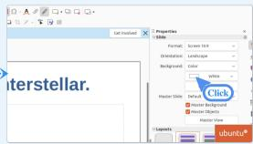

X Thought: To change the background color of slide 2 to match the title color of slide 1, I need to access the background color settings. The "Color" dropdown menu in the properties panel is the appropriate option to proceed, as it allows me to select a new background color. Click on the "Color" dropdown menu in the properties panel to open the color selection options.  
Action: click (start_box: [0.905, 0.318, 0.905, 0.318])

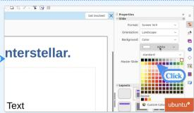

X Thought: To change the background color of slide 2 to match the title color of slide 1, I need to select the red color from the color selection dialog. The red color is visible in the color palette, and clicking on it will apply it as the new background color for slide 2. Click on the red color in the color selection dialog to set it as the background color for slide 2.  
Action: click (start_box: [0.905, 0.318, 0.905, 0.318])

X Thought: The task of changing the background color of slide 2 to match the title color of slide 1 has been successfully completed. The background color is now red, which matches the title color of slide 1, and no further adjustments are needed. I can now confirm that the task is complete. Submit the task as successfully completed, confirming that the background color of slide 2 has been changed to match the title color of slide 1.  
Action: finished

  
Figure 9: Test case on Ubuntu impress scene from UI-TARS. The task is: Make the background color of slide 2 same as the color of the title from slide 1.

Play the song under Mount Fuji(富士山下) for me

XUI-TARS

X Thought: Tap the "Music" icon in the left-center of the screen, which is a red circle with a white note pattern inside, to open the music app.  
Action: click (start_box:[0.24, 0.306, 0.24, 0.306])

X Thought: To activate the input function, tap the search box, a rounded gray rectangle at the top center of the page that contains the text "I am Beria." ("我是贝利亚")  
Action: click (start_box: [0.492, 0.075, 0.492, 0.075])

X Thought: Type "under Mount Fujin" ("富士山下") into the search box and see the relevant search results.  
Action: type (content='富士山下')

X Thought: Click on the first option in the search results, "Under Mount Fuji" ("富士山下"), which is at the top left of the screen with red text.  
Action: click (start box: [0.229, 0.138, 0.229, 0.138])

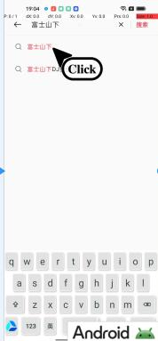  
Figure 10: Test case on Android from UI-TARS. The task is: Play the song under Mount Fuji.

X Thought: I clicked on the first song entry in the search results list, "Under Mount Fuji" ("富士山下") which is in the upper middle of the page with red text.  
Action: click (start box: [0.499, 0.218, 0.499, 0.218])

X Thought: The task has been completed, I have played the song under Mount Fuji(富士山下) on music app.  
Action: finished

# Please help me install the autoDocstring extension in VS Code in sidebar.

# XUI-TARS

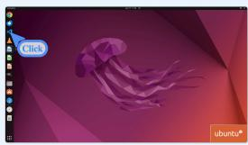  
X Thought: To proceed with installing the autoDosstring extension in VS Code, I need to open the VS Code application. The VS Code icon is clearly visible on the left side of the screen, so the next step is to click on it to launch the application. Click on the VS Code icon in the left sidebar to open the application.

  
X Thought: To install the autoDocstring extension in VS Code, I need to access the extensions management interface. This can be done by clicking on the "Extensions" tab in the left sidebar, which will allow me to search for and install the desired extension. Click on the "Extensions" tab in the left sidebar to open the extensions management interface.

  
X Thought: To proceed with installing the autoDodstring extension, I need to access the extensions management interface. Since the "File" menu is already open, the next logical step is to click on the "Preferences" option, as it typically contains settings and extensions-related options in VS Code. Click on the "Preferences" option in the "File" menu to access settings and extensions management.

  
X Thought: To proceed with installing the autoDocstring extension, I need to access the extensions management interface. Since the "Preferences" menu is already open, the next logical step is to click on the "Extensions" option, as it will allow me to search for and install the desired extension. Click on the "Extensions" option in the "Preferences" menu to access the extensions management interface.

Figure 11: Test case on Ubuntu VSCode scene from UI-TARS. The task is: Please help me install the autoDocstring extension in VS Code.  
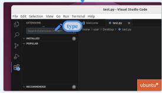  
Action: click (start_box: [0.018, 0.186, 0.018, 0.186])  
X Thought: To proceed with installing the autoDocstring extension, I need to search for it in the extensions management interface. The search bar is prominently displayed at the top of the "Extensions" section, so the next step is to type "autoDocstring" into the search bar to locate the extension. Type "autoDocstring" into the search bar in the "Extensions" section to search for the extension.

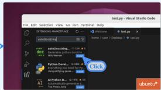  
Action: click (start_box: [0.24, 0.306, 0.24, 0.306])  
X Thought: To proceed with installing the autoDostring extension, I need to select it from the search results and initiate the installation process. The extension is clearly visible at the top of the list, so the next step is to click on the "Install" button next to it to begin the installation. Click on the "Install" button next to the autoDostring extension in the search results to start the installation process.

  
Action: click (start_box: [0.275, 0.72, 0.275, 0.72])  
X Thought: To proceed with installing the autoDocstring extension, I need to address the error that has occurred. The "Try Again" button is prominently displayed, and clicking it will likely retry the installation process, which is necessary to continue with the task. Click on the "Try Again" button to retry the installation of the autoDocstring  
Action: click (start_box: [0.576, 0.713, 0.576, 0.713])

  
Action: click (start_box: [0.462, 0.767, 0.462, 0.767])  
X Thought: To proceed with installing the autoDostring extension, I need to initiate the installation process by clicking on the "Install" button. This action is necessary to complete the task of adding the extension to VS Code. Click on the "Install" button to start the installation of the autoDostring extension.  
Action: click (start_box: [0.528, 0.463, 0.528, 0.463])

  
Action: type (content='autoDocstring')  
Action: click (start_box: [0.342, 0.409, 0.342, 0.409])  
X Thought: The task of installing the autoDocstring extension in VS Code has been successfully completed, as evidenced by the presence of the extension in the sidebar and its enabled status. There is no further action required to fulfill the task, and I can now confirm its completion. Submit the task as successfully completed, confirming that the autoDocstring extension has been installed in VS Code.  
Action: finished

I want to show bookmarks bar by default in chrome.

XUI-TARS

  
Figure 12: Test case on Windows chrome scene from UI-TARS. The task is: I want to show bookmarks bar by default in chrome.

X Thought: To enable the bookmarks bar by default in Chrome, I first need to open the browser. The next logical step is to double-click on the Chrome icon on the desktop to launch the application and access its settings. Double-click on the Chrome icon on the desktop to open the browser.  
Action: left double (start_box: [0.02, 0.319, 0.02, 0.319])

X Thought: To enable the bookmarks bar by default in Chrome, I need to access the browser's settings. The three-dot menu icon in the top-right corner is the gateway to the settings, so the next step is to click on it to reveal the dropdown menu. Click on the three-dot menu icon in the top-right corner of the Chrome window to open the settings menu.  
Action: click (start_box: [0.984, 0.056, 0.984, 0.056])

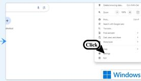

X Thought: To enable the bookmarks bar by default in Chrome, I need to navigate to the settings page where this option can be configured. Clicking on the "Settings" option in the dropdown menu will take me to the appropriate section to make this adjustment. Click on the "Settings" option in the dropdown menu to access the Chrome settings page.  
Action: click (start_box: [0.873, 0.642, 0.873, 0.642])

X Thought: To enable the bookmarks bar by default in Chrome, I need to access the "Appearance" settings, as this section typically contains options related to the browser's visual elements, including the bookmarks bar. Click on the "Appearance" option in the left sidebar to access settings related to the browser's appearance, including the bookmarks bar.  
Action: click (start_box: [0.052, 0.303, 0.052, 0.303])

X Thought: To enable the bookmarks bar by default in Chrome, I need to activate the "Show bookmarks bar" toggle switch. This action will ensure that the bookmarks bar is displayed by default in the browser, fulfilling the task objective. Click on the "Show bookmarks bar" toggle switch to enable the bookmarks bar by default.  
Action: click (start_box: [0.661, 0.375, 0.661, 0.375])

X Thought: The task of enabling the bookmarks bar by default in Chrome has been successfully completed, as evidenced by the active toggle switch. At this point, I should confirm the completion of the task and submit it, ensuring that no further adjustments are necessary. Submit the task, confirming that the bookmarks bar has been successfully enabled by default in Chrome.  
Action: finished

# B Data Example

We show several data examples for perception training in Figure 13, Figure 14, Figure 15, and Figure 16.

# Dense Caption

  
Figure 13: Dense caption example.

Personal Business

My TSB Rewards

Money Confidence

Help & Support

Register

Current Accounts Savings

# Fancy a free lunch?

You can earn £5 cashback every month for 6 months with the Spend & Save current account.

Min 20 card payments each month. Cashback payable for first 6 months including month account opened.  $18+$  & UK resident. T&Cs apply.

Input: Provide a detailed description of the GUI screenshot, including all visible elements, layout, and styling.

Output: The screenshot displays the homepage of TSB Bank's website, which has a clean and modern layout with a color scheme of blues, whites, and a pop of pink. The background is light blue.

At the top of the screen, there is a navigation bar with options for "Personal," "Business," "My TSB Rewards," "Money Confidence," "Help & Support," "Register," and "Login". The TSB logo is prominently displayed on the left side under the navigation bar.

Below the navigation bar, there are additional options for "Current Accounts," "Savings," "Mortgages," "Insurance," "Loans," and "Credit Cards". To the right, there is a search icon with the word "Search" to it.

The main focus of the screen is a large heading that reads "Fancy a free lunch?" in bold, dark blue text. Below the heading, there is a paragraph explaining that you can earn £5 cashback every month for 6 months with the Spend & Save current account, along with terms and conditions. There is also a blue button labeled with white text "Find out more".

To the right of the text, there is an image of a pink elephant sitting down and enjoying a meal of what appears to be dim sum, with a big blue and a small white circle in the background. The elephant is holding chopsticks in its trunk, and there is a speech bubble above its head with the word "SWITCH GUARANTEE" inside.

Below the main heading and image, there are six icons with accompanying text. Each icon has a blue background with a white symbol representing different services offered by the bank, such as a wallet with a pound sign, a house, and a piggy bank. The text below the icons includes "Find the right," "Find a current," "See our savings," "Get a personal," "Help for money," and "Help & support".

From the screenshot, it can be inferred that TSB Bank is promoting its Spend & Save current account with a cashback offer, and the website provides options for users to explore various banking services. The user can click on the navigation options at the top of the screen or the icons below the main heading to learn more about the bank's offerings.

# State Transition Caption

  
Figure 14: State transition caption example.

# Input:

Given two consecutive GUI screenshots, describe what has changed and what user interaction likely occurred between them, as if you were describing a scene transition in a movie.

# Requirements:

1. Describe what was shown in the first screenshot  
2. Describe what changed in the second screenshot  
3. Explain what user action most likely happened in between.

Output: The first screenshot shows the interface of Creo Parametric 8.0 software (as indicated by the light gray text at the top center of the screen). On the left side, there is a window labeled "Model Tree" which lists multiple files and folders, including "TRAY0001.ASM", "ASM_RIGHT", "ASM_TOP", "ASM_FRONT", "ASM_DEF_CSYS", and "TRAY_BOX". These files and folders are organized in a tree structure, showing the components of the current project. At the top of the interface is a toolbar with multiple tabs in the first row ("File", "Tray"), and the second row contains various tool buttons such as "Printer", "Assemble", "Arrange on Tray", "Pattern", "Generate Support", "Edit Support Parameters", "Measure", "Printability Validation", "Global Interference", "Calculate Build", "Note", and "Preview 3D Printing".

In the center of the software, there is a file open dialog box containing multiple files: Bolt.prt, Bushing.prt, Clips.prt (which appears to be selected by the mouse), Handles1.prt, Handles2.prt, and Handlebar_grip.prt. Below shows a yellow clip-shaped part with two connected cylindrical structures, which appears to be Clips.prt, with a modification time of 16-Jan-21 12:10:34 AM. At the bottom are several buttons, including a blue "Open" button and a "Cancel" button on the right.

The second screenshot still shows the Creo Parametric 8.0 software interface and file open dialog box. However, the displayed image has changed to a handle part. The preview window shows a silver and green cylindrical handle component. The 3D preview shows it has two sections: a longer silver cylindrical main body, and a shorter green protruding section, likely used for gripping or fixing. From the file list, we can see that Handlebar_grip.prt is currently selected, and the file name "Handlebar_grip.prt" is displayed at the bottom of the file dialog box. Overall, it appears the user clicked on Handlebar_grip.prt in the file open dialog box, causing the 3D file preview area below to switch to the silver handle component.

# Question Answering

Input: What is the title of the first recent post? Use the image to answer the question with a single word or phrase.

Output: What Happens in Vegas, Stays in Vegas

FOR FIREFOX

Cert Pinner Code on Cadenberg

MY OTHER PROJECTS ON

CODEBERG

Peter Ener, Wifd P. ppm

computing,etc.

RECENT POSTS

What happens in Vulture Stairs?

Vegas-Fun with an Overlay

Filesystem

Restoring a Clonzeilla Backup in

Virtualbo -Mind the EF1

SSHClientFun-Localand

Global IP with a Single Hostname

Napbook is a (Virtueless) Book

1

Project Goal

another value:

sudo echo 270 > /proc/sys/net/ipv4/tcp_keepalive_time

To make this permanent, add the following line to /etc/vctcl.cfm

(uberto)

net_tsv6_tcp keepalive time=270

In practice, changing the value by writing the number of seconds to this virtual

file takes immediate effect, even for already established TCP connections. As

I'm not keen on having too many TCP keep-alives for the sake of mobile

device power using I started my experiments at 9 minutes . That mobile

network , however, won't have it. I finally ended up with a man year 270

week , i.e . 45 minutes . Anything more and the NAT surgery would kill the

TFR session and thus cause a connection outage and reconnect. Seriously?

So a TCP keep alive every 4.5 minutes to ALL connections is the price for

__________

September 2, 2020 Martin Uncategorized

PREVOCES

A 2D Barcode For Your Will Password

特此公告。

# Set of Mark Question Answering

Input: Tell me what is inside the red rectangle margin.

Output: Main content text that reads "A home is something you can't live without. This page, not so much. Don't worry."

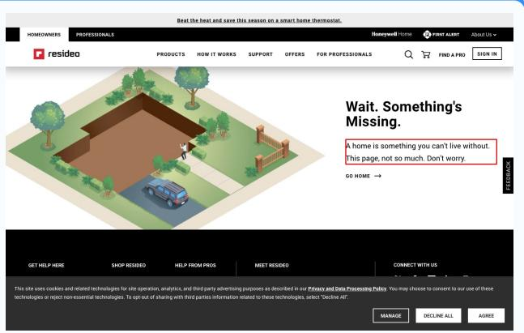  
Figure 15: Question answering and set of mark example.

# Element Description

Input: Identify the UI control types (such as buttons, text fields, dropdowns) at [0.47,0.89,0.84,0.99], using standard Windows/UI control terminology.

Output:ComboBox

Input: Describe the visual appearance of UI element at  $[0.47, 0.89, 0.84, 0.99]$ , including its shape, color, text content, and visual styling details.

Output: The element is a rectangularComboBox with the text at the left 'Product description' inside. The text is black, with the same font size, and is laid out horizontally. The element has a white background.

Input: Describe the spatial location of the element with the relationship to other elements using clear directional and relational terms. The element is at  $[0.47, 0.89, 0.84, 0.99]$ .

Output: The element is located at the bottom right of the screenshot. Above it, there is a paragraph describing the product.

Input: For the UI element at  $[0.47, 0.89, 0.84, 0.99]$ , explain its probable function and how users would typically interact with it in the interface.

Output: After clicking this combobox, we can choose to display different product attributes in the interface. Currently, it shows the general product introduction.

Figure 16: Element description example, the target element is highlighted with a pink bounding box in the image.