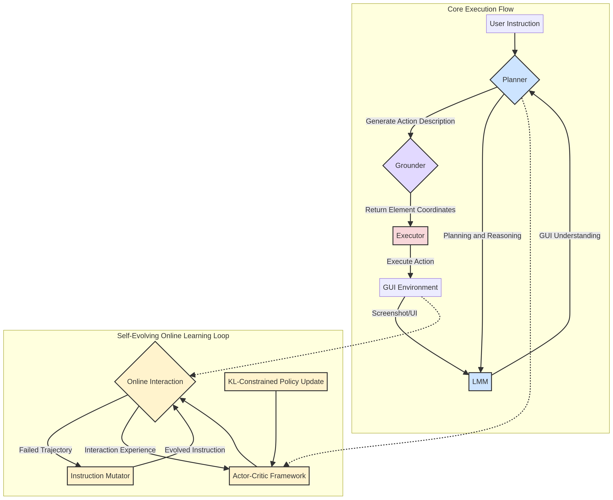

# AutoGLM 架构设计

**发布日期**: 2025年12月16日

**作者**: Manus AI

---

## 1. 核心架构理念

AutoGLM 的架构设计围绕两大核心洞见展开，旨在解决 GUI 智能体在规划灵活性和动作准确性之间的矛盾，并克服训练数据稀缺的瓶颈。这两大洞见分别是**中间接口设计 (Intermediate Interface Design)** 和 **自进化在线课程强化学习 (Self-Evolving Online Curriculum RL)** [1]。

这种设计理念将复杂的 GUI 自动化任务分解为更易于管理和优化的模块，并通过持续的自我学习来提升智能体的通用性和鲁棒性。

## 2. 整体架构图

AutoGLM 的整体架构可以分为**核心执行流程**和**自进化在线学习循环**两大部分。核心执行流程负责处理单个用户指令，而自进化学习循环则负责模型的长期能力迭代。

*图 1: AutoGLM 整体架构图*

## 3. 核心执行流程 (Core Execution Flow)

核心执行流程是 AutoGLM 响应用户指令、与 GUI 环境交互的主体部分。该流程通过精细的模块分工，实现了从高级意图到具体像素操作的转化。

### 3.1. 中间接口设计：解耦规划与定位

AutoGLM 架构最关键的创新之一是引入了“中间接口”，将高级的**规划 (Planning)** 与低级的**定位 (Grounding)** 行为解耦。研究发现，现有的大型模型在规划层面表现尚可，但大量错误来源于在 GUI 界面上错误地识别和定位元素 [1]。

- **规划模块 (Planner)**: 由大型多模态模型 (LMM) 驱动，负责理解用户的高级指令和当前屏幕截图，生成一个描述性的、与具体坐标无关的动作计划。例如，生成“点击位于右下角的‘提交’按钮”这样的自然语言动作描述，而不是直接输出 `[823, 684]` 这样的坐标。

- **定位模块 (Grounder)**: 接收规划模块生成的动作描述，其唯一任务是在当前屏幕截图中精确地找到该描述对应的 UI 元素，并返回其坐标。该模块可以通过在大量无监督的 GUI 数据上进行专门训练来优化，从而实现高精度的元素定位。

这种解耦设计带来了显著优势：

| 优势 | 描述 |
| :--- | :--- |
| **模块化开发** | 规划和定位模块可以独立迭代和优化，互不干扰。 |
| **提升准确性** | 定位模块可以专门针对元素识别任务进行训练，显著降低操作错误率。 |
| **增强灵活性** | 规划模块可以更专注于任务流程和错误恢复，而无需关心像素级的实现细节。 |

实验证明，该设计能显著提升基于 GPT-4o 等先进模型的 GUI 智能体性能，在 VAB-WebArena-Lite 基准测试中，引入中间接口设计将 GPT-4o (visual) 的成功率从 18.2% 提升至 27.3% [1]。

### 3.2. 执行器 (Executor)

执行器是动作的最终实施者。它接收来自定位模块的精确坐标，并调用底层的 ADB (Android Debug Bridge) 或浏览器控制接口，在设备上执行具体操作，如点击、滑动或文本输入。

## 4. 自进化在线学习循环 (Self-Evolving Online Learning Loop)

为了解决高质量训练数据稀缺和模型错误恢复能力不足的问题，AutoGLM 设计了一套基于强化学习的自进化框架。

- **Actor-Critic 框架**: 作为在线学习的核心，智能体 (Actor) 在真实或模拟的 GUI 环境中进行交互，而评估器 (Critic) 则负责评估其行为的好坏，并提供反馈信号。
- **指令变异器 (Instruction Mutator)**: 当智能体在执行某个任务失败时，该模块会自动对原始指令进行变异（例如，简化或复杂化），从而生成新的、难度适中的训练任务。这些新任务经过评估器筛选后，被用于下一轮的在线交互训练。
- **KL 散度约束策略更新**: 在课程学习中，为了防止模型在学习新任务时遗忘旧能力（即策略分布漂移），AutoGLM 采用 KL 散度约束来确保策略更新的平滑性，从而保证了训练过程的稳定和性能的持续提升。

通过这个闭环学习系统，AutoGLM 能够“自我成长”，在没有海量人工标注数据的情况下，通过与环境的持续交互来不断提升其任务成功率和鲁棒性。

---

### 参考文献

[1] Liu, X., Qin, B., Liang, D., et al. (2024). *AutoGLM: Autonomous Foundation Agents for GUIs*. arXiv:2411.00820. [https://arxiv.org/abs/2411.00820](https://arxiv.org/abs/2411.00820)
