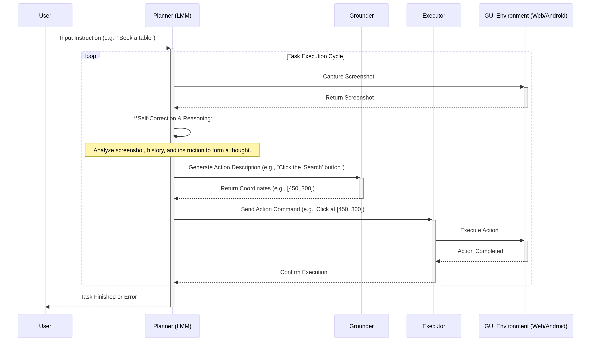

# AutoGLM 规划与决策算法

**发布日期**: 2025年12月16日

**作者**: Manus AI

---

## 1. 概述

规划与决策是自主智能体 (Autonomous Agent) 的核心大脑，它决定了智能体如何将用户的抽象指令分解为一系列具体、可执行的动作。AutoGLM 在此方面采用了先进的算法设计，特别是通过其创新的**中间接口 (Intermediate Interface)** 和 **自进化在线课程强化学习 (Self-Evolving Online Curriculum RL)** 框架，实现了高效且鲁棒的规划与决策能力 [1]。

## 2. 规划与决策流程

AutoGLM 的规划与决策流程是一个循环往复的“感知-思考-行动”周期。其核心是将高级任务规划与低级动作执行明确分离，从而提高整个系统的灵活性和准确性。

*图 1: AutoGLM 规划与决策流程时序图*

上图清晰地展示了从接收用户指令到完成任务的完整闭环。该流程可以分解为以下几个关键步骤：

1.  **指令理解与状态感知**: 流程始于用户输入一条自然语言指令。**规划模块 (Planner)** 首先捕获当前 GUI 环境的屏幕截图，将其与用户指令和历史操作记录一同作为输入。

2.  **思考与推理 (Reasoning)**: 在接收到所有上下文信息后，**大型多模态模型 (LMM)** 会进入一个“思考”阶段。它会分析当前界面，理解用户意图，并形成一个内部的、高层次的行动计划。例如，它可能会思考：“用户想订一张票，我需要先点击‘出发地’输入框”。

3.  **生成动作描述**: 基于思考结果，规划模块 (Planner) 生成一个与具体坐标无关的、描述性的动作指令，例如 `action="Click", element_description="the 'Submit' button on the bottom right"`。这是“中间接口”设计的核心体现。

4.  **元素定位 (Grounding)**: **定位模块 (Grounder)** 接收这个动作描述，并在屏幕截图中精确地找到对应的 UI 元素，然后返回其中心坐标。

5.  **动作执行**: **执行器 (Executor)** 接收到精确的坐标和动作类型（如 Click, Type），并调用底层接口（如 ADB）在设备上执行该动作。

6.  **循环与迭代**: 一个动作执行完毕后，系统会重新捕获屏幕状态，进入下一个“感知-思考-行动”循环，直到整个任务完成或遇到无法解决的错误。

## 3. 核心算法：自进化在线课程强化学习

为了让规划模块具备强大的错误恢复和泛化能力，AutoGLM 采用了一套名为 **WebRL** 的自进化在线课程强化学习框架 [2]。该框架旨在解决 GUI Agent 训练中两大核心难题：**任务数据稀缺**和**策略分布漂移**。

| 挑战 | AutoGLM 的解决方案 |
| :--- | :--- |
| **任务数据稀缺** | 设计了**指令变异器 (Instruction Mutator)**。当智能体在训练中失败时，该模块会自动修改失败任务的指令（如简化或增加约束），从而创造出难度适中的新任务，实现了训练数据的自我增殖。 |
| **策略分布漂移** | 采用 **KL 散度约束的策略更新 (KL-constrained policy update)** 机制。在通过课程学习引入新任务时，该机制可以防止模型在学习新技能时忘记旧技能，确保了训练过程的稳定性和性能的持续提升。 |

通过这个强化学习框架，AutoGLM 的规划模块 (Planner) 能够在与环境的持续交互中不断“试错”和“学习”，逐步掌握复杂的任务规划和强大的错误恢复能力，而不仅仅是模仿专家数据。

## 4. 总结

AutoGLM 的规划与决策算法通过将宏观的任务规划与微观的元素定位解耦，并结合强大的自进化强化学习框架，构建了一个既灵活又精确的决策系统。这种设计不仅显著提升了任务的成功率，也为解决 GUI 智能体在真实世界中的泛化和鲁棒性问题提供了一条清晰、有效的技术路径。

---

### 参考文献

[1] Liu, X., Qin, B., Liang, D., et al. (2024). *AutoGLM: Autonomous Foundation Agents for GUIs*. arXiv:2411.00820. [https://arxiv.org/abs/2411.00820](https://arxiv.org/abs/2411.00820)

[2] Qi, Z., Liu, X., Iong, I. L., et al. (2024). *WebRL: Training LLM Web Agents via Self-Evolving Online Curriculum Reinforcement Learning*. [https://github.com/THUDM/WebRL](https://github.com/THUDM/WebRL)
