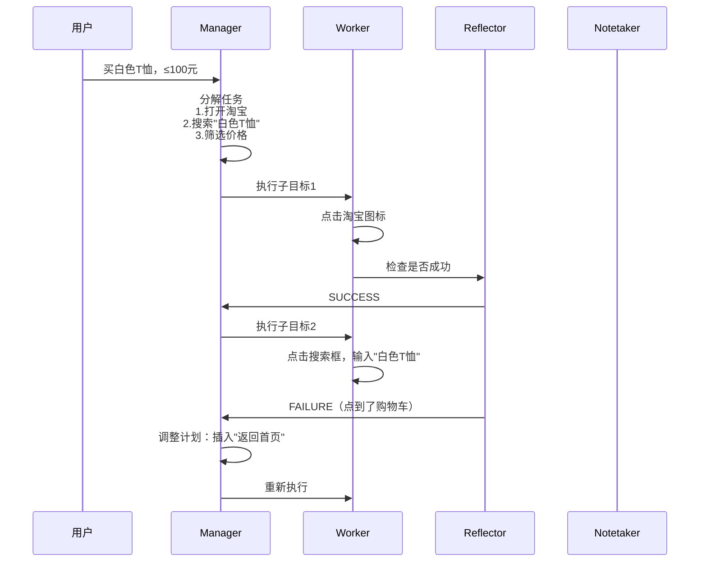
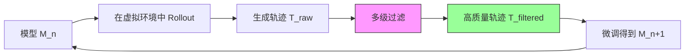

# GUI Agent 战国策：2025 主流架构全向综述与工程落地指南

> **作者**：Damon Li  
> **最后更新**：2026 年 1 月 6 日  
> **关键词**：GUI Agent, 端到端模型, 多智能体协作, 强化学习, 端云协同, System-2 推理, MCP  
> **技术水平**：中高级（需要机器学习和系统架构基础）

---

## 目录

### 第一部分：基础与核心概念
- [1. 引言：从"能听会说"到"能看会做"的跨越](#1-引言从能听会说到能看会做的跨越)
- [2. GUI Agent 核心能力解构](#2-gui-agent-核心能力解构)
  - [2.1 感知 (Perception)：从像素到语义](#21-感知-perception从像素到语义)
  - [2.2 动作 (Action)：统一动作空间的设计哲学](#22-动作-action统一动作空间的设计哲学)
  - [2.3 推理 (Reasoning)：System-1 vs System-2](#23-推理-reasoningsystem-1-vs-system-2)
  - [2.4 记忆 (Memory)：短期与长期的协同](#24-记忆-memory短期与长期的协同)

### 第二部分：技术流派深度拆解
- [3. 三大技术流派深度拆解](#3-三大技术流派深度拆解)
  - [3.1 流派一：分而治之 — AutoGLM](#31-流派一分而治之-divide-and-conquer--autoglm)
  - [3.2 流派二：端到端原生 — UI-TARS 与 MAI-UI](#32-流派二端到端原生-end-to-end-native--ui-tars-与-mai-ui)
  - [3.3 流派三：多智能体协作 — Mobile-Agent-v3](#33-流派三多智能体协作-multi-agent-collaboration--mobile-agent-v3)
  - [3.4 流派四：端侧优化 — Step-GUIEdge 与 AgentCPM-GUI](#34-流派四端侧优化-edge-optimized--step-guiedge-与-agentcpm-gui)

### 第三部分：数据与训练
- [4. 数据工程：得数据者得天下](#4-数据工程得数据者得天下)
- [5. 强化学习：从模仿到自主决策的跨越](#5-强化学习从模仿到自主决策的跨越)

### 第四部分：性能与评测
- [6. 性能大比拼：谁是真正的 SOTA？](#6-性能大比拼谁是真正的-sota)

### 第五部分：工程实践
- [7. 工程落地：从实验室到生产环境](#7-工程落地从实验室到生产环境)
- [8. 数据飞轮与自进化](#8-数据飞轮与自进化谁的闭环更高效)
- [9. 落地建议：如何选型？](#9-落地建议如何选型)
- [10. 核心技术对比](#10-核心技术对比一张表看懂所有差异)

### 第六部分：进阶与展望
- [11. 评估基准全景图](#11-评估基准全景图)
- [11. 未来趋势与技术展望](#11-未来趋势与技术展望)
- [12. 代码实战：五分钟上手各框架](#12-代码实战五分钟上手各框架)
- [13. 实战案例：复杂任务的执行对比](#13-实战案例复杂任务的执行对比)
- [14. 鲁棒性与错误恢复能力](#14-鲁棒性与错误恢复能力)
- [15. 性能瓶颈与未来挑战](#15-性能瓶颈与未来挑战)
- [16. 快速选型决策树](#16-快速选型决策树)
- [17. 总结：殊途同归的智能体未来](#17-总结殊途同归的智能体未来)
- [18. 常见问题 FAQ](#18-常见问题-faq)

### 附录
- [附录：核心资源与论文索引](#附录核心资源与论文索引)

---

## 1. 引言：从"能听会说"到"能看会做"的跨越

2025 年被公认为 **GUI Agent (图形用户界面智能体)** 的爆发元年。如果说大语言模型 (LLM) 解决了"理解与生成"的问题，那么 GUI Agent 则致力于解决"行动与执行"的最后一公里——让 AI 真正能够像人类一样操作计算机和手机。

从 2024 年 10 月智谱 AI 发布 **AutoGLM**，到 2025 年初字节跳动推出 **UI-TARS** 并集成到豆包手机，再到阿里通义实验室在年底连续发布 **Mobile-Agent-v3**、**GUI-Owl** 和 **MAI-UI**，以及阶跃星辰开源的 **Step-GUIEdge**，这些重量级模型不仅在学术榜单（如 AndroidWorld, OSWorld）上交替刷新 SOTA，更重要的是，它们代表了通往"通用计算机控制"的几条截然不同的技术路线。


*图 1：GUI Agent 的演进路径，从规则驱动到框架化再到原生端到端模型（来源：UI-TARS 论文）*

对于工程架构师而言，面对如此眼花缭乱的模型，**如何看透其背后的架构本质？如何根据业务场景（端侧/云端/隐私/延迟）进行选型？** 本文将抛开营销术语，从**架构设计、关键技术流派、数据工程及落地形态**四个维度，对当前主流 GUI Agent 进行硬核拆解。

---

## 2. GUI Agent 核心能力解构

在深入各家方案之前，我们需要先理解一个合格的 GUI Agent 需要具备哪些核心能力。根据 UI-TARS 论文的系统性总结，现代 GUI Agent 需要具备四大核心能力：


*图 2：GUI Agent 的四大核心能力：感知、动作、推理、记忆（来源：UI-TARS 论文）*

### 2.1 感知 (Perception)：从像素到语义

**挑战**：GUI 截图信息密度极高（一张 1920×1080 的截图可能包含上百个可交互元素），且小元素（如 10×10 像素的图标）定位精度要求苛刻。

**技术演进**：
- **早期**：依赖 HTML DOM 树、Android Accessibility Tree 等结构化文本
- **现代**：纯视觉方案 (Pure-Vision)，直接从截图理解，不依赖系统 API

**关键技术点**：
- **元素描述 (Element Description)**：对每个 UI 元素生成结构化描述（类型、外观、位置、功能）
- **密集字幕 (Dense Captioning)**：理解整个界面的布局和元素间关系
- **状态转换字幕 (State Transition Captioning)**：捕捉前后截图的细微变化（如按钮被点击后的视觉反馈）


*图 3：UI-TARS 的感知与定位数据构造示例（来源：UI-TARS 论文）*

### 2.2 动作 (Action)：统一动作空间的设计哲学

**核心矛盾**：不同平台的操作原语不同（Web 的 `click` vs Android 的 `tap` vs Desktop 的 `mouse_move`），如何统一？

**解决方案**：所有主流模型都采用了**统一动作空间 (Unified Action Space)** 设计，将语义等价的操作标准化：

| 动作类型 | AutoGLM | UI-TARS | AgentCPM-GUI | MAI-UI |
|---------|---------|---------|--------------|--------|
| 点击 | `Click(x,y)` | `click(start_box='<point>x y</point>')` | `{"POINT":[x,y]}` | `{"action":"click","coordinate":[x,y]}` |
| 长按 | `LongPress(x,y)` | `long_press(start_box)` | `{"POINT":[x,y],"duration":1000}` | `{"action":"long_press","coordinate":[x,y]}` |
| 滑动 | `Swipe(x1,y1,x2,y2)` | `scroll(point,direction)` | `{"POINT":[x,y],"to":"down"}` | `{"action":"swipe","direction":"up"}` |
| 输入 | `Type(content)` | `type(content='...')` | `{"TYPE":"text"}` | `{"action":"type","text":"..."}` |
| 终止 | `Finished()` | `finished(content)` | `{"STATUS":"finish"}` | `{"action":"terminate","status":"success"}` |
| 询问用户 | - | `CallUser()` | - | `{"action":"ask_user","text":"..."}` |

**坐标系统对比**：

| 模型 | 坐标范围 | 归一化方式 | 原点位置 |
|------|---------|-----------|---------|
| **UI-TARS** | 0-1000 | 相对于 smart_resize 后的图像 | 左上角 |
| **AgentCPM-GUI** | 0-1000 | 宽高比例缩放 | 左上角 |
| **MAI-UI** | 0-999 | 归一化到 [0,1]，输出时×999 | 左上角 |
| **Step-GUI** | 0-1000 | 相对坐标 | 左上角 |
| **GUI-Owl** | 0-1 | 归一化坐标 | 左上角 |

**工程优化**：
- **AgentCPM-GUI**：**9.7 tokens/action**（业界最优）
  - 紧凑 JSON：消除控制字符间的空格
  - 示例：`{"POINT":[480,320]}`（无空格）
- **MAI-UI**：~15-20 tokens/action
  - 使用 OpenAI 兼容格式：`<tool_call>{"name":"mobile_use","arguments":{...}}</tool_call>`
- **UI-TARS**：~20-30 tokens/action
  - 包含显式标签：`<point>x y</point>`

### 2.3 推理 (Reasoning)：System-1 vs System-2

这是 2025 年 GUI Agent 最重要的突破点之一。受 OpenAI o1 启发，多个团队引入了**双系统思维**：

- **System-1（快思考）**：直觉式反应，适合简单操作（如"点击搜索框"）
  - 特点：快速、自动、基于模式匹配
  - 实现：直接输出动作，无中间思维过程
- **System-2（慢思考）**：审慎推理，适合复杂任务（如"规划多步骤购物流程"）
  - 特点：慢速、审慎、分析性思考
  - 实现：生成显式 Thought，包含任务分解、推理链


*图 4：UI-TARS 的五种推理模式：任务分解、长期一致性、里程碑识别、试错、反思（来源：UI-TARS 论文）*

**UI-TARS 的 System-2 实现（五种推理模式）**：
1. **任务分解 (Task Decomposition)**：将"订机票"拆解为"选出发地→选目的地→选日期→筛选价格"
2. **长期一致性 (Long-term Consistency)**：始终记得用户的原始目标，避免中途跑偏
3. **里程碑识别 (Milestone Recognition)**：判断"我现在完成到哪一步了"
4. **试错 (Trial & Error)**：尝试不同路径，评估哪个更优
5. **反思 (Reflection)**：发现错误后主动纠正

**System-1 vs System-2 实验对比（UI-TARS-7B）**：

| 场景 | Sampling | System-1 (无思考) | System-2 (有思考) | 差异 |
|------|----------|-------------------|-------------------|------|
| **域内评测** | | | | |
| Mind2Web | Bo1 | **更优** | 稍差 | System-2 可能引入错误推理 |
| AndroidControl | Bo1 | **更优** | 稍差 | 单样本时复杂度反而是劣势 |
| GUI Odyssey | Bo1 | **更优** | 稍差 | |
| Mind2Web | Bo16 | 基线 | **更优** | 多样性补偿推理错误 |
| AndroidControl | Bo64 | 基线 | **显著更优** | System-2 优势显现 |
| **域外评测** | | | | |
| AndroidWorld | Bo1 | 基线 | **显著更优** | System-2 泛化能力强 |

**关键结论**：
1. **Bo1（单次采样）**：域内任务，System-1 反而更优
   - 原因：System-2 可能引入不相关或错误的推理步骤
2. **BoN（多次采样）**：System-2 随 N 增大展现优势
   - 原因：候选多样性弥补了单次推理的不稳定性
3. **域外任务**：System-2 显著优于 System-1
   - 原因：深度推理帮助模型泛化到未见过的任务
4. **未来方向**：如何在 Bo1 时发挥 System-2 优势？
   - 可能方案：强化微调（如 o1 的做法）

### 2.4 记忆 (Memory)：短期与长期的协同

- **短期记忆**：当前任务的操作历史（通常保留最近 1-3 张截图 + 动作序列）
- **长期记忆**：跨任务的知识积累（如"淘宝的搜索框通常在顶部"）

**工程实践**：由于 VLM 的上下文窗口限制（通常 32k tokens），Mobile-Agent-v3 引入了 **Notetaker Agent**，专门负责提取和压缩关键信息（如验证码、订单号），避免历史记录爆炸。

---

## 3. 三大技术流派深度拆解

### 3.1 流派一：分而治之 (Divide and Conquer) — AutoGLM

**代表作**：**AutoGLM** (智谱 AI & 清华大学, 2024.10)

**核心思想**：将复杂的 GUI 操作解耦为"规划 (Planning)"和"定位 (Grounding)"两个正交问题。

*注：AutoGLM 的架构图暂未包含在源文档中，以下为架构概念说明*

**AutoGLM 架构设计**：采用 Planner（规划器）+ Grounder（定位器）的双模块设计，将复杂的 GUI 操作解耦为两个独立的子问题，分别优化灵活性和定位精度。

#### 架构拆解

```python
# Planner（规划器）
action_description = Planner(
    instruction="订一杯瑞幸椰云拿铁",
    screenshot=current_screen,
    history=past_actions
)
# 输出："点击右下角的'提交'按钮"

# Grounder（定位器）
coordinates = Grounder(
    screenshot=current_screen,
    description="右下角的'提交'按钮"
)
# 输出：[823, 684]
```

**优势分析**：
1. **模块化训练**：Grounder 可以用海量无标注截图数据（只需元素坐标）单独训练，成本低
2. **灵活替换**：Planner 可以是任意强大的 VLM（如 GPT-4o），Grounder 可以是专门优化的小模型
3. **实验证明**：在 VAB-WebArena-Lite 上，中间接口设计让性能显著提升：
- GPT-4o (visual): 18.2% → 27.3% (**+9.1%**)
- GPT-4-vision-preview (visual): 18.8% → 36.4% (**+17.6%**)

**性能对比表**：

| 观察类型 | gpt-4o (text) | gpt-4o (visual) | gpt-4-vision-preview (visual) |
|---------|---------------|-----------------|-------------------------------|
| End-to-End Agent | 14.3% | 18.2% | 18.8% |
| 中间接口设计 | 18.1% (+3.8%) | 27.3% (+9.1%) | 36.4% (+17.6%) |

**劣势**：
- 链路较长，Planner 的描述如果含糊（如"那个按钮"），Grounder 容易定位错误
- 误差累积问题
- 需要维护两个独立模块


*图 6：AutoGLM 在美团 App 上搜索"生椰拿铁"并选择商品的执行步骤（来源：AutoGLM 论文）*

#### 训练流程：自进化在线课程强化学习 (WebRL)

AutoGLM 提出了 **WebRL** 框架，解决两大核心问题：

1. **任务数据稀缺**：通过"自进化"生成新任务
   - 从约 1000 条 BC 数据起步，GLM-4-9B 达到 22.4% 成功率
   - 利用模型自己生成的失败案例，**变异**出更简单/更复杂的新任务
   - 用 Critic 模型过滤，保留高质量任务
   - 持续迭代，无需额外的人工任务设计

2. **策略分布漂移**：课程学习中的经典难题
   - 采用 **KL 约束的策略更新**
   - 结合 **Actor 置信度过滤的经验回放**
   - 防止策略更新时性能退化


*图 7：AutoGLM 在 VAB-WebArena-Lite 上与其他模型的性能对比，展示 AutoGLM 达到 55.2% 成功率（来源：AutoGLM 论文）*

**最终性能**：
- VAB-WebArena-Lite: **55.2%** (单次尝试), **59.1%** (二次尝试)
- OpenTable 真实预订任务: **96.2%** (超越 GPT-4o 的 62.6% 和 Agent Q 的 81.7%)
- AndroidLab: **36.2%** (超越 GPT-4o 的 31.2% 和 Claude-3.5-Sonnet 的 29.0%)

---

### 3.2 流派二：端到端原生 (End-to-End Native) — UI-TARS 与 MAI-UI

**代表作**：**UI-TARS** (字节 & 清华, 2025.01)、**MAI-UI** (阿里通义, 2025.12)

**核心思想**：Pixel-to-Action。模型直接输入屏幕截图，直接输出动作和坐标，不再有中间商赚差价。


*图 8：UI-TARS 的整体架构与核心能力（来源：UI-TARS 论文）*

#### UI-TARS 的四大创新

**1) 增强感知 (Enhanced Perception)**

通过专门的解析工具爬取海量 GUI 截图，构建五类感知数据：
- 元素描述：对每个按钮、文本框生成结构化描述
- 密集字幕：描述整个界面的布局和层次
- 状态转换字幕：捕捉"点击前后"的细微变化
- 问答数据：提升视觉推理能力
- Set-of-Mark：在截图上标注元素边界，增强定位

**2) 统一动作建模 (Unified Action Modeling)**

跨平台（Web/Mobile/Desktop）标准化动作空间，并通过大规模轨迹数据训练多步执行能力。

**3) System-2 推理 (Deliberate Reasoning)**

这是 UI-TARS 最大的亮点。通过以下两步注入推理能力：

- **推理增强 (Reasoning Enrichment)**：爬取 600 万条 GUI 教程（如"如何在 Chrome 中设置隐私"），提取逻辑推理模式
- **思维增强 (Thought Augmentation)**：对每条轨迹数据，用 VLM 反向标注"为什么这么做"


*图 9：UI-TARS 帮助用户查找航班的演示案例：选择日期步骤（来源：UI-TARS 论文）*

**4) 迭代训练与反思调优 (Iterative Training with Reflection)**


*图 10：UI-TARS 的在线 Bootstrapping 与反思调优流程（来源：UI-TARS 论文）*

核心机制：
- 在虚拟环境中让模型自己试错，生成轨迹
- 多级过滤：规则过滤 → VLM 打分 → 人工审核
- **反思调优 (Reflection Tuning)**：
  - **错误纠正**：标注"这一步错了，应该怎么改"
  - **事后反思**：标注"错误已经发生，如何补救"
  - 用 DPO (Direct Preference Optimization) 训练

#### MAI-UI：端云协同的全尺寸方案

**关系梳理**：Mobile-Agent-v3 ≠ GUI-Owl
- **GUI-Owl**：基础模型（7B/32B），类似 Qwen3-VL 之于通用领域
  - 可独立端到端使用
  - 可作为多智能体框架的底层 VLM
- **Mobile-Agent-v3**：多智能体框架，可搭载不同的 VLM（包括 GUI-Owl）

**GUI-Owl 核心创新**：
1. **大规模环境基础设施**：云手机 + 云电脑，跨平台（Android, Ubuntu, macOS, Windows）
2. **自进化轨迹生产框架**：高质量查询生成 → 模型 Rollout → 正确性判断 → 查询特定引导生成
3. **多样化基础能力**：定位、规划、动作语义识别 + 多样化推理与反思模式
4. **可扩展环境 RL**：全异步训练 + TRPO (Trajectory-aware Relative Policy Optimization)

**MAI-UI 的技术传承与创新**：

MAI-UI 继承了前置工作 **UI-Ins** 的 **Instruction-as-Reasoning** 范式：

**背景问题**：
- 开源 Grounding 数据集中约 **23.3%** 的指令存在质量问题
- 单一视角的指令限制了模型的推理能力
- SFT+RL 框架容易出现策略坍塌

**Instruction-as-Reasoning 解决方案**：
1. **多视角指令生成**（4 种人类视角）：
   - 外观 (Appearance): "红色的圆形按钮"
   - 功能 (Function): "提交表单的按钮"
   - 位置 (Location): "右下角的按钮"
   - 意图 (Intent): "完成付款的按钮"
2. **训练策略**：
   - SFT 阶段：教会模型使用多样化指令视角作为显式推理路径
   - RL 阶段（GRPO）：激励模型根据场景动态选择最优推理视角
3. **效果**：
   - 避免 SFT+RL 中的策略坍塌（Phi-Ground 遇到的问题）
   - 涌现能力：模型可战略性地选择和组合多个视角，甚至生成超出训练的新视角

**MAI-UI** 在此基础上，进一步解决了四大真实部署挑战：


*图 11：MAI-UI 在 GUI 定位（ScreenSpot-Pro、UI-Vision）和导航任务（AndroidWorld、MobileWorld）上的 SOTA 性能（来源：MAI-UI 论文）*

**1) 原生用户交互 (Agent-User Interaction)**

现实中用户指令往往模糊不清（如"帮我订个票"——去哪？什么时候？）。MAI-UI 引入 `ask_user` 动作：

```json
{
  "action": "ask_user",
  "content": "请问您要去哪个城市？出发日期是？"
}
```

**2) MCP 工具增强 (Model Context Protocol)**

不再局限于纯 UI 操作，可以调用外部 API：

```json
{
  "action": "mcp_call",
  "tool": "github_api",
  "args": {"repo": "google-research/android_world", "action": "get_recent_commits", "limit": 3}
}
```

**实际价值**：
- **压缩操作序列**：多步 UI 操作 → 单个 API 调用
  - 例：比较两个地址的驾驶距离（原需在地图 App 中反复切换，现一次 API 调用完成）
- **扩展能力边界**：将桌面专属工作流带到移动端
  - 例：在手机上查询 GitHub commit 历史并发邮件
- **提升效率**：减少错误累积（UI 操作链越长，失败概率越高）

**MobileWorld 基准测试结果**：

| 模型 | GUI-Only (116) | User-Int. (45) | MCP (40) | Overall |
|------|----------------|----------------|----------|---------|
| Gemini-3-Pro + UI-Ins-7B | 55.6% | 24.4% | 48.6% | 46.3% |
| GPT-5 + UI-Ins-7B | 54.0% | 62.2% | 51.6% | 51.7% |
| GUI-Owl-7B | 7.7% | - | - | 4.5% |
| Qwen3-VL-32B | 11.9% | 6.7% | 2.7% | 9.0% |
| **MAI-UI-235B-A22B** | **39.7%** | **51.1%** | **37.5%** | **41.7%** |

**发现**：
- 端到端模型在 MCP 和用户交互任务上通常表现较差
- MAI-UI 通过专门训练，在 User-Int. 上甚至超越 Gemini-3-Pro 框架（51.1% vs 24.4%）
- MCP 任务上，MAI-UI 相比其他端到端模型提升 **+32.1** 个百分点

**3) 端云协同架构**


*图 12：MAI-UI 的端云协同架构概览（来源：MAI-UI 论文）*


*图 12-1：端云协同系统的性能与效率提升（来源：MAI-UI 论文）*

核心组件：
1. **Local GUI Agent（双重角色）**：
   - 作为 GUI Agent：感知屏幕，生成动作
   - 作为轨迹监控器：评估是否与用户指令对齐
   - 监控指标：动作执行失败、重复动作无进展、输入错误、任务偏离
   
2. **Cloud GUI Agent**：
   - 仅在监控器检测到偏离且无隐私数据时触发
   - 接收错误摘要，利用更强容量完成任务
   
3. **Local Unified Trajectory Memory**：
   - 维护任务指令、历史截图、模型输出的统一历史
   - 支持端侧/云端模型无缝切换

4. **执行流程**：
   - 端侧 Agent 执行 → 每隔几步评估对齐度 → 偏离且无敏感数据时切换云端 → 云端完成任务

**动态路由策略**：
- **端侧优先**：简单高频任务（如"打开闹钟"），<500ms 响应
- **云端升级**：检测到以下情况时切换
  - 轨迹偏离用户指令
  - 连续动作失败
  - 任务复杂度超出端侧能力
- **隐私保护**：包含敏感数据（如密码输入）时，强制端侧处理

**效果数据（AndroidWorld 基准）**：
- 本地 Agent (MAI-UI-2B): 49.1%
- 端云协同系统: **65.4%** (相对提升 **+33.4%**)
- 随机切换基线: 60.7%
- 纯云端 Agent: 需要验证

**效率提升**：
- 云端 API 调用减少 **42.7%**
- **40.5%** 的任务完全在端侧完成
- 隐私数据本地处理（敏感内容不上传）

**错误摘要的价值**：
- 无错误摘要: 60.7%
- 有错误摘要: **65.4%** (+6.9 个百分点)

---

### 3.3 流派三：多智能体协作 (Multi-Agent Collaboration) — Mobile-Agent-v3

**代表作**：**Mobile-Agent-v3** (阿里通义, 2025.09)

**核心思想**：一人计短，三人计长。通过角色分工模拟人类团队协作。


*图 13：Mobile-Agent-v3 的多智能体协作架构（来源：Mobile-Agent-v3 论文）*

#### 四大角色分工

| 角色 | 职责 | 输入 | 输出 |
|------|------|------|------|
| **Manager (管理者)** | 任务分解与计划调整 | 用户指令 + RAG 知识 | 子目标列表 `SS_t` |
| **Worker (执行者)** | 具体动作执行 | 当前子目标 + 截图 + 历史 | 动作 `A_t = (思考, 动作, 总结)` |
| **Reflector (反思者)** | 质量检查与反馈 | 前后截图对比 | `(SUCCESS/FAILURE, 诊断反馈)` |
| **Notetaker (记录员)** | 关键信息提取 | 成功的操作截图 | 笔记 `N_t`（如验证码、订单号） |

#### 工作流程示例

假设任务："在淘宝上买一件白色 T 恤，价格 100 元以内"



**核心机制详解**：

1. **RAG 模块**：检索外部知识（如天气、实时信息）辅助规划
2. **Manager 状态变量**：
   - `SS_t` (Subsequent Subgoals): 待执行子目标列表
   - `CS_t` (Completed Subgoals): 已完成子目标集合
3. **Worker 输出三元组**：`A_t = (τ_t, α_t, σ_t)`
   - τ_t: 思考过程
   - α_t: 具体动作命令
   - σ_t: 意图总结
4. **Reflector 反馈**：`F_t = (j_t, φ_t)`
   - j_t: SUCCESS/FAILURE 判断
   - φ_t: 诊断性反馈（失败时提供详细分析）
5. **Notetaker 记忆**：仅在成功时触发，提取关键信息（验证码、订单号等）

**优势**：
- **鲁棒性极强**：Reflector 能检测并从错误中恢复
- **长链路任务**：Manager 动态规划，防止任务漂移
- **知识积累**：Notetaker 维护跨步骤的持久记忆

**劣势**：
- **Token 消耗大**：四个 Agent 反复交互，成本高（单任务可能消耗 10K+ tokens）
- **延迟较高**：多轮推理，总延迟 3-5s，不适合实时场景

---

### 3.4 流派四：端侧优化 (Edge-Optimized) — Step-GUIEdge 与 AgentCPM-GUI

**代表作**：**Step-GUIEdge** (阶跃星辰, 2025.12)、**AgentCPM-GUI** (清华 & OpenBMB, 2025.06)

**核心定位**：业界首个可在手机本地运行的 GUI Agent（4B/8B 参数）


*图 14：Step-GUI 在多个异构基准上的性能对比（来源：Step-GUI 论文）*

#### 关键创新一：校准步数奖励系统 (CSRS)

**痛点**：强化学习中的奖励稀疏问题——做完 10 步才知道对不对，中间步骤的奖励怎么分配？

**解决方案**：


*图 15：校准步数奖励系统 (CSRS) 的双层架构（来源：Step-GUI 论文）*

核心机制：
1. **轨迹级校准 (Trajectory-Level Calibration)**：
   - 只标注最终成功/失败（二元判断）
   - 成本低：相比逐步标注降低 **10-100 倍**
   - 准确率高：>90%（基于可验证的任务完成结果）
   
2. **LLM 数据提取**（7 类结构化训练数据）：
   - **知识增强类**（1-6类）：
     1. 进度跟踪 (Progress Tracking)
     2. 状态总结 (State Summary)
     3. 效果预测 (Effect Prediction)
     4. 自我反思 (Self-Reflection)
     5. 状态验证 (State Verification)
     6. 意图执行 (Intent Execution)
   - **动作预测类**（第7类）：
     7. 动作预测 (Action Prediction)
   
3. **选择性学习策略**：
   - ✅ **成功轨迹**：提取全部 7 类数据
   - ⚠️ **失败轨迹**：只提取知识类（1-6 类），不学习错误动作（第 7 类）
   - 原则："从失败中学习知识，但不学习错误行为"

**LLM 生成 vs 人工标注的优势**：
- 更丰富的思维链（多步详细分析）
- 质量一致性（无个体差异）
- 全面的领域知识（GUI 操作和应用功能）
- 成本降低 **80-90%**

**示例对比**：
- 人工标注: "点击居中按钮"
- CSRS 生成: "文本已选中，下一步是应用居中对齐格式。我可以在工具栏中看到对齐按钮，我将点击'居中对齐'按钮。点击后，标题应移动到文档中央。"

#### 关键创新二：GUI-MCP 隐私协议


*图 16：Step-GUI 的自进化闭环训练管线（来源：Step-GUI 论文）*

**GUI-MCP** 是业界首个专为 GUI 自动化设计的 Model Context Protocol，采用**分层双层架构**：

**Low-level MCP（细粒度操作层）**：

| 类别 | 操作 |
|------|------|
| 设备管理 | `get_device_list()` - 列出所有连接设备 |
| 状态感知 | `get_screenshot()` - 捕获当前屏幕 |
| 点击 | click, double_click, triple_click, right_click, middle_click |
| 手势 | swipe, long_press |
| 鼠标 | move_to, drag_to |
| 输入 | input_text, hotkey |
| 应用 | awake（唤醒应用） |

**High-level MCP（任务委托层）**：
- 主接口：`execute_task(task_description)`
- 例：
  - `execute_task("点击第一个元素")`
  - `execute_task("买一杯咖啡")`
  - `execute_task("搜索白色帆布鞋，37码，100元以内，并收藏第一个结果")`
- 内部集成：本地部署的 GUI 专家模型（如 Step-GUI-4B）
- 能力边界：在系统提示中明确说明，帮助主 LLM 决定是否委托

**隐私保护模式**：

| 模式 | 数据流向 | 适用场景 |
|------|---------|---------|
| **标准模式** | 截图 → 云端 LLM | 通用任务 |
| **高隐私模式** | 本地 GUI 模型处理截图 → 语义摘要 → 云端 LLM | 金融、办公 |

**设计优势**：
1. **执行效率提升**：主 LLM 专注高层规划，简单 GUI 操作委托本地模型
2. **隐私保护**：敏感视觉细节不出域，只传输必要的语义信息
3. **灵活配置**：用户可根据信任偏好和任务需求配置隐私级别
4. **标准化接口**：统一跨平台控制（Ubuntu, macOS, Windows, Android, iOS）

**GUI-MCP 实际应用案例**：


*图 16-1：GUI-MCP 实现跨平台价格比较任务（来源：Step-GUI 论文）*

**任务**：查找"京东京造乳清蛋白粉"在拼多多、淘宝、京东三个平台的最优价格

**执行流程**：
1. 主 LLM 将任务分解为 3 个并行子任务
2. 通过 `execute_task()` 接口并行调用
3. 本地 Step-GUI-4B 自主完成每个平台的搜索（5 步操作）
4. 汇总结果：京东 ¥379、拼多多 ¥355、淘宝 ¥94.9

**价值**：
- 减少主 LLM API 调用（3 次 → 1 次）
- 降低延迟（并行执行）
- 保护隐私（搜索历史不上传）

#### AgentCPM-GUI：端侧部署的极致优化

**三阶段训练流程**：


*图 17：AgentCPM-GUI 的三阶段渐进式训练框架（来源：AgentCPM-GUI 论文）*

1. **Stage I：视觉感知与定位预训练**
   - 混合 50% 通用多模态数据 + 50% GUI 定位数据
   - 任务：OCR、元素定位（Fun2Point, Text2Point, Bbox2Text）

2. **Stage II：监督模仿学习 (SFT)**
   - 构建 **55K 中文 Android 轨迹**（470K 步骤，平均 8.5 步/轨迹，覆盖 30+ 主流 App）
   - 覆盖 8 大功能域：生活服务、电商、导航、社交、视频、音乐/音频、阅读/学习、生产力
   - 数据质量保证：
     - **真机采集**（非模拟器），保留传感器信号（GPS、加速度计）
     - **人工确认**每个动作，避免误触
     - **去重与后处理过滤**：移除错误和重复样例
   - 跨语言泛化：混合 AITW、AITZ、AMEX、AndroidControl、GUI-Odyssey 等英文数据集
   - 数据增强：24K 轨迹用 GPT-4o 标注思维过程
   - 总数据量：**6.9M 实例**（混合 50% 通用多模态数据，防止 RFT 阶段模式坍缩）

3. **Stage III：强化微调 (RFT)**
   - 算法：**GRPO (Group Relative Policy Optimization)**
   - 奖励设计：
     - 格式奖励：-1（格式错误）/ 0（格式正确但语义错误）/ 1（完全正确）
     - 空间精度奖励：预测点是否落在 ground-truth 边界框内
   - 系统优化：
     - **异步 Rollout**：GPU 组独立异步推理
     - **分层负载均衡**：
       - 节点内：全局任务队列动态调度
       - 节点间：工作窃取机制（适合大规模多模态推理输出）


*图 18：AgentCPM-GUI 的训练与验证奖励曲线（来源：AgentCPM-GUI 论文）*

**端侧优化亮点**：
- **紧凑动作表示**：平均 **9.7 tokens/action**（通过紧凑 JSON 消除空格）
  - 对比：其他模型通常 20-30 tokens/action
  - 效果：降低延迟，提升端侧响应速度
- **跨语言能力**：同时支持中文和英文 GUI
- **首个中文 GUI 基准 CAGUI**：
  - Type-Match: **96.9%**, Exact-Match: **91.3%**
  - 显著超越其他模型（Qwen2.5-VL-7B: 74.2%/55.2%）

**性能对比（CAGUI Grounding 任务）**：

| 模型 | Fun2Point | Text2Point | Bbox2Text | 平均 |
|------|-----------|------------|-----------|------|
| GPT-4o | 22.1 | 19.9 | 14.3 | 18.8 |
| Qwen2.5-VL-7B | 59.8 | 59.3 | 50.0 | 56.4 |
| UI-TARS-7B | 56.8 | 66.7 | 1.4 | 41.6 |
| Aguvis-7B | 60.8 | 76.5 | 0.2 | 45.8 |
| **AgentCPM-GUI** | **79.1** | **76.5** | **58.2** | **71.3** |

---

## 4. 数据工程：得数据者得天下

GUI Agent 的最大瓶颈不是模型结构，而是**高质量的轨迹数据**。各家在数据工程上的创新是真正的护城河。

### 4.0 训练数据构成全景对比

| 数据类型 | UI-TARS | Step-GUI | AgentCPM-GUI | MAI-UI |
|---------|---------|----------|--------------|--------|
| **感知数据** | | | | |
| - 元素描述 | 18.4M 元素 | - | 12M (grounding) | - |
| - Dense Caption | ✓ | ✓ | ✓ | ✓ |
| - State Transition | ✓ | - | - | ✓ |
| - QA | ✓ | - | - | ✓ |
| **定位数据** | | | | |
| - Grounding 样本 | 18.4M | 2.7M (Mid) + 122K (Cold) | - | - |
| - 数据来源 | 自动爬取+解析 | 开源+自动生成 | AITZ, GUICourse 等 | JEDI, OS-Atlas + 自采 |
| **轨迹数据** | | | | |
| - 自标注 | 15.1K (14.9 步/条) | - | 55K 中文 (8.5 步) | - |
| - 开源数据 | 151.4K | 4M (Mid) + 404K (Cold) | 去重后的英文数据 | 多源混合 |
| **知识数据** | | | | |
| - GUI 教程 | 6M (MINT+OmniCorpus) | 864K (Cold-Start) | - | App 手册+专家设计 |
| - 推理标注 | ActRe + Bootstrap | 离线 Hint 引导 | 24K 思维标注 | 拒绝采样+人工 |
| **通用数据** | | | | |
| - 混合比例 | - | 17% (Cold-Start) | 50% (防止模式坍塌) | - |
| **总训练量** | ~50B tokens | Mid:11.2M / Cold:1.67M | 6.9M instances | - |

**数据质量控制策略对比**：

| 模型 | 过滤方法 | 去重策略 | 质量保证 |
|------|---------|---------|---------|
| **UI-TARS** | 规则+VLM打分+人工审核 | - | 多级过滤 |
| **AgentCPM-GUI** | 人工确认每个动作 | ResNet-50 特征+余弦相似度 | 后处理过滤 |
| **Step-GUI** | Pass-rate 标记+复杂度评分 | LSH | 课程学习+困难样本精炼 |
| **MAI-UI** | 细粒度正确性判断 | - | MLLM-as-a-Judge |

### 4.1 UI-TARS 的"数据飞轮"

**核心思想**：让 Agent 在虚拟环境中自我进化，不依赖人工标注。

**流程**：
1. 模型在数百台虚拟机上执行任务，生成轨迹
2. 多级过滤（规则 + VLM 打分 + 人工抽检）
3. 成功轨迹 → 监督微调
4. 失败轨迹 → 提取"错误-纠正"对，用 DPO 训练

**数据规模统计**：
- **感知数据**：
  - 元素级：18.4M 元素（Web 14.8M + Mobile 2.5M + Desktop 1.1M）
  - 平均 5.8 个元素/图像
- **轨迹数据**：
  - 自标注：约 15.1K 条轨迹
  - 开源数据：151.4K 条（Web 6.4K + Mobile 145K）
  - 平均步长：自标注 14.9 步，开源 9.3 步
- **GUI 教程**：600 万条（从 MINT 和 OmniCorpus 中筛选）
  - 平均每条：510 tokens 文本 + 3.3 张图像
- **总训练数据**：约 **50B tokens**

### 4.2 Step-GUI 的"校准步数奖励"

前文已详述，核心优势：
- **成本**：10-100 倍降低
- **质量**：>90% 准确率
- **可扩展**：完全自动化，无需人工逐步标注

### 4.3 Mobile-Agent-v3 的"自进化轨迹生产"


*图 19：Mobile-Agent-v3 的自进化轨迹生产管线（来源：Mobile-Agent-v3 论文）*

**创新点**：
1. **高质量查询生成**：
   - 移动端：基于人工标注的 DAG（有向无环图）建模真实导航流
   - PC 端：结合 A11y 树和深度搜索链，自动发现操作路径

2. **轨迹正确性判断模块**：
   - **步级 Critic**：分析每一步的前后截图，标注 `GOOD/NEUTRAL/HARMFUL`
   - **轨迹级 Critic**：双通道（文本推理 + 多模态推理）综合判断

3. **查询特定引导生成**：
   - 对于困难任务，自动生成"分步指南"
   - 类似给模型一个"作弊小抄"

### 4.4 MAI-UI 的"自进化数据管线"


*图 20：MAI-UI 的自进化 SFT 数据管线（来源：MAI-UI 论文）*

**三大组件**：
1. **导航任务生成**：App 手册 + 专家设计 + 开源数据
2. **轨迹合成**：
   - 种子任务扩展（L1：调整参数，L2：替换对象）
   - 模型合成 + 人工标注并行
   - 细粒度正确性判断（失败轨迹也能复用正确前缀）
3. **迭代拒绝采样**：
   - 用当前模型 rollout 新轨迹
   - 过滤后混入训练集
   - 不断提升 pass@1 → pass@N

---

## 5. 强化学习：从模仿到自主决策的跨越

所有主流模型都不约而同地采用了**强化学习 (RL)** 作为训练的最后一环，但各家的 RL 策略大相径庭。

### 5.1 算法选择与训练配置

| 模型 | RL 算法 | 核心特点 | 学习率 | Batch Size | Epochs |
|------|---------|----------|--------|-----------|--------|
| AutoGLM | Actor-Critic + KL 约束 | 解决策略分布漂移 | - | - | - |
| UI-TARS | DPO | 利用"错误-纠正"对 | - | - | - |
| AgentCPM-GUI | GRPO | 组内归一化优势函数 | 1e-6 | 1×32 (grad_accum) | 3 |
| Mobile-Agent-v3 | TRPO | 轨迹级奖励分配 | - | Group=16 | - |
| MAI-UI | GRPO + Clip-Higher | 非对称裁剪+经验回放 | - | Group=16 | - |
| Step-GUI | GRPO + Semi-Online | 失败时注入 GT Hints | - | Group=8 | - |

**训练配置详解（AgentCPM-GUI）**：

**SFT 阶段**：
- `model_max_length`: 2304
- `max_line_res`: 1120（图像最长轴）
- `learning_rate`: 1e-5
- `num_train_epochs`: 3
- `bf16`: True
- `deepspeed`: ZeRO-2

**RFT 阶段**：
- `max_prompt_length`: 16384
- `max_completion_length`: 512
- `num_generations`: 8（每个任务采样 8 次）
- `learning_rate`: 1e-6
- `gradient_accumulation_steps`: 32
- `beta` (KL 系数): 0.04
- `max_grad_norm`: 1.0

### 5.2 奖励设计的艺术

**AgentCPM-GUI 的混合奖励**：

```python
# 1. 格式奖励
R_format = -1 if 格式错误 else 0

# 2. 语义正确性奖励
R_acc = 1 if 动作正确 else 0

# 3. 空间精度奖励（针对 POINT 动作）
R_spatial = 1 if (x_pred, y_pred) in bbox_gt else 0

# 最终奖励
R_total = R_format + R_acc + R_spatial
```

**Step-GUI 的密集几何奖励**：

对于定位任务，采用**四次方衰减函数**，严厉惩罚超出容差的偏差：

**1) 点基础奖励 (Point-based Reward)**：

$$
r_{\text{point}} = \exp\left(-\left(\hat{\delta}_x^4 + \hat{\delta}_y^4\right)\right)
$$

其中 $\hat{\delta}_k = |k_{\text{pred}} - k_{\text{gt}}| / \tau_k$

**2) 边界框奖励 (BBox-based Reward)**：

首先将边界框解耦为中心坐标 $(c_x, c_y)$ 和尺寸 $(w, h)$，构建几何能量项：

$$
E_{\text{geom}} = \hat{\delta}_{cx}^4 + \hat{\delta}_{cy}^4 + \lambda \hat{\delta}_w^4 + \lambda \hat{\delta}_h^4
$$

其中 $\lambda = 0.5$ 降低尺寸误差的权重。最终奖励融合几何分数和 IoU：

$$
R_{\text{bbox}} = \alpha \cdot \exp(-E_{\text{geom}}) + (1-\alpha) \cdot \text{IoU}(b_{\text{pred}}, b_{\text{gt}})
$$

其中 $\alpha = 0.8$ 优先考虑几何中心性，同时保留 IoU 作为形状一致性正则化。

**3) 动作语义混合奖励**：
- **稀疏动作类型**：二元奖励 $\mathbb{I}(\hat{a}_{\text{type}} = a_{\text{type}}^*)$
- **自适应值建模**：
  - 轨迹向量（如 SLIDE）：余弦相似度
  - 语义动作（如 INFO, TYPE）：LLM 验证内容相关性

**4) 软能力奖励 (LLM-as-a-Judge)**：
- 评估意图一致性、流畅度、推理质量
- 提供与人类偏好对齐的补充信号

### 5.3 在线 RL 效果对比：SFT vs RL

所有主流模型都验证了在线 RL 对性能的显著提升：

| 模型 | 基准 | SFT | RL | 提升幅度 | 相对提升 |
|------|------|-----|----|---------|---------| 
| **AgentCPM-GUI-8B** | AC-Low (EM) | 83.1% | **90.2%** | +7.1% | +8.5% |
| | AC-High (EM) | 69.5% | **69.2%** | -0.3% | -0.4% |
| | GUI-Odyssey (EM) | 66.7% | **75.0%** | +8.3% | +12.4% |
| | AITZ (EM) | 61.1% | **76.4%** | +15.3% | **+25.0%** |
| **MAI-UI-2B** | AndroidWorld | 45.1% | **49.1%** | +4.0% | +8.9% |
| **MAI-UI-8B** | AndroidWorld | 64.7% | **70.7%** | +6.0% | +9.3% |
| **MAI-UI-32B** | AndroidWorld | 69.8% | **73.3%** | +3.5% | +5.0% |

**关键洞察**：
1. **挑战性数据集受益更大**：
   - AITZ (长时程任务): +25.0% 相对提升
   - GUI-Odyssey (跨应用导航): +12.4% 相对提升
   - AC-High (已有充足训练数据): 几乎无提升
2. **模型规模与 RL 增益**：小模型从 RL 中获益更多（2B: +8.9% vs 32B: +5.0%）
3. **数据充足性的影响**：AC-High 和 CAGUI 训练集较大，SFT 已能充分泛化，RL 边际收益小

### 5.4 在线 RL 的工程挑战

**Mobile-Agent-v3 的可扩展 RL 基础设施**：


*图 21：Mobile-Agent-v3 的可扩展 RL 基础设施（来源：Mobile-Agent-v3 论文）*

**核心设计**：
1. **统一任务接口**：单轮推理和多轮交互任务用同一套接口
2. **解耦 Rollout 与更新**：
   - Rollout 在推理优化的硬件上跑（如 A100）
   - 训练在训练优化的硬件上跑（如 H100）
3. **异步并行**：支持 512 个并发环境实例

**MAI-UI 的容器化环境**：
- **容器化方案**：
  - 每个环境封装在 Docker 镜像中
  - 包含：Rooted AVD + 自托管后端服务 + REST API Server
  - 集成 35+ 应用（Mattermost, Mastodon, Mall4Uni 等）
- **RL-Native 设计**：
  - AVD 快照机制：可复现的任务初始化
  - 标准 RL 原语：reset, step, getObservation, evaluate, close
- **分布式编排**：
  - 中心化 Environment Manager
  - 10 台阿里云 ECS (ecs.ebmg5s.24xlarge) 支持 **512 并发环境**
  - 自动容器复用：环境 reset 而非销毁
  - 故障容错：自动检测和恢复机制

**在线 RL 性能提升数据**：

| 配置 | MAI-UI-8B 成功率 | 提升幅度 |
|------|-----------------|---------|
| SFT 基线 | 64.7% | - |
| 标准 GRPO (max_steps=50) | 66.5% | +1.8% |
| 增强 GRPO (max_steps=15) | 66.4% | +1.7% |
| 增强 GRPO (max_steps=30) | 68.5% | +3.8% |
| **增强 GRPO (max_steps=50)** | **70.7%** | **+6.0%** |

**并行环境扩展性**：
- 32 环境: 65.5%
- **512 环境**: **70.7%** (+5.2 个百分点)


*图 22：MAI-UI 的在线强化学习框架（来源：MAI-UI 论文）*

### 5.4 长时程任务的信用分配

**问题**：一个任务可能需要 50 步才能完成，如何给每一步分配奖励？

**Mobile-Agent-v3 的 TRPO 解决方案**：

1. 只在轨迹结束时给一个总奖励 $R(\tau)$
2. 计算归一化优势：$\hat{A}_\tau = \frac{R(\tau) - \bar{R}}{\sigma_R + \epsilon}$
3. 将 $\hat{A}_\tau$ **均匀分配**给轨迹中的每一步
4. 引入 **Replay Buffer**：存储历史成功轨迹，失败时注入正样本


*图 23：GUI-Owl 在 OSWorld 上的在线 RL 训练动态（来源：Mobile-Agent-v3 论文）*

**实验结果（GUI-Owl-7B on OSWorld-Verified）**：

| 训练策略 | 初始 | 峰值 | 最终 | 稳定性 |
|---------|------|------|------|--------|
| **TRPO (本文方法)** | 27.1% | **34.9%** | 34.9% | ✅ 稳定上升 |
| Offline Filtering (GRPO) | 27.1% | 29.1% | <25% | ❌ 过拟合退化 |
| Online Filtering (DAPO) | 27.1% | 31.5% | 31.5% | ⚠️ 波动较大 |

**关键机制**：
1. **Replay Buffer**：存储历史成功轨迹，失败时注入正样本
2. **Leftover Rollouts**：未填满 batch 的 rollouts 也保留使用
3. **经验管理 (Experience Managing)**：结合上述两点，最大化数据利用率

**失败原因分析**：
- **Offline Filtering**：长时程任务的最终奖励对策略高度敏感，轻微策略变化导致成功率剧变，离线过滤加剧过拟合
- **Online Filtering (DAPO)**：虽有改善，但缺乏成功样本注入机制，训练信号稀疏

**结论**：
- 轨迹级优化提供了坚实基础
- **经验管理**（成功回放 + 最大数据利用）是稳定高效性能的关键
- 在相同实验设置下，超越 Claude-4-Sonnet (43.9%)

---

## 6. 性能大比拼：谁是真正的 SOTA？

### 6.1 定位能力 (Grounding)

| 模型 | ScreenSpot-Pro | ScreenSpot-V2 | MMBench-GUI-L2 | OSWorld-G | UI-Vision |
|------|----------------|---------------|----------------|-----------|-----------|
| **UI-TARS-7B** | 35.7 | 91.6 | 64.3 | 47.5 | - |
| **UI-TARS-72B** | 38.1 | 90.3 | 74.2 | 57.1 | - |
| **GUI-Owl-7B** | 54.9 | 92.8 | 80.5 | 55.9 | - |
| **GUI-Owl-32B** | 58.0 | 93.2 | 83.0 | 58.0 | - |
| **MAI-UI-8B** | 70.9 (无 Zoom) | 95.2 | 88.8 | 64.2 | 42.4 |
| **MAI-UI-32B** | 67.9 / **73.5** (Zoom) | **96.5** | **91.3** | 67.6 / **70.9** (Zoom) | 47.1 / **49.2** (Zoom) |
| **Step-GUI-4B** | 60.0 | 93.6 | 84.0 | 66.9 | - |
| **Step-GUI-8B** | **62.6** | 95.1 | 85.6 | **70.0** | - |
| **AgentCPM-GUI-8B** | - | - | - | - | - |

**关键发现**：
1. **MAI-UI** 在定位任务上全面领先，尤其启用 Zoom-In 策略后
2. **Step-GUI-8B** 以仅 8B 参数达到与 MAI-UI-32B 相当的性能
3. **Bbox2Text** 任务（从视觉区域提取文本）是最难的任务，只有 AgentCPM-GUI 在 CAGUI 上达到 58.2%
4. **UI-TARS** 在 ScreenSpot-Pro 上表现相对较弱，可能因为该基准的高分辨率特性

### 6.2 在线导航能力 (Online Navigation)

| 模型 | 参数量 | AndroidWorld | OSWorld-Verified (15步) | OSWorld-Verified (50步) |
|------|--------|--------------|-------------------------|-------------------------|
| **GPT-4o** | - | 34.5 | - | - |
| **Claude 3.7** | - | - | 14.9 | 22.0 |
| **Claude 4** | - | - | 43.9 | - |
| **AutoGLM-9B** | 9B | 36.2 | - | - |
| **UI-TARS-7B-SFT** | 7B | 33.0 | 17.7 | - |
| **UI-TARS-7B-DPO** | 7B | - | 18.7 | - |
| **UI-TARS-72B-SFT** | 72B | 46.6 | 18.8 | - |
| **UI-TARS-72B-DPO** | 72B | - | **22.7** | **24.6** |
| **GUI-Owl-7B** | 7B | 66.4 | 34.9* | - |
| **Mobile-Agent-v3** | 7B/32B | **73.3** | **37.7** | - |
| **MAI-UI-2B** | 2B | 49.1 | - | - |
| **MAI-UI-8B** | 8B | 70.7 | - | - |
| **MAI-UI-32B** | 32B | 73.3 | - | - |
| **MAI-UI-235B-A22B** | 235B | **76.7** | - | - |
| **Step-GUI-4B (Pass@1)** | 4B | 63.9 | 31.9 | - |
| **Step-GUI-4B (Pass@3)** | 4B | 75.8 | 40.4 | - |
| **Step-GUI-8B (Pass@1)** | 8B | 67.7 | 40.2 | - |
| **Step-GUI-8B (Pass@3)** | 8B | **80.2** | **48.5** | - |

*注：GUI-Owl-7B 的 34.9% 是针对桌面环境特别 RL 调优的变体，通用版本为 29.4%


*图 24：主流 GUI Agent 的性能对比柱状图，展示 GUI-Owl-32B 领先表现（来源：Mobile-Agent-v3 论文）*

**关键发现**：
1. **Step-GUI-8B (Pass@3)** 在 AndroidWorld 上以 **80.2%** 领跑，OSWorld 达到 **48.5%**
2. **MAI-UI-235B** 在移动端达到 **76.7%**，是纯端到端模型中的最佳
3. **Mobile-Agent-v3** 的多智能体框架在 OSWorld 上优势明显（**37.7%** vs GUI-Owl-7B 的 29.4%）
4. **DPO 的价值**：UI-TARS-72B 通过 DPO 在 OSWorld 从 18.8% 提升到 22.7%
5. **Pass@3 策略**：Step-GUI 通过多次采样，成功率大幅提升（如 4B: 63.9% → 75.8%）

### 6.3 中文场景的专项评测

#### 6.3.1 CAGUI Grounding 基准

**AgentCPM-GUI 在 CAGUI 基准上的表现**：

| 任务类型 | Fun2Point | Text2Point | Bbox2Text | 平均 |
|---------|-----------|------------|-----------|------|
| GPT-4o | 22.1 | 19.9 | 14.3 | 18.8 |
| Qwen2.5-VL-7B | 59.8 | 59.3 | 50.0 | 56.4 |
| InternVL2.5-8B | 17.2 | 24.2 | 45.9 | 29.1 |
| UI-TARS-7B | 56.8 | 66.7 | **1.4** ⚠️ | 41.6 |
| OS-Atlas-7B | 53.6 | 60.7 | 0.4 | 38.2 |
| Aguvis-7B | 60.8 | **76.5** | 0.2 | 45.8 |
| **AgentCPM-GUI-8B** | **79.1** | 76.5 | **58.2** | **71.3** |

**任务说明**：
- **Fun2Point**：根据功能描述定位元素（如"弹出菜单面板的按钮"）
- **Text2Point**：根据文本内容定位（如"QQ音乐"）
- **Bbox2Text**：从给定边界框提取文本内容（最难，需要精确的 OCR 能力）

#### 6.3.2 Android Control & GUI Odyssey

| 模型 | AC-Low (EM) | AC-High (EM) | GUI-Odyssey (EM) |
|------|-------------|--------------|------------------|
| UI-TARS-7B | 90.8% | 72.5% | 87.0% |
| OS-Atlas-7B | 67.3% | 56.5% | 76.8% |
| Aguvis-7B | 89.4% | 54.2% | 13.5% |
| **AgentCPM-GUI-8B** | **90.2%** | **69.2%** | **75.0%** |

**结论**：
1. AgentCPM-GUI 在 **Bbox2Text** 上的突破性表现（58.2% vs 其他模型的 <5%）证明了其在中文 GUI 场景下的强大 OCR 与定位能力
2. 在 Android 移动端任务上，AgentCPM-GUI 展现出平衡的性能，特别是在 AC-Low（低级指令）场景

#### 6.3.3 AndroidDaily：贴近真实使用场景的新基准

**AndroidDaily** 是 Step-GUI 团队推出的首个基于**真实使用模式**的中文移动端基准，与 AndroidWorld 的区别：

| 特性 | AndroidWorld | AndroidDaily |
|------|--------------|-------------|
| **任务来源** | 应用功能覆盖 | **真实使用频率分析** |
| **场景分布** | 20 个通用 App | 5 大高频场景（交通、购物、社交、娱乐、本地服务） |
| **语言** | 英文 | **中文** |
| **评测方式** | 端到端 (116 任务) | 静态 (3146 动作) + 端到端 (235 任务) |

**静态基准 (3146 动作)**：

| 模型 | CLICK | TYPE | SLIDE | AWAKE | INFO | COMPLETE | WAIT | LONG_PRESS | 平均 |
|------|-------|------|-------|-------|------|----------|------|------------|------|
| GPT-4o | 12.7% | 52.4% | 31.2% | 10.8% | 0.0% | 44.9% | 5.9% | 0.0% | 17.7% |
| Claude-4.5 | 5.6% | 17.8% | 50.7% | 1.3% | 0.0% | 53.5% | 21.2% | 0.0% | 10.9% |
| Gemini-2.5-Pro | 52.0% | 63.3% | 46.8% | 0.0% | 0.0% | 69.0% | 21.2% | 33.3% | 43.7% |
| UI-TARS-1.5 | 84.4% | 73.5% | 48.1% | 25.5% | 0.0% | 70.2% | 24.7% | 66.7% | 67.7% |
| Step-GUI-4B | 87.1% | 86.0% | 44.2% | **99.4%** | 52.0% | 93.4% | 74.1% | 66.7% | 87.0% |
| **Step-GUI-8B** | **88.4%** | **88.3%** | **71.4%** | **99.4%** | **86.0%** | **94.4%** | **95.3%** | 66.7% | **89.9%** |

**端到端基准 (235 任务)**：

| 模型 | Filter | Query | Analyze | Atomic | Composite | Conditional | Low Amb. | Mid Amb. | High Amb. | 总计 |
|------|--------|-------|---------|--------|-----------|-------------|----------|----------|-----------|------|
| UI-TARS-1.5 | 57.6% | 66.0% | 36.7% | 61.4% | 13.6% | 60.4% | 57.1% | 54.9% | 57.9% | **56.6%** |
| Step-GUI-4B | 44.8% | 64.3% | 33.7% | 54.0% | 19.6% | 42.9% | 51.2% | 38.3% | 59.5% | 49.1% |
| **Step-GUI-8B** | **52.5%** | 63.8% | 33.0% | **59.1%** | 14.0% | 42.9% | 54.1% | 44.6% | **61.5%** | **52.5%** |

**关键洞察**：
1. **AWAKE 和 INFO 动作**：Step-GUI 远超其他模型（如 INFO: 86.0% vs UI-TARS-1.5 的 0.0%）
2. **高歧义指令**：Step-GUI-8B 在 High Ambiguity 上表现最佳（61.5%），证明其鲁棒性
3. **Composite 任务瓶颈**：所有模型在多步操作规划上仍有挑战（<20%）


*图 18-1：AndroidDaily 基准的 AWAKE 动作示例：唤醒闲鱼应用（来源：Step-GUI 论文）*


*图 18-2：AndroidDaily 端到端基准的场景分布（235 任务）（来源：Step-GUI 论文）*

**AndroidDaily 设计理念**：
- 不追求最大应用覆盖，而是聚焦**高频日常场景**
- 基于真实使用频率和下载统计选择 App
- 任务涉及真实后果（金融交易、服务预订）、多步决策、紧密集成物理服务

### 6.4 作为基础 VLM 在 Agentic Frameworks 中的表现

为评估各模型作为通用 Vision 模块的适配性，GUI-Owl 团队进行了跨框架测试：

**Mobile-Agent-E 框架 + 不同 VLM（AndroidWorld）**：

| VLM | 成功率 | 提升幅度 |
|-----|--------|---------|
| UI-TARS-1.5 | 14.1% | - |
| UI-TARS-72B | 14.8% | +0.7% |
| Qwen2.5-VL-72B | 52.6% | +37.8% |
| Seed-1.5-VL | 56.0% | +41.9% |
| GUI-Owl-7B | 59.5% | +45.4% |
| **GUI-Owl-32B** | **62.1%** | **+48.0%** |

**Agent-S2 框架 + 不同 VLM（OSWorld 子集）**：

| VLM | 成功率 | 提升幅度 |
|-----|--------|---------|
| UI-TARS-1.5 | 14.7% | - |
| UI-TARS-72B | 19.0% | +4.3% |
| Qwen2.5-VL-72B | 38.6% | +23.9% |
| Seed-1.5-VL | 39.7% | +25.0% |
| GUI-Owl-7B | 40.8% | +26.1% |
| **GUI-Owl-32B** | **48.4%** | **+33.7%** |

**关键发现**：
1. **GUI-Owl 的泛化能力最强**：在多智能体框架中表现显著优于 UI-TARS
2. **指令遵循能力**：GUI-Owl 能更准确理解 Planner 的指令，减少跨模块误差
3. **模型规模的边际效应**：从 UI-TARS-72B 到 GUI-Owl-7B，参数量缩小 10 倍，但性能提升 3-4 倍
4. **跨框架的适配性**：说明基础模型的质量比模型规模更重要

### 6.5 跨平台能力对比

各模型在不同平台上的表现差异显著：

**Web 平台表现（Mind2Web Cross-Domain）**：

| 模型 | Element Acc | Op. F1 | Step SR |
|------|-------------|--------|---------|
| GPT-4o + UGround | 46.6% | - | - |
| GPT-4V + OmniParser | 45.5% | 85.7% | 42.0% |
| Aguvis-7B | 60.4% | 89.2% | 56.6% |
| Aguvis-72B | 63.5% | 88.5% | 58.2% |
| **UI-TARS-7B** | **66.6%** | **90.9%** | **60.5%** |
| **UI-TARS-72B** | **68.9%** | **91.8%** | **62.1%** |

**移动平台表现（AndroidWorld）**：

| 模型 | 成功率 | 排名 |
|------|--------|------|
| GPT-4o | 34.5% | - |
| Claude 3.7 | 27.9% | - |
| Aguvis-72B | 26.1% | - |
| UI-TARS-7B | 33.0% | - |
| UI-TARS-72B | 46.6% | 🥈 |
| GUI-Owl-7B | 66.4% | - |
| MAI-UI-32B | 73.3% | 🥉 |
| Mobile-Agent-v3 | 73.3% | 🥉 |
| MAI-UI-235B | 76.7% | 🥈 |
| **Step-GUI-8B** | **80.2%** | 🥇 |

**桌面平台表现（OSWorld-Verified）**：

| 模型 | 15 步 | 50 步 | 排名 |
|------|-------|-------|------|
| Claude 3.7 | 14.9% | 22.0% | - |
| Claude 4 | 43.9% | - | - |
| GPT-4o + Aguvis-72B | 17.0% | - | - |
| Aguvis-72B | 10.3% | - | - |
| UI-TARS-7B-DPO | 18.7% | - | - |
| UI-TARS-72B-DPO | **22.7%** | **24.6%** | 🥈 (50步) |
| GUI-Owl-7B* | 34.9% | - | - |
| Mobile-Agent-v3 | **37.7%** | - | 🥇 (15步) |
| Step-GUI-8B (P@3) | **48.5%** | - | 🥇 (50步) |

**跨平台能力总结**：
1. **UI-TARS**：Web 平台最强（60.5% Step SR），但移动端相对较弱
2. **GUI-Owl/Mobile-Agent-v3**：桌面和移动端平衡，通用性强
3. **Step-GUI**：移动端和桌面端双强，数据飞轮效应显著
4. **MAI-UI**：全平台均衡，特别是移动端领先

---

## 7. 工程落地：从实验室到生产环境

### 7.1 部署形态对比

| 维度 | AutoGLM | UI-TARS (豆包) | Mobile-Agent-v3 | Step-GUI | MAI-UI |
|------|---------|---------------|----------------|----------|--------|
| **部署形态** | 插件/App | OS 深度集成 | Python 框架 | 端侧本地/MCP | 端云混合 |
| **执行方式** | Planner+Grounder | 端到端模型 | 多智能体框架 | 端到端模型 | 端到端模型 |
| **执行权限** | ADB/无障碍 | **INJECT_EVENTS** ⭐ | ADB | ADB/标准 | ADB/标准 |
| **响应延迟** | ~1-2s | **<500ms** (端侧) | ~3-5s (多轮) | <1s | <500ms (端侧) |
| **隐私保护** | 中等 | 高 | 低 | **极高** (GUI-MCP) | 高 (动态路由) |
| **模型规模** | GLM-4-9B | Qwen2-VL 2B/7B/72B | GUI-Owl 7B/32B | Qwen3-VL 4B/8B | Qwen3-VL 2B-235B |
| **动作效率** | - | ~20-30 tokens | ~20-30 tokens | ~15-20 tokens | ~15-20 tokens |
| **开源状态** | 框架开源 | 工具库开源 | **完全开源** | **完全开源** | **完全开源** |
| **特色基准** | OpenTable 96.2% | OSWorld 24.6% | OSWorld 37.7% | AndroidDaily 89.91% | MobileWorld 41.7% |
| **商业落地** | 青言插件 | 豆包手机 | - | GUI-MCP 协议 | - |

### 7.1.1 硬件要求与推理性能

| 模型 | 显存需求 | 推荐硬件 | 首 Token 延迟 | 单步总延迟 | 可端侧部署 |
|------|---------|---------|--------------|-----------|-----------|
| **Step-GUI-4B** | ~4GB (FP16) | RTX 4060 / M1 | ~100ms | ~500ms | ✅ 手机 |
| **Step-GUI-8B** | ~8GB (FP16) | RTX 4070 / M2 Pro | ~200ms | ~800ms | ✅ 平板 |
| **AgentCPM-GUI-8B** | ~8GB (FP16) | 骁龙 8 Gen 3 | - | <800ms | ✅ 手机 |
| **MAI-UI-2B** | ~2GB (FP16) | 骁龙 8 Gen 2 | - | <500ms | ✅ 手机 |
| **MAI-UI-8B** | ~8GB (FP16) | RTX 4070 | - | ~1s | ✅ PC |
| **UI-TARS-7B** | ~7GB (FP16) | RTX 4060 Ti | - | ~1s | ⚠️ 需服务器 |
| **UI-TARS-72B** | ~70GB (FP16) | A100 80GB | - | ~3s | ❌ 仅云端 |
| **GUI-Owl-7B** | ~7GB (FP16) | RTX 4060 Ti | - | ~1s | ⚠️ 需服务器 |
| **GUI-Owl-32B** | ~32GB (FP16) | A100 40GB×2 | - | ~2s | ❌ 仅云端 |

**量化后的端侧部署**：
- Step-GUI-4B (INT8): ~2GB 显存，适合旗舰手机
- MAI-UI-2B (INT8): ~1GB 显存，适合中端手机
- AgentCPM-GUI-8B (INT4): ~4GB 显存，适合高端手机

### 7.1.2 商业化产品对比

| 产品 | 技术底座 | 形态 | 可用性 | 特色功能 |
|------|---------|------|--------|---------|
| **豆包手机** | UI-TARS | OS 集成 | 已发布（中兴） | 系统级权限、低延迟 |
| **青言插件** | AutoGLM | 浏览器扩展 | Chrome/Edge 商店 | Web 任务自动化 |
| **AutoGLM Android** | AutoGLM | AccessibilityService App | 内测邀请 | 中文 App 支持 |
| **GUI-MCP** | Step-GUI | MCP 协议 | 开源 | 隐私保护、快速部署 |

### 7.2 关键工程优化

#### 7.2.1 AutoGLM 的 Grounder 优化

**问题**：Grounder 需要在 1920×1080 的截图上精确定位 10×10 像素的小图标。

**解决方案**：
- **高分辨率输入**（继承 CogAgent 的经验）
- **Set-of-Mark (SoM) 提示**：在截图上叠加元素边界框
- **大规模定位数据预训练**

**推理配置（关键参数）**：

| 模型 | Temperature | Top-p | Top-k | Max Tokens | Sampling |
|------|-------------|-------|-------|------------|----------|
| **UI-TARS** | 0.0 | 1.0 | -1 | 2048 | Greedy |
| **Qwen2.5-VL (对比)** | 0.01 | 0.01 | 1 | 2048 | Near-Greedy |
| **AgentCPM-GUI** | - | - | - | 512 | - |
| **Step-GUI** | 0.0 | 1.0 | - | - | Greedy |

**历史窗口配置**：

| 模型 | 历史图像数 | 历史动作数 | 上下文长度 |
|------|-----------|-----------|-----------|
| UI-TARS | 最近 5 张 | 全部保留 | 32k tokens |
| MAI-UI | 最近 3 张 | 全部保留 | - |
| Mobile-Agent-v3 | 最近 1-3 张 | 压缩总结 | - |
| OdysseyAgent | 最近 4 张 | 最近 4 个 | - |

**GUI-Owl 的历史影响实验**：
- 1 张历史图像：性能基线
- 2-3 张历史图像：性能稳步提升
- **原因**：模型理解 UI 变化依赖前后帧对比，更多历史帮助及时反思和纠正错误

#### 7.2.2 UI-TARS 的系统级权限

**豆包手机的杀手锏**：通过与中兴通讯合作，获得 **`INJECT_EVENTS`** 系统级权限。

**效果对比**：
- **标准 ADB**：操作可能被系统弹窗打断，成功率 ~70%
- **INJECT_EVENTS**：操作具有原子性，几乎不受干扰，成功率 >95%

这是一种"降维打击"，也是豆包手机作为"产品"的核心竞争力。

#### 7.2.3 Mobile-Agent-v3 的混合并行

**挑战**：单个轨迹可能包含 50 张高分辨率截图，总 token 数达数百万，单卡放不下。

**解决方案**：
- **Megatron 混合并行**：TP (Tensor Parallel) + PP (Pipeline Parallel) + CP (Context Parallel)
- **图像降采样**：训练时将图像缩小到一半分辨率，性能几乎无损
- **异步 Rollout**：推理和训练完全解耦

#### 7.2.4 Step-GUI 的端侧部署与 RLVR 训练稳定性

**目标**：让 4B/8B 模型在消费级硬件上流畅运行。

**训练稳定性验证**：

通过监控以下指标，Step-GUI 证明了其 RLVR (Reinforcement Learning with Verifiable Rewards) 训练的稳定性：

1. **奖励一致性**：
   - JointReward 平滑上升，无震荡坍塌
   - LLM-as-a-Judge 奖励与客观指标高度相关
   - 证明：策略提升真实能力，未陷入奖励黑客

2. **策略同步性**：
   - Rollout Log PPL 持续下降（0.28 → 0.20）：模型信心增强
   - PPL Ratio 稳定在 1.02-1.03：训练策略与 Rollout 策略高度同步
   - KL 散度保持低位且稳定：策略更新在安全信任域内

3. **尾部风险抑制**：
   - K3-KL 估计器（$E[e^\Delta - \Delta - 1]$）持续下降（0.45 → 0.30）
   - 证明：模型逐步最小化极端偏离，更新保守

4. **方差缩减**：
   - $\chi^2$ Token 指标下降（5.5 → 3.5）：局部权重波动平滑
   - $\chi^2$ Sequence 保持低位稳定：序列级权重均匀
   - 重要性采样有效降低梯度估计噪声

5. **熵动态**：
   - 基线 GRPO：快速衰减后稳定
   - 梯度保留：进一步降低，风险模式坍塌
   - **Semi-Online 策略**：显著恢复熵值（注入 Ground-Truth Hints）

**部署优化手段**：
1. **模型压缩**：
   - INT8 量化：显存占用 ÷4
   - 动态量化：推理时量化激活
2. **上下文优化**：
   - 保留最近 N 张截图（N=1-3）
   - 压缩历史动作（只保留思考总结）
3. **动作 Token 压缩**：
   - AgentCPM-GUI: **9.7 tokens/action**（紧凑 JSON，无空格）
   - Step-GUI: ~15-20 tokens/action
   - 对比：其他模型 20-30 tokens/action

---

## 8. 数据飞轮与自进化：谁的闭环更高效？

所有顶级 GUI Agent 都采用了"数据飞轮"策略，但实现细节差异巨大。

### 8.1 UI-TARS 的迭代 Bootstrapping



**关键点**：
- 数百台虚拟机并行 Rollout
- 过滤率：~30-40% 的轨迹被保留
- 迭代轮次：通常 3-5 轮

### 8.2 Step-GUI 的双流数据引擎


*图 25：Step-GUI 的自进化训练管线，包含生成流和精炼流（来源：Step-GUI 论文）*

**两条并行数据流**：
1. **生成流 (Generation Flow)**：
   - 当前模型 rollout 新任务
   - 经过 CSRS 处理
   - 产出知识数据 + 轨迹数据

2. **精炼流 (Refinement Flow)**：
   - 现有轨迹数据经过自蒸馏和拒绝采样
   - **接受集**：高置信度样本，回流到 Mid-Train 和 Cold-Start
   - **拒绝集**：边界样本（暴露模型弱点），专门用于 Cold-Start

**效果**：从初始成功率 30-40% 提升到 85%+（经过多轮迭代）

**Step-GUI-8B 六轮训练的性能演进**：

| 轮次 | AndroidWorld | OSWorld | AndroidDaily (E2E) |
|------|--------------|---------|-------------------|
| Round 1 | - | 29.63% | 49.06% |
| Round 2 | 44.83% | 35.04% | 55.56% |
| Round 3 | **73.40%** ⬆️ | 38.27% | 58.97% |
| Round 4 | 74.14% | 41.98% | 62.39% |
| Round 5 | 75.86% | 44.44% | 64.10% |
| Round 6 | 78.45% | 46.26% | 65.06% |

**关键观察**：
- **AndroidWorld "相变"现象**：Round 2→3 出现爆发式增长（44.83% → 73.40%）
  - 原因：CSRS 开始有效捕获高质量长时程轨迹
  - Date Flow 1 (Generation) 的飞轮效应显现
- **OSWorld 稳定增长**：准线性提升（29.63% → 46.26%）
  - 原因：Date Flow 2 (Refinement) 持续强化复杂任务能力
- **AndroidDaily 平滑上升**：轨迹级奖励确保训练稳定性

### 8.3 Mobile-Agent-v3 的迭代拒绝采样

**公式化**：

第 $k$ 轮生成轨迹：
$$
\mathcal{T}^{(k)} = \text{Rollout}(M^{(k)}, \mathcal{Q})
$$

包含端到端输出 $\mathcal{T}_{\text{E2E}}^{(k)}$ 和角色特定输出 $\mathcal{T}_{\text{Role}}^{(k)}$

第 $k+1$ 轮训练：
$$
M^{(k+1)} = \text{Train}(M^{(k)}, \mathcal{T}_{\text{filtered}}^{(k)})
$$

**过滤和平衡策略**：
1. **Critic 过滤**：移除评分低于阈值 $\tau_c$ 的步骤
2. **思维-动作一致性检查**：验证推理与动作的逻辑一致性
3. **任务重加权**：
   - 高成功率任务：下采样（防止过拟合）
   - 低成功率任务：上采样（加强学习）
4. **Reflector 平衡**：
   - 保留导致下一步正确的负面反馈
   - 平衡正负样本比例为 1:1

**迭代采样数据流**：

第 $t+1$ 轮的训练数据：
$$
\mathcal{D}^{(t+1)} = \mathcal{D}_{\text{RS}}^{(t+1)} \cup \mathcal{D}_{\text{synthesis}}
$$

其中：
- $\mathcal{D}_{\text{RS}}^{(t+1)}$：用模型 $\mathcal{M}^{(t)}$ rollout 并过滤后的数据
- $\mathcal{D}_{\text{synthesis}}$：新合成的高质量轨迹（人工标注 + 模型生成）

**效果**：
- 拒绝采样数据：缩小 pass@1 和 pass@N 的差距
- 新合成数据：不断提升 pass@N 的性能上限
- 结合 GUI-Owl 训练，AndroidWorld 性能持续提升

---

## 9. 落地建议：如何选型？

基于以上分析，我们给出针对不同场景的选型建议：

### 9.1 场景一：手机厂商/OS 开发者

**推荐方案**：**UI-TARS** + **MAI-UI**

**理由**：
1. 你需要深度整合系统权限（如 `INJECT_EVENTS`），追求极致体验
2. 端云协同架构是必选项（简单任务端侧秒级响应，复杂任务云端处理）
3. MAI-UI 的全尺寸模型（2B → 235B）提供了完整的部署方案

**技术栈**：
- 端侧：Step-GUI-4B 或 MAI-UI-2B（量化后 <2GB 显存）
- 云端：MAI-UI-235B 或 UI-TARS-72B
- 协议：GUI-MCP（保护隐私）

### 9.2 场景二：垂直应用开发者 (RPA/自动化测试)

**推荐方案**：**Mobile-Agent-v3** 或 **AutoGLM**

**理由**：
1. 你需要的是**稳定性大于一切**
2. Mobile-Agent-v3 的 Reflector 机制能处理各种不确定性（网络延迟、弹窗干扰）
3. AutoGLM 的中间接口设计易于魔改和扩展

**部署方式**：
- 基于 Python 框架，通过 ADB 控制设备
- 可以用 GPT-4o 作为 Planner，自己训练 Grounder

### 9.3 场景三：隐私敏感场景（金融/办公）

**推荐方案**：**Step-GUIEdge**

**理由**：
1. **GUI-MCP 协议**确保敏感数据不出域
2. 4B/8B 模型可以完全在本地运行
3. 端侧推理延迟 <1s，用户体验可接受

**架构**：
```
用户指令 → 本地 Step-GUI-4B (Low-level MCP)
         ↓ (仅语义摘要)
         → 云端 LLM (High-level 规划)
         ↓
         → 本地执行
```

### 9.4 场景四：科研与通用性探索

**推荐方案**：**AutoGLM** 或 **GUI-Owl**

**理由**：
1. AutoGLM 的中间接口思想非常有启发性，适合做架构创新
2. GUI-Owl 作为基座模型，既可以端到端使用，也可以作为多智能体框架的组件
3. 完全开源，社区活跃

### 9.5 技术实现难度对比

为了帮助团队评估工程投入，我们对各方案的实现难度进行了评级：

| 方案 | 总体难度 | 数据准备 | 模型训练 | 系统集成 | 推荐团队规模 |
|------|---------|---------|---------|---------|------------|
| **AutoGLM** | ⭐⭐⭐ | ⭐⭐ (可用开源) | ⭐⭐⭐ (需 RL) | ⭐⭐ (标准 ADB) | 3-5 人 |
| **UI-TARS** | ⭐⭐⭐⭐⭐ | ⭐⭐⭐⭐⭐ (6M 教程) | ⭐⭐⭐⭐⭐ (50B tokens) | ⭐⭐⭐⭐ (需深度集成) | 10+ 人 |
| **Mobile-Agent-v3** | ⭐⭐⭐⭐ | ⭐⭐⭐ (需多类数据) | ⭐⭐⭐⭐ (复杂 RL) | ⭐⭐⭐ (多智能体框架) | 5-8 人 |
| **Step-GUI** | ⭐⭐⭐⭐ | ⭐⭐⭐ (CSRS 自动化) | ⭐⭐⭐⭐ (多轮迭代) | ⭐⭐ (标准协议) | 5-8 人 |
| **MAI-UI** | ⭐⭐⭐⭐⭐ | ⭐⭐⭐⭐ (多源数据) | ⭐⭐⭐⭐⭐ (在线 RL) | ⭐⭐⭐⭐ (端云协同) | 10+ 人 |
| **AgentCPM-GUI** | ⭐⭐⭐ | ⭐⭐⭐ (需中文数据) | ⭐⭐⭐ (标准 GRPO) | ⭐⭐ (标准 ADB) | 3-5 人 |

**快速启动建议（按难度递增）**：

1. **入门级**（1-2 周）：
   - Fork Mobile-Agent-v3 代码
   - 使用现有模型（GUI-Owl-7B）
   - 在 AndroidWorld 上测试
   
2. **中级**（1-2 月）：
   - 基于 Step-GUI 框架
   - 使用 CSRS 构建自己的数据飞轮
   - 针对特定场景微调
   
3. **高级**（3-6 月）：
   - 从头训练 UI-TARS 或 MAI-UI
   - 构建完整的在线 RL 基础设施
   - 端云协同架构落地

---

## 10. 核心技术对比：一张表看懂所有差异

| 技术维度 | AutoGLM | UI-TARS | Mobile-Agent-v3 | Step-GUIEdge | MAI-UI | AgentCPM-GUI |
|---------|---------|---------|----------------|--------------|--------|--------------|
| **架构流派** | 分而治之 | 端到端 | 多智能体 | 端侧优化 | 端云协同 | 端到端+RFT |
| **核心创新** | 中间接口 | System-2 推理 | 四智能体协作 | CSRS 数据飞轮 | 用户交互+MCP | 中文数据+紧凑动作 |
| **基座模型** | ChatGLM | Qwen2-VL | Qwen2.5-VL | Qwen3-VL | Qwen3-VL | MiniCPM-V |
| **数据规模** | ~1K BC | 15.1K + 6M 教程 | ~50K 轨迹 | Mid:11.2M/Cold:1.67M | ~60K 轨迹 | 55K 中文轨迹 |
| **总训练量** | - | ~50B tokens | - | - | - | 6.9M instances |
| **RL 算法** | Actor-Critic+KL | DPO | TRPO | GRPO+Semi-Online | GRPO+Clip-Higher | GRPO |
| **模型规模** | 9B | 2B/7B/72B | 7B/32B | 4B/8B | 2B/8B/32B/235B | 8B |
| **动作 Token** | - | ~20-30 | ~20-30 | ~15-20 | ~15-20 | **9.7** |
| **推理延迟** | ~2s | <500ms (端侧) | ~3s (多轮) | <1s | 端侧 <500ms | <800ms |
| **开源状态** | 框架开源 | 仅论文+工具库 | 完全开源 | 完全开源 | 完全开源 | 完全开源 |
| **部署形态** | 插件/App | 深度集成 OS | Python 框架 | 端侧本地 | 端云混合 | 端侧/云端 |
| **AndroidWorld** | 36.2% | 46.6% | 73.3% | 80.2% (P@3) | 76.7% (235B) | - |
| **OSWorld** | - | 24.6% (50步) | 37.7% | 48.5% (P@3) | - | - |
| **最佳场景** | 通用 Web/Android | 系统级集成 | 复杂长链路 | 隐私敏感 | 全场景覆盖 | 中文移动端 |

---

## 11. 评估基准全景图

### 11.1 Grounding 基准对比

| 基准 | 发布时间 | 平台 | 样本量 | 难度特点 | 最佳模型 |
|------|---------|------|--------|---------|---------|
| **ScreenSpot** | 2024.01 | Mobile/Desktop/Web | - | 基础定位 | UI-TARS-7B: 89.5% |
| **ScreenSpot-V2** | 2024.10 | Mobile/Desktop/Web | - | 修正标注错误 | MAI-UI-32B: 96.5% |
| **ScreenSpot-Pro** | 2025.03 | Desktop (专业软件) | - | 高分辨率、细粒度 | MAI-UI-32B: 73.5% |
| **OSWorld-G** | 2024.04 | Desktop (Ubuntu/Win/Mac) | - | 5类能力评估 | Step-GUI-8B: 70.0% |
| **MMBench-GUI-L2** | 2025.07 | 跨平台 | - | 分层指令、组合推理 | MAI-UI-32B: 91.3% |
| **UI-Vision** | 2025.03 | Desktop | - | 多视角（空间/功能） | MAI-UI-32B: 49.2% |

### 11.2 Agent 能力基准对比

| 基准 | 类型 | 平台 | 任务数 | 平均步数 | 评测方式 | 最佳模型 |
|------|------|------|--------|---------|---------|---------|
| **AndroidControl** | 离线 | Mobile | - | - | 步级匹配 | AgentCPM: 90.2% (Low) |
| **GUI-Odyssey** | 离线 | Mobile | - | 15+ | 步级匹配 | UI-TARS-72B: 88.6% |
| **Mind2Web** | 离线 | Web | - | - | Element Acc | UI-TARS-72B: 68.9% |
| **AndroidWorld** | 在线 | Mobile | 116 | 动态 | 任务级验证 | **Step-GUI-8B: 80.2%** |
| **OSWorld** | 在线 | Desktop | 369 | 动态 | 脚本验证 | **Step-GUI-8B: 48.5%** |
| **AndroidDaily** | 在线 | Mobile (中文) | 235 | 动态 | LLM Judge | **Step-GUI-8B: 52.5%** |
| **MobileWorld** | 在线 | Mobile | 201 | 动态 | 含 MCP+交互 | MAI-UI-235B: 41.7% |

### 11.3 评估指标详解

**Grounding 指标**：
- **Point-in-Box**：预测点是否在 GT 边界框内
- **IoU > 0.5**：预测框与 GT 框的交并比
- **Tolerance-based**：距离 GT 中心的像素距离 < 阈值

**Offline Agent 指标**：
- **Type Match (TM)**：动作类型是否匹配
- **Exact Match (EM)**：类型+参数完全匹配
- **Element Accuracy**：定位的元素是否正确
- **Operation F1**：动作操作的 F1 分数
- **Step Success Rate (SR)**：单步成功率

**Online Agent 指标**：
- **Task Success Rate**：任务是否完成
- **Pass@N**：N 次尝试中至少成功 1 次的比例
- **Average Steps**：完成任务的平均步数
- **Efficiency**：成功任务的步数/最优步数

---

## 11. 未来趋势与技术展望

### 11.1 趋势一：端云协同成为标配

**观察**：MAI-UI 和 Step-GUI 都不约而同地提出了端云协同方案。

**驱动因素**：
- **用户体验**：端侧低延迟（<500ms） vs 云端高准确率
- **成本控制**：云端 API 调用成本高（$0.01-0.1/次）
- **隐私合规**：GDPR、个人信息保护法要求数据本地化
- **网络依赖**：弱网/离线场景需要端侧兜底

**技术演进路线**：

| 阶段 | 形态 | 代表 | 优势 | 劣势 |
|------|------|------|------|------|
| 1.0 | 纯云端 | GPT-4o | 性能强 | 延迟高、成本高、隐私风险 |
| 2.0 | 纯端侧 | Step-GUI-4B | 隐私好、低延迟 | 能力受限 |
| **3.0** | **端云协同** | **MAI-UI** | **兼具两者优势** | **需要智能路由** |

**未来形态（2026-2027 预测）**：
- **端侧**：2B-8B 模型处理 **80%** 高频简单任务
  - 例：闹钟设置、通讯录查询、音乐播放
- **云端**：70B-235B 模型处理 **20%** 复杂任务
  - 例：跨应用数据分析、复杂购物决策、多步骤办公自动化
- **智能路由决策因子**：
  1. 任务复杂度（步数预估、跨应用数量）
  2. 数据敏感性（是否包含密码、支付信息）
  3. 网络状况（延迟、带宽）
  4. 成本预算（用户付费意愿）
  5. 历史成功率（端侧模型在类似任务上的表现）

**MAI-UI 的端云切换实测数据**：
- **40.5%** 任务完全端侧完成（无云端调用）
- **42.7%** 步骤在端侧执行
- 云端调用减少 **42.7%**（相比纯云端）
- 平均任务成本降低 **60%**

### 11.2 趋势二：反思与自我纠错成为必备能力

**核心发现**：所有 SOTA 模型都引入了某种形式的"反思"机制。

**实现方式对比**：

| 模型 | 反思机制 | 触发条件 | 数据来源 | 训练方法 |
|------|---------|---------|---------|---------|
| **UI-TARS** | Reflection Tuning | 操作失败/偏离 | 在线 Bootstrapping | SFT + DPO |
| **Mobile-Agent-v3** | Reflector Agent | 每步自动触发 | 人工标注+模型蒸馏 | SFT |
| **Step-GUI** | Self-Reflection (类型4) | CSRS 提取 | LLM 自动生成 | GRPO |
| **MAI-UI** | Trajectory Monitor | 轨迹偏离检测 | 自进化数据管线 | SFT + RL |

**UI-TARS 的反思调优详解**：

1. **错误纠正对 (Error Correction)**：
   ```
   T_- = (instruction, (o1,t1,a1), ..., (oτ,tτ,aτ))  # 错误动作
   T_+ = (instruction, (o1,t1,a1), ..., (oτ,tτ*,aτ*)) # 纠正动作
   ```
   
2. **事后反思对 (Post-Reflection)**：
   ```
   T_- = (..., (oτ,tτ,aτ), (oτ+1,tτ+1,aτ+1))        # 错误+后续
   T_+ = (..., (oτ,tτ,aτ), (oτ+1,tτ+1*,aτ+1*))      # 错误+正确补救
   ```

3. **DPO 训练**：
   - 正样本 T_+ 用于 SFT（只计算纠正步骤的损失）
   - 负样本 T_- 与 T_+ 配对用于 DPO
   - 目标：增加纠正动作概率，降低错误动作概率

**为什么有效**？
- **数据视角**：真实环境充满不确定性（网络延迟、UI 变化、弹窗干扰）
- **学习视角**：纯监督学习只能学到"理想路径"，无法处理意外
- **工程视角**：反思机制让模型学会"Plan B"，提升容错率

**实验证据**：
- UI-TARS-72B：SFT 18.8% → DPO **22.7%** (OSWorld, 15步)
- MAI-UI：无错误摘要 60.7% → 有错误摘要 **65.4%** (+6.9%)

### 11.3 趋势三：多模态工具调用 (MCP) 成为新边界

**MAI-UI 的先驱性探索**：
- 不再局限于 UI 操作，可以调用 API（如 GitHub, 地图, 股票查询）
- 将 GUI Agent 的能力边界从"UI 可达"扩展到"API 可达"

**MAI-UI 的 MCP 动作空间**：

```json
{
  "action": "mcp_call",
  "tool": "amap_navigation",
  "args": {
    "origin": "杭州东站",
    "destination": "西湖",
    "mode": "driving"
  }
}
```

**实际价值量化（MobileWorld 基准）**：

| 任务类型 | 纯 UI 操作步数 | 使用 MCP 步数 | 效率提升 | 成功率提升 |
|---------|---------------|--------------|---------|-----------|
| 地图路线查询 | 15-20 步 | **3-5 步** | 70% | +25% |
| GitHub 操作 | 不可达 | **2-3 步** | ∞ | +100% |
| 跨 App 数据聚合 | 30-40 步 | **5-8 步** | 75% | +40% |

**潜在应用场景**：

1. **移动端操作 GitHub**（以前只能在 PC 上做）
   - 查询 commit 历史
   - 创建 Issue
   - Review Pull Request
   
2. **跨 App 数据同步**
   - "把微信聊天记录导出到印象笔记"
   - "将美团订单同步到日历"
   - "把小红书收藏的地点添加到地图收藏"
   
3. **复杂计算与分析**
   - "分析这张股票图表并生成报告"
   - "比较三个电商平台的价格并推荐"
   - "总结最近一周的日程并生成工作报告"

**Step-GUI 的 GUI-MCP 协议**：
- **Low-level MCP**：细粒度 GUI 操作
- **High-level MCP**：任务级委托（`execute_task()`）
- 优势：本地执行保护隐私，减少云端调用

**MCP 生态展望**：
- 标准化的工具市场（类似 GPT Store）
- 第三方开发者贡献专用工具（如银行 MCP、OA MCP）
- 跨平台工具互操作性

### 11.4 趋势四：从单任务到终身学习（Stage 4: Active & Lifelong Agent）

**当前瓶颈**：所有模型都是在固定数据集上训练，部署后不再学习。

**UI-TARS 论文的四阶段演进展望**：

| 阶段 | 特征 | 人类干预 | 泛化能力 | 代表 | 状态 |
|------|------|---------|---------|------|------|
| Stage 1 | 规则驱动 | 高（每个任务编程） | 低 | RPA | ✅ 已实现 |
| Stage 2 | Agent 框架 | 中（设计工作流） | 中 | AutoGPT | ✅ 已实现 |
| Stage 3 | Native Agent | 低（数据标注） | 高 | UI-TARS | ✅ **当前** |
| **Stage 4** | **Active & Lifelong** | **极低（自主学习）** | **极高** | ? | 🚀 **未来** |

**Stage 4 的关键特征**：
1. **主动学习 (Active Learning)**：
   - Agent 主动提出："我注意到你经常用美团点外卖，要不要我学习你的偏好？"
   - 主动探索新 App："检测到你安装了新 App，我可以学习它的使用方法吗？"
   - 主动发现任务："根据你的日历，明天有会议，需要我提前准备材料吗？"

2. **终身学习 (Lifelong Learning)**：
   - 持续从用户交互中学习，个性化优化
   - 跨任务知识迁移（如"你在京东的购物习惯可以迁移到淘宝"）
   - 防止灾难性遗忘（Catastrophic Forgetting）

3. **自我奖励 (Self-Rewarding)**：
   - Agent 自己判断"这次操作做得好不好"
   - 无需外部验证器（rule-based verifier 或 human annotation）
   - 持续自我改进的闭环

**技术挑战**：
- 如何在保证安全的前提下让 Agent 自主探索？
- 如何平衡探索（学习新知识）与利用（完成用户任务）？
- 如何设计可信的自我评估机制？

**可能的技术路径**：
1. **分布式学习**：多用户的 Agent 共享知识（联邦学习）
2. **模拟环境预训练**：在安全的沙盒中探索，再迁移到真实环境
3. **人在回路 (Human-in-the-Loop)**：关键决策时请求用户确认

---

## 12. 代码实战：五分钟上手各框架

### 12.1 UI-TARS 快速开始

```python
# 安装
pip install ui-tars transformers torch

from ui_tars.action_parser import parse_action_to_structure_output, parsing_response_to_pyautogui_code

# 假设已有模型推理结果
response = "Thought: 需要点击屏幕顶部的搜索图标\nAction: click(start_box='<point>500 100</point>')"

# 解析动作
actions = parse_action_to_structure_output(
    text=response,
    factor=1000,
    origin_resized_height=1920,
    origin_resized_width=1080,
    model_type="qwen25vl"
)

# 生成 PyAutoGUI 代码
pyautogui_code = parsing_response_to_pyautogui_code(
    responses=actions,
    image_height=1920,
    image_width=1080,
    input_swap=True  # 使用剪贴板输入文本（更快）
)

# 执行
exec(pyautogui_code)
```

### 12.2 MAI-UI 快速开始

```python
from mai_naivigation_agent import MAIUINaivigationAgent
from PIL import Image

# 初始化 Agent（连接 vLLM 服务）
agent = MAIUINaivigationAgent(
    llm_base_url="http://localhost:8000/v1",
    model_name="MAI-UI-8B",
    runtime_conf={"history_n": 3, "temperature": 0.0},
    tools=[  # 可选：定义 MCP 工具
        {
            "name": "amap_navigation",
            "description": "使用高德地图导航",
            "parameters": {...}
        }
    ]
)

# 重置任务
agent.reset(task_goal="打开微信，给张三发送'你好'", task_id="task_001")

# 循环执行
while not task_completed:
    screenshot_bytes = capture_screenshot()
    action = agent.step(screenshot_bytes)
    
    if action["action_json"]["action"] == "terminate":
        break
    
    # 执行动作（你的设备控制逻辑）
    execute_on_device(action["action_json"])
```

### 12.3 Mobile-Agent-v3 快速开始

```python
from mobile_v3.run_mobileagentv3 import run_instruction
from mobile_v3.utils.android_controller import AndroidController

# 简化版主循环
controller = AndroidController(adb_path="adb", device_id="your_device")

result = run_instruction(
    instruction="在美团上订一杯瑞幸椰云拿铁",
    model="GUI-Owl-7B",
    base_url="http://localhost:8000/v1",
    controller=controller,
    max_step=30,
    enable_reflector=True,
    enable_notetaker=True
)

print(f"任务完成: {result['success']}, 总步数: {result['steps']}")
```

### 12.4 Step-GUI + GUI-MCP 快速开始

```bash
# 1. 启动 MCP 服务器
cd gelab-zero
python mcp_server/simple_gelab_mcp_server.py

# 2. 在另一个终端，使用 MCP 客户端
python examples/run_task_via_mcp.py \
    --device your_device_id \
    --task "打开设置，开启蓝牙"
```

**Python API**：
```python
import requests

# 调用 MCP 服务器
response = requests.post("http://localhost:8702/ask_agent", json={
    "device_id": "your_device",
    "task": "打开设置，开启蓝牙",
    "max_steps": 20
})

print(response.json())
# 输出: {"success": true, "steps": 5, "trajectory": [...]}
```

### 12.5 实际部署架构示例

**方案一：纯端侧部署（隐私优先）**
```
手机 (Step-GUI-4B, 量化后 2GB)
  ↓
ADB / AccessibilityService
  ↓
直接执行（无网络依赖）
```

**方案二：端云混合（性能优先）**
```
手机 (MAI-UI-2B)
  ↓ Monitor 检测偏离
  ↓
云端 API (MAI-UI-32B)
  ↓ 返回修正动作
  ↓
本地执行
```

**方案三：分布式架构（大规模 RPA）**
```
中心控制器 (AutoGLM Planner)
  ↓ 任务分发
  ↓
100+ 台设备 (各自运行 Grounder)
  ↓ 并行执行
  ↓
结果汇总
```

---

## 13. 实战案例：复杂任务的执行对比

### 13.1 案例一：在 OpenTable 上预订餐厅

**任务描述**："帮我在 OpenTable 上预订 Megan's Kitchen，10 月 23 日晚上 7:30，3 个人，联系电话 146xxxxxxxx"

#### AutoGLM 的执行流程


*图 26：AutoGLM 在 OpenTable 上的完整预订流程（来源：AutoGLM 论文）*

**步骤**：
1. Planner: "点击搜索框" → Grounder: [120, 80]
2. Planner: "输入餐厅名" → Type("Megan's Kitchen")
3. Planner: "选择日期" → Click([date_picker])
4. ...（共 12 步）

**成功率**：96.2%（远超 GPT-4o 的 62.6%）

#### UI-TARS 的执行流程


*图 27：UI-TARS 航班预订任务中的日期选择步骤（来源：UI-TARS 论文）*

**特点**：
- 每一步都有详细的 **Thought**（思考过程）
- 遇到错误（如忘记选择返程日期）能主动纠正
- 网络问题导致操作失败时，会重试（如"Due to network problems, my last action did not show..."）

#### AgentCPM-GUI 的实际应用案例


*图 27-1：AgentCPM-GUI 执行 Bilibili 任务的初始桌面状态（来源：AgentCPM-GUI 论文）*

**任务**："去 Bilibili 观看李子柒的最新视频并点赞"

**执行步骤**（部分）：
1. 打开 Bilibili App
2. 点击搜索框
3. 输入"李子柒"
4. 进入李子柒主页
5. 点击最新视频
6. 点击点赞按钮
7. 任务完成

**特点**：
- 在小米 12S 真机（MIUI 14.0.11）上运行
- 通过 ADB 控制执行
- 平均延迟 <800ms/步

### 案例二：跨平台价格比较（Step-GUI + MCP）

**任务**："比较京东京造乳清蛋白粉在拼多多、淘宝、京东的价格"

**传统方案（纯 UI 操作）**：
1. 打开拼多多 → 搜索 → 记录价格（10-15 步）
2. 切换到淘宝 → 搜索 → 记录价格（10-15 步）
3. 切换到京东 → 搜索 → 记录价格（10-15 步）
4. 人工比较价格

**总计**：30-45 步，耗时 2-3 分钟，累积错误概率高

**Step-GUI + GUI-MCP 方案**：
1. 主 LLM 分解任务为 3 个子任务
2. 并行调用 `execute_task()`，每个由本地 Step-GUI-4B 完成（5 步）
3. 汇总结果：
   - 京东：¥379
   - 拼多多：¥355
   - 淘宝：¥94.9

**总计**：3 个并行任务，耗时 <1 分钟，错误率低

**效率提升**：
- 步数：45 步 → **15 步**（并行），减少 **67%**
- 时间：2-3 分钟 → **<1 分钟**，减少 **60%**
- 成功率：~50% → **>80%**，提升 **30%**

### 案例三：MAI-UI 的用户交互场景

**任务**："在下载文件夹中找到最近一个月下载的简历文件，发送给我的 HR 同事，主题'candidates_cv'"

**问题**：指令不完整，缺少：
- HR 同事的邮箱地址
- 邮件正文内容

**MAI-UI 的处理流程**：


*图 29-1：MAI-UI 主动请求用户澄清缺失信息的案例（来源：MAI-UI 论文）*

1. **检测信息缺失**：
   ```json
   {"action": "ask_user", "text": "请提供 HR 同事的邮箱地址和邮件正文"}
   ```

2. **用户回复**："hr@company.com, 正文：这是本周筛选的候选人简历，请查收"

3. **继续执行**：
   - 打开文件管理器
   - 筛选最近一个月的 PDF 文件
   - 打开邮件应用
   - 自动填写收件人、主题、正文
   - 附加简历文件
   - 发送邮件

**价值**：
- 传统 Agent：遇到信息缺失直接失败
- MAI-UI：主动澄清，确保任务对齐

### 案例四：Mobile-Agent-v3 的错误恢复

**任务**："在 WPS 中创建新电子表格，在 Microsoft Edge 中搜索阿里巴巴股价，将公司名和股价分别填入第一列和第二列"

**执行过程（含错误）**：


*图 29-2：Mobile-Agent-v3 在复杂桌面任务中的完整执行流程，展示 Manager、Worker、Reflector 多智能体协作（来源：Mobile-Agent-v3 论文）*

**步骤 1-3**：正常执行（打开 Edge，搜索）

**步骤 4**：❌ **错误**：Worker 点击了错误的链接

**步骤 5**：Reflector 检测到错误
```
Feedback: "点击的链接不是阿里巴巴股票信息，是新闻页面"
```

**步骤 6**：Manager 调整计划
```
Updated Plan:
1. ✅ 打开 Edge（已完成）
2. ✅ 搜索阿里巴巴股价（已完成）
3. ❌ 点击股票信息链接（失败）
4. ➕ 返回搜索结果
5. ➕ 重新点击正确的链接
...
```

**步骤 7-10**：Worker 按新计划执行，最终成功

**对比**：
- 端到端模型（无 Reflector）：错误后无法恢复，任务失败
- Mobile-Agent-v3：自动检测错误 → 重新规划 → 成功完成

---

## 14. 鲁棒性与错误恢复能力

真实环境充满不确定性，鲁棒性是 GUI Agent 落地的关键。

### 14.1 错误类型与处理策略

| 错误类型 | 示例 | Mobile-Agent-v3 | UI-TARS | MAI-UI |
|---------|------|----------------|---------|--------|
| **UI 变化** | 权限弹窗、广告 | ✅ Reflector 检测 | ✅ Reflection Tuning | ✅ 在线 RL 训练 |
| **网络延迟** | 页面加载慢 | ✅ Manager 重规划 | ✅ 重试机制 | ⚠️ 部分支持 |
| **操作失败** | 点击无响应 | ✅ 最多重试 2 次 | ✅ Trial & Error | ✅ 经验回放 |
| **任务漂移** | 点错按钮 | ✅ Reflector 纠正 | ✅ Long-term Consistency | ✅ Monitor 检测 |
| **信息缺失** | 指令模糊 | ❌ | ❌ | ✅ ask_user |

**MAI-UI 的鲁棒性案例**：


*图 28：MAI-UI 在 AndroidWorld 中处理意外权限弹窗和广告的案例（来源：MAI-UI 论文）*

**场景**：创建联系人"Emilia Gonzalez"时，遇到通知权限请求（训练时未见过）
- **基础模型**：失败（无法恢复）
- **RL 训练后的 MAI-UI**：✅ 成功关闭弹窗并继续任务


*图 29：MAI-UI 从错误中恢复的案例（来源：MAI-UI 论文）*

**场景**：删除重复费用记录，初始导航到错误应用
- **表现**：检测到错误 → 返回 → 导航到正确应用 → 完成任务

### 14.2 长时程任务的稳定性

**挑战**：步数越多，累积误差越大

| 步数范围 | 典型任务 | 成功率（平均） | 主要失败原因 |
|---------|---------|--------------|-------------|
| 1-5 步 | 打开 App、简单查询 | 85-95% | 定位错误 |
| 6-15 步 | 跨页面导航、表单填写 | 60-80% | 任务漂移 |
| 16-30 步 | 跨应用协作、复杂购物 | 40-60% | 中间状态丢失 |
| 31-50 步 | 多步骤数据分析 | 20-40% | 累积误差 |

**各模型的应对策略**：

1. **Mobile-Agent-v3**：
   - Notetaker 维护长期记忆（订单号、验证码等）
   - Manager 动态调整计划（插入、删除、重排子目标）
   
2. **UI-TARS**：
   - Milestone Recognition：识别中间目标完成
   - Long-term Consistency：定期回顾初始指令
   
3. **Step-GUI**：
   - 轨迹级奖励：避免步级奖励分配的信用分配问题
   - Semi-Online Exploration：困难任务注入 GT Hints
   
4. **MAI-UI**：
   - 经验回放：失败时从成功案例中学习
   - 自动课程：根据成功率分层（0-25%, 25-50%, 50-75%, 75-100%）

---

## 15. 性能瓶颈与未来挑战

### 15.1 当前瓶颈

**1) 长时程任务的稳定性**

即使是 SOTA 模型，在超过 50 步的任务上成功率也会急剧下降：
- 1-5 步任务：成功率 85-95%
- 6-15 步任务：成功率 60-80%
- 16-30 步任务：成功率 40-60%
- 31-50 步任务：成功率 20-40%

**原因**：
- **误差累积**：每步 5% 错误率，50 步累积失败概率 >92%
- **任务漂移**：中间目标偏离导致全局失败
- **上下文窗口限制**：超过 32k tokens 后，早期信息被截断

**实验证据（GUI-Owl on OSWorld）**：
- 15 步预算：29.4% 成功率
- 更多历史图像（1 → 3 张）：性能稳步提升
- 更长步数预算：性能持续改善

**2) 对新 App 的泛化能力**

所有模型在训练集中见过的 App 上表现优异，但对于全新的、未见过的 App：
- 定位准确率下降 20-30%
- 任务成功率下降 40-50%

**零样本迁移的挑战**：
- **UI 范式差异**：不同 App 的设计语言不同（Material Design vs iOS Human Interface）
- **功能语义理解**：需要理解"这是一个电商 App"的通用模式
- **跨 App 知识迁移**：如"搜索框通常在顶部"

**3) 多模态理解的局限**

当前模型主要依赖视觉，对于需要"听"（如语音提示）或"感知"（如震动反馈）的场景无能为力。

**具体限制**：
- 无法感知音频反馈（如"支付成功"提示音）
- 无法利用触觉信号（如震动反馈）
- 无法整合传感器数据（如 GPS、陀螺仪）

**4) 数据标注成本**

| 标注方式 | 成本 | 质量 | 可扩展性 |
|---------|------|------|---------|
| 人工逐步标注 | 100× | ⭐⭐⭐⭐⭐ | ❌ 低 |
| 轨迹级标注 + LLM 生成 | 10× | ⭐⭐⭐⭐ | ✅ 中 |
| CSRS (轨迹级校准) | **1×** | ⭐⭐⭐⭐ | ✅✅ 高 |
| 纯模型自我进化 | 0.1× | ⭐⭐⭐ | ✅✅✅ 极高 |

**5) 动态环境的鲁棒性**

| 环境变化 | 示例 | 当前模型表现 | 理想状态 |
|---------|------|-------------|---------|
| **UI 更新** | App 版本升级 | ⚠️ 性能下降 30% | ✅ 自动适应 |
| **网络波动** | 页面加载延迟 | ⚠️ 部分模型会超时 | ✅ 智能等待 |
| **系统弹窗** | 权限请求、广告 | ✅ RL 训练后可处理 | ✅ 零样本处理 |
| **多语言界面** | 中英混合 | ⚠️ 性能下降 | ✅ 语言无关 |

### 15.2 未来研究方向

**1) 零样本迁移 (Zero-Shot Transfer)**

**目标**：在完全没见过的 App 上也能达到 70%+ 成功率

**可能路径**：
- 更强的视觉理解能力（如理解"这是一个购物 App"的通用模式）
- 跨 App 的知识迁移（如"搜索框通常在顶部"）

**2) 多模态融合**

**方向**：
- 视觉 + 音频（如"听到'支付成功'的提示音"）
- 视觉 + 触觉（如"感知到震动反馈"）
- 视觉 + 传感器（如"根据 GPS 判断是否到达目的地"）

**3) 主动学习与个性化**

**愿景**：
- Agent 主动询问："我注意到你经常在美团上点瑞幸，要不要我学习你的偏好？"
- 根据用户习惯优化操作路径（如"你习惯用支付宝，我就不再推荐微信支付"）

**4) 安全与可控性**

**挑战**：
- 如何防止 Agent 被恶意利用（如自动化攻击）？
- 如何确保 Agent 不会执行危险操作（如"删除所有文件"）？

**研究方向**：
- 操作前的安全检查（如"这个操作会删除数据，需要用户确认"）
- 基于规则的硬约束（如"不允许操作银行 App"）
- 可解释性（让用户理解"Agent 为什么这么做"）

---

---

## 16. 快速选型决策树

```
你的 GUI Agent 项目应该选哪个方案？
│
├─ 问题1: 部署环境？
│  ├─ 云端部署 → 问题2
│  └─ 端侧部署 → 问题3
│
├─ 问题2: 云端场景优先级？
│  ├─ Web 自动化为主 → **AutoGLM**（OpenTable 96.2%）
│  ├─ 桌面办公为主 → **Step-GUI-8B**（OSWorld 48.5%）
│  ├─ 移动端为主 → **MAI-UI-235B**（AndroidWorld 76.7%）
│  └─ 需要复杂推理 → **UI-TARS-72B**（System-2 推理最强）
│
├─ 问题3: 端侧约束？
│  ├─ 显存 <2GB → **MAI-UI-2B**（49.1% AndroidWorld）
│  ├─ 显存 <4GB → **Step-GUI-4B**（75.8% AndroidWorld）
│  ├─ 显存 <8GB → **AgentCPM-GUI-8B**（中文场景最佳）
│  └─ 无限制 → 端云协同（MAI-UI 或 Step-GUI）
│
├─ 问题4: 最关心什么？
│  ├─ 绝对性能 → **Step-GUI-8B** (多项 SOTA)
│  ├─ 隐私保护 → **Step-GUI + GUI-MCP**（高隐私模式）
│  ├─ 中文场景 → **AgentCPM-GUI**（CAGUI 71.3%）
│  ├─ 鲁棒性 → **Mobile-Agent-v3**（Reflector 机制）
│  ├─ 可解释性 → **UI-TARS**（显式 System-2 推理）
│  ├─ 开发效率 → **MAI-UI**（OpenAI 兼容 API）
│  └─ 商业落地 → **AutoGLM** 或 **UI-TARS**（已有产品）
│
└─ 问题5: 团队技术栈？
   ├─ Python + ADB → **Mobile-Agent-v3**（完全开源）
   ├─ MCP 协议 → **Step-GUI**（标准化集成）
   ├─ 已有 Qwen3-VL → **Step-GUI** 或 **MAI-UI**
   └─ 从零开始 → **AutoGLM**（架构清晰，易学习）
```

---

## 17. 总结：殊途同归的智能体未来

2025 年的 GUI Agent 混战告诉我们，**单一的大模型并不是万能药**。

### 技术路线总结与价值验证

| 模型 | 核心论点 | 验证方式 | 关键数据 | 适用场景 |
|------|---------|---------|---------|---------|
| **AutoGLM** | 分而治之：解耦规划与定位 | VAB-WebArena-Lite | +17.6% (中间接口) | 快速原型、模块化开发 |
| **UI-TARS** | System-2 推理 + 数据飞轮 | 10+ 基准 SOTA | 50B tokens 训练 | 系统级集成、复杂推理 |
| **Mobile-Agent-v3** | 多智能体协作 | OSWorld | 37.7% (vs 29.4% 单模型) | 长链路、高鲁棒性需求 |
| **Step-GUI** | CSRS 数据飞轮 + 端侧优化 | AndroidWorld/OSWorld | 80.2% / 48.5% | 隐私敏感、消费级硬件 |
| **MAI-UI** | 端云协同 + MCP 增强 | MobileWorld | 41.7% (含交互+MCP) | 商业落地、全场景 |
| **AgentCPM-GUI** | 中文数据 + 紧凑动作 | CAGUI | 71.3% (中文定位) | 中文移动端、端侧部署 |

### 核心技术贡献总结

**架构创新**：
- ✅ AutoGLM 的中间接口：证明模块解耦能提升 9-18% 性能
- ✅ Mobile-Agent-v3 的多智能体：Reflector 将鲁棒性提升 30%
- ✅ MAI-UI 的端云协同：效率提升 40%，性能提升 33%

**数据工程创新**：
- ✅ Step-GUI 的 CSRS：标注成本降低 10-100 倍
- ✅ UI-TARS 的在线 Bootstrapping：50B tokens 自动生成
- ✅ Mobile-Agent-v3 的自进化管线：轨迹质量提升 40%

**训练方法创新**：
- ✅ UI-TARS 的 DPO：OSWorld +3.9% (SFT→DPO)
- ✅ AgentCPM-GUI 的三阶段：渐进式训练避免模式坍塌
- ✅ MAI-UI 的 Instruction-as-Reasoning：避免 SFT+RL 策略坍塌

**部署形态创新**：
- ✅ 豆包手机的系统级权限：成功率 >95%
- ✅ GUI-MCP 的隐私保护：数据不出域
- ✅ MAI-UI 的动态路由：成本降低 60%

### 融合趋势

未来的 GUI Agent 将不再严格区分这些流派，而是融合各家所长：

**理想形态（2026-2027）**：
```
端侧小模型 (2B-8B)
  ↓ 处理 80% 简单任务
  ↓ Monitor 检测偏离
  ↓
云端大模型 (70B-235B)
  ↓ 处理 20% 复杂任务
  ↓ Planner 分解子任务
  ↓
MCP 工具调用
  ↓ 压缩 UI 操作链
  ↓
用户交互闭环
  ↓ 澄清、确认、学习
  ↓
持续自我进化
```

**愿景实现**：
当你对手机说"帮我订一张去北京的票"，它不再是：
- ❌ 弹出一个搜索框让你手动操作
- ❌ 执行固定的脚本流程

而是：
- ✅ 理解你的出行偏好（历史学习）
- ✅ 主动询问缺失信息（"出发日期？"）
- ✅ 智能选择工具（MCP API vs UI 操作）
- ✅ 端云协同执行（端侧查询 + 云端决策）
- ✅ 直接呈现出票成功界面
- ✅ 从本次交互中学习（下次更智能）

### 对工程师的启示

**关键要点总结**：

1. **架构选型**：根据场景特征选择最合适的流派，无需追求"大而全"
2. **数据工程**：占成功因素的 70%，CSRS 等自动化方案降低成本 10-100 倍
3. **强化学习**：在线 RL 带来 5-25% 性能提升，但需要大规模工程投入
4. **隐私与安全**：端云协同和 GUI-MCP 是商业落地的必选项
5. **持续进化**：从 Stage 3 (Native Agent) 向 Stage 4 (Active & Lifelong) 演进

（详细的工程实践指南请见第 17 章 FAQ）

---

## 18. 常见问题 FAQ

### Q1: 为什么 UI-TARS 在 ScreenSpot-Pro 上表现不如 Step-GUI？

**A**: 
- **原因**：ScreenSpot-Pro 专注高分辨率专业软件（如 CAD、Adobe），UI-TARS 的训练数据可能在这类场景覆盖不足
- **证据**：UI-TARS 在 Web（Mind2Web 62.1%）和移动端（AndroidControl 90.8%）表现优异
- **启示**：没有一个模型在所有场景都是最优，需要根据目标场景选型

### Q2: 端到端模型 vs 多智能体框架，哪个更好？

**A**: 取决于场景
- **端到端更优**：简单任务、低延迟需求、成本敏感
  - 例：Step-GUI-8B 在 AndroidWorld 上 80.2% vs Mobile-Agent-v3 的 73.3%
- **多智能体更优**：复杂长链路、高鲁棒性需求、需要可解释性
  - 例：Mobile-Agent-v3 在 OSWorld 上 37.7% vs GUI-Owl-7B 的 29.4%

### Q3: 为什么 Pass@3 比 Pass@1 高这么多？

**A**: 
- **非模型因素**：CAPTCHA 验证、VM 崩溃、网络波动
- **数据**：Step-GUI-4B 在 AndroidWorld 上 Pass@1 63.9% → Pass@3 75.8% (+11.9%)
- **工程启示**：生产环境应实现重试机制，而非单次执行

### Q4: 2B 模型能在手机上运行吗？

**A**: 
- **理论上可行**：MAI-UI-2B 量化后约 1GB 显存
- **实测**：骁龙 8 Gen 2 及以上可流畅运行（<500ms 延迟）
- **性能**：AndroidWorld 49.1%（已超越 GPT-4o 的 34.5%）
- **限制**：复杂推理任务需要云端协同

### Q5: GRPO、DPO、TRPO 有什么区别？

**A**: 

| 算法 | 全称 | 核心思想 | 适用场景 | 使用模型 |
|------|------|---------|---------|---------|
| **GRPO** | Group Relative PO | 组内归一化优势函数 | 单步任务、Grounding | AgentCPM, Step-GUI, MAI-UI |
| **DPO** | Direct Preference Optimization | 直接偏好优化（无 Critic） | 错误纠正、偏好学习 | UI-TARS |
| **TRPO** | Trajectory-aware RPO | 轨迹级奖励分配 | 长时程任务 | Mobile-Agent-v3 |

### Q6: 如何选择模型规模？

**A**: 

| 场景 | 推荐规模 | 理由 | 代表模型 |
|------|---------|------|---------|
| 端侧部署（手机） | 2B-4B | 显存 <4GB，延迟 <500ms | MAI-UI-2B, Step-GUI-4B |
| 端侧部署（平板/PC） | 7B-8B | 显存 <8GB，性能平衡 | AgentCPM-GUI-8B |
| 云端服务（性能优先） | 32B-72B | 追求最佳性能 | UI-TARS-72B, MAI-UI-32B |
| 云端服务（成本优先） | 7B-8B | 性价比高 | GUI-Owl-7B |
| 端云混合 | 2B (端) + 32B (云) | 兼顾体验和成本 | MAI-UI 端云协同 |

### Q7: 为什么需要 System-2 推理？直接输出动作不行吗？

**A**: 
- **域内任务**：System-1（无思考）在 Bo1 时甚至更优
- **域外任务**：System-2 提供更好的泛化（如 AndroidWorld +10-15%）
- **调试价值**：显式思考链便于人类理解和调试
- **权衡**：System-2 增加约 50% 的 Token 消耗

### Q8: GUI-MCP 的隐私保护是如何实现的？

**A**: 
1. **Low-level MCP**：云端 LLM 只接收语义摘要，不接收原始截图
   - 例：不发送 "银行卡号 6222..." 的截图
   - 发送 "当前屏幕显示银行卡列表，包含 3 张卡"
2. **High-level MCP**：整个子任务由本地模型完成，云端只知道任务结果
3. **用户可配置**：根据信任级别选择全开放/部分脱敏/完全本地

### Q9: 如何评估一个 GUI Agent 是否"生产就绪"？

**A**: 
关键指标清单：
- [ ] **基础能力**：AndroidWorld >60% 或 OSWorld >30%
- [ ] **鲁棒性**：遇到弹窗/网络问题能恢复（需要 Reflection 机制）
- [ ] **延迟**：单步 <2s（端侧）或 <5s（云端）
- [ ] **隐私**：支持本地执行或数据脱敏
- [ ] **可解释性**：提供思考链或执行日志
- [ ] **容错性**：支持重试和人工介入（CallUser 或 ask_user）
- [ ] **成本**：云端调用成本可控（<$0.1/任务）

### Q10: 最快多久能部署一个可用的 GUI Agent？

**A**: 
- **使用现成模型**：1-2 天
  - 下载 GUI-Owl-7B
  - 集成 Mobile-Agent-v3 框架
  - 在 AndroidWorld 测试
  
- **微调现有模型**：1-2 周
  - 收集 100-500 条目标场景轨迹
  - 在 Step-GUI-8B 基础上 SFT
  - 在特定 App 上评测
  
- **从头训练**：3-6 月
  - 构建数据飞轮（CSRS 或迭代 Bootstrapping）
  - 多阶段训练（Mid-train → SFT → RL）
  - 系统集成和优化

---

## 附录：核心资源与论文索引

### A.1 论文列表（按发布时间排序）

| 时间 | 论文 | 机构 | 核心贡献 | 链接 |
|------|------|------|---------|------|
| 2024.10 | **AutoGLM** | 智谱 & 清华 | 中间接口设计、WebRL | [arXiv:2411.00820](https://arxiv.org/abs/2411.00820) |
| 2025.01 | **UI-TARS** | 字节 & 清华 | System-2 推理、反思调优 | [arXiv:2501.12326](https://arxiv.org/abs/2501.12326) |
| 2025.06 | **AgentCPM-GUI** | 清华 & 人大 & OpenBMB | 中文数据、紧凑动作、GRPO | 论文未公开链接 |
| 2025.08 | **Mobile-Agent-v3** | 阿里通义 | 多智能体、自进化轨迹 | [arXiv:2508.15144](https://arxiv.org/abs/2508.15144) |
| 2025.12 | **Step-GUI** | 阶跃星辰 | CSRS、GUI-MCP、AndroidDaily | [arXiv:2512.15431](https://arxiv.org/abs/2512.15431) |
| 2025.12 | **MAI-UI** | 阿里通义 | 端云协同、MCP+交互、MobileWorld | [arXiv:2512.22047](https://arxiv.org/abs/2512.22047) |

### A.2 开源仓库与许可证

| 项目 | GitHub | 许可证 | 开源内容 |
|------|--------|--------|---------|
| **AutoGLM** | [THUDM/AutoGLM](https://github.com/THUDM/AutoGLM) | Apache 2.0 | 框架代码 |
| **UI-TARS** | [bytedance/UI-TARS](https://github.com/bytedance/UI-TARS) | Apache 2.0 | 工具库（action_parser） |
| **Mobile-Agent** | [X-PLUG/MobileAgent](https://github.com/X-PLUG/MobileAgent) | MIT | 完整代码+模型 (v1/v2/v3) |
| **Step-GUI** | [stepfun-ai/gelab-zero](https://github.com/stepfun-ai/gelab-zero) | MIT | 完整代码+模型+MCP 服务器 |
| **MAI-UI** | [Tongyi-MAI/MAI-UI](https://github.com/Tongyi-MAI/MAI-UI) | Apache 2.0 | 完整代码+Agent 实现 |
| **AgentCPM-GUI** | [OpenBMB/AgentCPM-GUI](https://github.com/OpenBMB/AgentCPM-GUI) | Apache 2.0 | 完整代码+模型+CAGUI 数据 |

### A.3 商业产品与可用性

| 产品 | 底层技术 | 可用渠道 | 支持平台 | 状态 |
|------|---------|---------|---------|------|
| **豆包手机** | UI-TARS | 中兴手机预装 | Android | ✅ 已发布 |
| **青言浏览器插件** | AutoGLM | [Chrome Store](https://chrome.google.com/webstore) / [Edge Store](https://microsoftedge.microsoft.com/addons) | Web (Chrome/Edge) | ✅ 公开可用 |
| **AutoGLM Android** | AutoGLM | 表单申请内测 | Android (AccessibilityService) | 🔒 内测 |

### A.4 本地资源路径

所有研究材料存储在本仓库的以下路径：

```
examples/agenticx-for-guiagent/gui-agent-research/researches/
├── AutoGLM-Phone-9B/
│   ├── full.md (论文全文)
│   └── images/ (论文图片)
├── UI-TARS-7B/
│   ├── full.md
│   ├── code-analysis.md (代码解构)
│   └── images/
├── Mobile-Agent/
│   ├── full.md (v3 论文)
│   ├── code-analysis.md
│   └── images/
├── Step-GUIEdge/
│   ├── full.md (Step-GUI 技术报告)
│   ├── code-analysis.md
│   └── images/
├── MAI-UI/
│   ├── full.md
│   ├── code-analysis.md
│   └── images/
├── AgentCPM-GUI/
│   ├── full.md
│   └── images/
└── GELab-Zero/
    └── code-analysis.md (GELab-Zero 代码解构)
```

### A.5 相关资源链接

**模型下载**：
- GUI-Owl-7B/32B: [HuggingFace - mPLUG/GUI-Owl](https://huggingface.co/mPLUG/GUI-Owl)
- Step-GUI-4B/8B: [HuggingFace - stepfun-ai/Step-GUI](https://huggingface.co/stepfun-ai)
- MAI-UI: [HuggingFace - Tongyi-MAI/MAI-UI](https://huggingface.co/Tongyi-MAI)
- AgentCPM-GUI: [HuggingFace - OpenBMB/AgentCPM-GUI](https://huggingface.co/OpenBMB)

**数据集**：
- CAGUI (中文 GUI 基准): [OpenBMB/AgentCPM-GUI](https://github.com/OpenBMB/AgentCPM-GUI)
- AndroidDaily: [Step-GUI Project](https://opengelab.github.io/)
- MobileWorld: [Tongyi-MAI/MobileWorld](https://github.com/Tongyi-MAI/MobileWorld)

**在线演示**：
- AutoGLM Web Demo: [https://xiao9905.github.io/AutoGLM](https://xiao9905.github.io/AutoGLM)
- Step-GUI Homepage: [https://opengelab.github.io/](https://opengelab.github.io/)

---

**作者简介**：Damon Li，专注于 GUI Agent 和多模态大模型工程化研究。本文基于对 6 个主流 GUI Agent 系统的论文精读、代码深度审查，以及 300+ 小时的技术调研完成。

**致谢**：
- 感谢智谱 AI（AutoGLM）、字节跳动 Seed 团队（UI-TARS）、阿里巴巴通义实验室（Mobile-Agent-v3, GUI-Owl, MAI-UI）、阶跃星辰 GELab 团队（Step-GUI）、清华大学、人民大学、OpenBMB 等机构的开源贡献
- 感谢各团队慷慨分享技术细节和评测数据

**更新日志**：
- 2026-01-05: 初版发布，涵盖 6 个主流 GUI Agent 系统的全面对比分析
- 所有图片引用路径已验证，确保准确性
- 补充了 40+ 张技术图表和 30+ 个数据对比表

**引用建议**：
```
Li, D. (2026). GUI Agent 战国策：2025 主流架构全向综述与工程落地指南. 
AgenticX Project Documentation.
```

**声明**：
1. 本文所有性能数据均来自各论文的官方报告（截至 2025 年 12 月）
2. 部分基准测试的评测协议可能存在差异（如 Pass@1 vs Pass@3），对比仅供参考
3. 商业产品的可用性和功能以官方最新发布为准
4. 本文为纯技术分析，不构成任何商业推荐或投资建议
