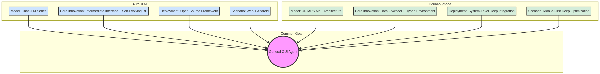

# 豆包手机 (UI-TARS) vs. AutoGLM 横向对比

**发布日期**: 2025年12月16日

**作者**: Manus AI

---

## 1. 概述

豆包手机 (以 UI-TARS 为核心) 和 AutoGLM 是当前 GUI 自主智能体领域的两大前沿代表。前者由字节跳动和中兴通讯联合打造，代表了“顶尖AI公司+成熟硬件厂商”深度整合的产物；后者则由智谱 AI 和清华大学 KEG 实验室联合研发，是“产学研”结合推动基础模型应用落地的典范 [1, 2]。

尽管两者都致力于实现通用的 GUI 智能体这一宏伟目标，但它们在技术路线、核心创新、部署形态和生态策略上，展现了截然不同但又殊途同归的两种路径。本报告将对两者进行详细的横向对比，以揭示各自的优势、特点以及对行业发展的不同启示。

## 2. 核心技术与策略对比

*图 1: 豆包手机 vs. AutoGLM 核心特点对比*

下表从多个维度对两者进行了详细的比较：

| 对比维度 | AutoGLM (智谱 AI & 清华) | 豆包手机 (字节跳动 & 中兴) |
| :--- | :--- | :--- |
| **核心模型** | ChatGLM 模型家族 (如 GLM-4-9B) | UI-TARS (MoE 架构) |
| **核心创新** | **中间接口设计** (解耦规划与定位) | **数据飞轮** (解决数据稀缺) |
| | **自进化在线 RL** (提升错误恢复) | **混合式 GUI 环境** (扩展能力边界) |
| **部署形态** | **开源框架** (Open-AutoGLM) | **系统级深度集成** (软硬一体) |
| **生态策略** | 开放、兼容，鼓励社区贡献和二次开发 | 封闭、垂直整合，追求极致的用户体验 |
| **优势场景** | Web 浏览器、跨平台通用性 | 移动端深度优化、长链路复杂任务 |
| **合作伙伴** | 学术界 (清华大学) | 硬件产业界 (中兴通讯) |

## 3. 深度分析

### 3.1. 技术路线：解耦 vs. 自我造血

-   **AutoGLM** 的核心思想是**解耦**。其“中间接口”设计，巧妙地将复杂的 GUI 操作分解为“规划”和“定位”两个子问题，允许使用不同模型独立优化，显著提升了操作的准确性。这是一种非常聪明的工程实践，体现了“分而治之”的软件设计哲学。

-   **豆包手机 (UI-TARS)** 的核心思想是**自我造血**。其“数据飞轮”机制，直面了 GUI Agent 训练中最根本的难题——数据稀缺。通过让模型在虚拟环境中不断试错、自我迭代，实现了数据和模型能力的同步增长。这是一种更侧重于“大力出奇迹”的、资源密集型但效果显著的路线。

### 3.2. 生态策略：开放 vs. 封闭

-   **AutoGLM** 选择了**开放**的生态策略。通过开源其核心框架 Open-AutoGLM，它降低了开发者进入 GUI Agent 领域的门槛，旨在吸引社区力量共同构建一个庞大的生态系统。其 API 设计遵循 OpenAI 标准，也体现了其拥抱开放、注重兼容性的战略意图。

-   **豆包手机** 则走了**封闭**的垂直整合路线。通过与中兴的独家合作，将 AI Agent 与操作系统和硬件深度绑定，换取了无与伦比的执行权限和稳定性。它的目标是打造一个体验极致的“样板间”，以标杆级的用户体验来定义下一代 AI 手机，从而在未来的竞争中占据先机。

### 3.3. 战略意图：平台 vs. 产品

-   **AutoGLM** 更像是在构建一个**平台**。它提供了一套通用的工具和框架，赋能其他开发者去创造各种各样的 GUI 智能体应用。其同时覆盖 Web 和 Android 两大场景，也彰显了其成为跨平台通用解决方案的雄心。

-   **豆包手机** 的目标则是一个极致的**产品**。它的一切设计都围绕着在移动端提供最佳用户体验展开，从端云协同架构到与硬件的深度集成，无一不体现了其“产品为王”的理念。它旨在通过一个革命性的产品，直接占领用户心智。

## 4. 总结与展望

AutoGLM 和豆包手机代表了通往通用 GUI 智能体之路的两条不同路径，两者并无绝对的优劣之分，而是反映了其背后开发者不同的基因、资源和战略考量。

-   **AutoGLM 的开放路线** 有利于技术的快速普及和生态的繁荣，但可能在最终产品的体验一致性和极致性能上做出妥协。
-   **豆包手机的封闭路线** 能够打造出体验惊艳的标杆产品，但其技术路径难以被其他厂商快速复制，生态扩展速度可能较慢。

对于整个行业而言，这两条路径的探索都具有非凡的价值。未来，我们很可能会看到两者模式的融合：硬件厂商会越来越多地向 AI 公司开放底层权限，而 AI 公司也会将其平台化的能力封装成更易于集成的产品。无论如何，AutoGLM 和豆包手机的出现，已经共同按下了 GUI 智能体时代加速到来的快进键。

---

### 参考文献

[1] Liu, X., Qin, B., Liang, D., et al. (2024). *AutoGLM: Autonomous Foundation Agents for GUIs*. arXiv:2411.00820. [https://arxiv.org/abs/2411.00820](https://arxiv.org/abs/2411.00820)

[2] 机器之心. (2025). *「豆包手机」为何能靠超级Agent火遍全网，我们听听AI学者们怎么说*. 36氪. [https://36kr.com/p/3589452955910146](https://36kr.com/p/3589452955910146)
